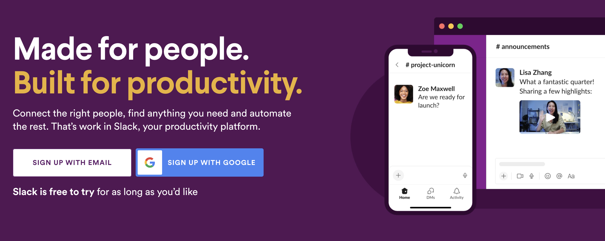

<div align="center">

[](https://slack.dev)

# Slack<a id="slack"></a>

One way to interact with the Slack platform is its HTTP RPC-based Web API, a collection of methods requiring OAuth 2.0-based user, bot, or workspace tokens blessed with related OAuth scopes.


</div>

## Table of Contents<a id="table-of-contents"></a>

<!-- toc -->

- [Requirements](#requirements)
- [Installation](#installation)
- [Getting Started](#getting-started)
- [Async](#async)
- [Raw HTTP Response](#raw-http-response)
- [Reference](#reference)
  * [`slackweb.admin.add_default_channels`](#slackwebadminadd_default_channels)
  * [`slackweb.admin.add_emoji`](#slackwebadminadd_emoji)
  * [`slackweb.admin.add_group_idp_groups`](#slackwebadminadd_group_idp_groups)
  * [`slackweb.admin.add_workspace_user`](#slackwebadminadd_workspace_user)
  * [`slackweb.admin.alias_add`](#slackwebadminalias_add)
  * [`slackweb.admin.approve_app_installation`](#slackwebadminapprove_app_installation)
  * [`slackweb.admin.approve_request`](#slackwebadminapprove_request)
  * [`slackweb.admin.archive_channel`](#slackwebadminarchive_channel)
  * [`slackweb.admin.associate_default_workspaces`](#slackwebadminassociate_default_workspaces)
  * [`slackweb.admin.convert_to_private_channel`](#slackwebadminconvert_to_private_channel)
  * [`slackweb.admin.create_channel_based_conversation`](#slackwebadmincreate_channel_based_conversation)
  * [`slackweb.admin.create_enterprise_team`](#slackwebadmincreate_enterprise_team)
  * [`slackweb.admin.delete_channel`](#slackwebadmindelete_channel)
  * [`slackweb.admin.deny_request`](#slackwebadmindeny_request)
  * [`slackweb.admin.disconnect_shared_channel`](#slackwebadmindisconnect_shared_channel)
  * [`slackweb.admin.get_all`](#slackwebadminget_all)
  * [`slackweb.admin.get_conversation_prefs`](#slackwebadminget_conversation_prefs)
  * [`slackweb.admin.get_info`](#slackwebadminget_info)
  * [`slackweb.admin.get_list`](#slackwebadminget_list)
  * [`slackweb.admin.get_teams_list`](#slackwebadminget_teams_list)
  * [`slackweb.admin.invalidate_session`](#slackwebadmininvalidate_session)
  * [`slackweb.admin.invite_user_to_channel`](#slackwebadmininvite_user_to_channel)
  * [`slackweb.admin.invite_user_to_workspace`](#slackwebadmininvite_user_to_workspace)
  * [`slackweb.admin.list`](#slackwebadminlist)
  * [`slackweb.admin.list_0`](#slackwebadminlist_0)
  * [`slackweb.admin.list_1`](#slackwebadminlist_1)
  * [`slackweb.admin.list_2`](#slackwebadminlist_2)
  * [`slackweb.admin.list_all`](#slackwebadminlist_all)
  * [`slackweb.admin.list_channels_get`](#slackwebadminlist_channels_get)
  * [`slackweb.admin.list_enterprise_emoji`](#slackwebadminlist_enterprise_emoji)
  * [`slackweb.admin.list_groups`](#slackwebadminlist_groups)
  * [`slackweb.admin.list_original_connected_channel_info`](#slackwebadminlist_original_connected_channel_info)
  * [`slackweb.admin.list_owners`](#slackwebadminlist_owners)
  * [`slackweb.admin.list_pending_workspace_invite_requests`](#slackwebadminlist_pending_workspace_invite_requests)
  * [`slackweb.admin.list_workspace_users`](#slackwebadminlist_workspace_users)
  * [`slackweb.admin.remove_channels`](#slackwebadminremove_channels)
  * [`slackweb.admin.remove_enterprise_emoji`](#slackwebadminremove_enterprise_emoji)
  * [`slackweb.admin.remove_idp_group`](#slackwebadminremove_idp_group)
  * [`slackweb.admin.remove_user_from_workspace`](#slackwebadminremove_user_from_workspace)
  * [`slackweb.admin.rename_channel`](#slackwebadminrename_channel)
  * [`slackweb.admin.rename_emoji`](#slackwebadminrename_emoji)
  * [`slackweb.admin.reset_sessions`](#slackwebadminreset_sessions)
  * [`slackweb.admin.restrict_app`](#slackwebadminrestrict_app)
  * [`slackweb.admin.search_channels`](#slackwebadminsearch_channels)
  * [`slackweb.admin.set_admin_user`](#slackwebadminset_admin_user)
  * [`slackweb.admin.set_conversation_prefs`](#slackwebadminset_conversation_prefs)
  * [`slackweb.admin.set_default_channels`](#slackwebadminset_default_channels)
  * [`slackweb.admin.set_description`](#slackwebadminset_description)
  * [`slackweb.admin.set_discoverability_of_workspace`](#slackwebadminset_discoverability_of_workspace)
  * [`slackweb.admin.set_expiration_guest`](#slackwebadminset_expiration_guest)
  * [`slackweb.admin.set_icon`](#slackwebadminset_icon)
  * [`slackweb.admin.set_name`](#slackwebadminset_name)
  * [`slackweb.admin.set_regular_user`](#slackwebadminset_regular_user)
  * [`slackweb.admin.set_teams_workspace_connection`](#slackwebadminset_teams_workspace_connection)
  * [`slackweb.admin.set_workspace_owner`](#slackwebadminset_workspace_owner)
  * [`slackweb.admin.unarchive_channel`](#slackwebadminunarchive_channel)
  * [`slackweb.admin/apps.approve_app_installation`](#slackwebadminappsapprove_app_installation)
  * [`slackweb.admin/apps.restrict_app`](#slackwebadminappsrestrict_app)
  * [`slackweb.admin/apps/approved.list`](#slackwebadminappsapprovedlist)
  * [`slackweb.admin/apps/requests.list`](#slackwebadminappsrequestslist)
  * [`slackweb.admin/apps/restricted.get_list`](#slackwebadminappsrestrictedget_list)
  * [`slackweb.admin/conversations.archive_channel`](#slackwebadminconversationsarchive_channel)
  * [`slackweb.admin/conversations.convert_to_private_channel`](#slackwebadminconversationsconvert_to_private_channel)
  * [`slackweb.admin/conversations.create_channel_based_conversation`](#slackwebadminconversationscreate_channel_based_conversation)
  * [`slackweb.admin/conversations.delete_channel`](#slackwebadminconversationsdelete_channel)
  * [`slackweb.admin/conversations.disconnect_shared_channel`](#slackwebadminconversationsdisconnect_shared_channel)
  * [`slackweb.admin/conversations.get_conversation_prefs`](#slackwebadminconversationsget_conversation_prefs)
  * [`slackweb.admin/conversations.get_teams_list`](#slackwebadminconversationsget_teams_list)
  * [`slackweb.admin/conversations.invite_user_to_channel`](#slackwebadminconversationsinvite_user_to_channel)
  * [`slackweb.admin/conversations.rename_channel`](#slackwebadminconversationsrename_channel)
  * [`slackweb.admin/conversations.search_channels`](#slackwebadminconversationssearch_channels)
  * [`slackweb.admin/conversations.set_conversation_prefs`](#slackwebadminconversationsset_conversation_prefs)
  * [`slackweb.admin/conversations.set_teams_workspace_connection`](#slackwebadminconversationsset_teams_workspace_connection)
  * [`slackweb.admin/conversations.unarchive_channel`](#slackwebadminconversationsunarchive_channel)
  * [`slackweb.admin/conversations/ekm.list_original_connected_channel_info`](#slackwebadminconversationsekmlist_original_connected_channel_info)
  * [`slackweb.admin/conversations/restrict_access.add_group_idp_groups`](#slackwebadminconversationsrestrict_accessadd_group_idp_groups)
  * [`slackweb.admin/conversations/restrict_access.list_groups`](#slackwebadminconversationsrestrict_accesslist_groups)
  * [`slackweb.admin/conversations/restrict_access.remove_idp_group`](#slackwebadminconversationsrestrict_accessremove_idp_group)
  * [`slackweb.admin/emoji.add_emoji`](#slackwebadminemojiadd_emoji)
  * [`slackweb.admin/emoji.alias_add`](#slackwebadminemojialias_add)
  * [`slackweb.admin/emoji.list_enterprise_emoji`](#slackwebadminemojilist_enterprise_emoji)
  * [`slackweb.admin/emoji.remove_enterprise_emoji`](#slackwebadminemojiremove_enterprise_emoji)
  * [`slackweb.admin/emoji.rename_emoji`](#slackwebadminemojirename_emoji)
  * [`slackweb.admin/invite_requests.approve_request`](#slackwebadmininvite_requestsapprove_request)
  * [`slackweb.admin/invite_requests.deny_request`](#slackwebadmininvite_requestsdeny_request)
  * [`slackweb.admin/invite_requests.list_pending_workspace_invite_requests`](#slackwebadmininvite_requestslist_pending_workspace_invite_requests)
  * [`slackweb.admin/invite_requests/approved.list`](#slackwebadmininvite_requestsapprovedlist)
  * [`slackweb.admin/invite_requests/denied.list`](#slackwebadmininvite_requestsdeniedlist)
  * [`slackweb.admin/teams.create_enterprise_team`](#slackwebadminteamscreate_enterprise_team)
  * [`slackweb.admin/teams.list_all`](#slackwebadminteamslist_all)
  * [`slackweb.admin/teams/admins.get_all`](#slackwebadminteamsadminsget_all)
  * [`slackweb.admin/teams/owners.list_owners`](#slackwebadminteamsownerslist_owners)
  * [`slackweb.admin/teams/settings.get_info`](#slackwebadminteamssettingsget_info)
  * [`slackweb.admin/teams/settings.set_default_channels`](#slackwebadminteamssettingsset_default_channels)
  * [`slackweb.admin/teams/settings.set_description`](#slackwebadminteamssettingsset_description)
  * [`slackweb.admin/teams/settings.set_discoverability_of_workspace`](#slackwebadminteamssettingsset_discoverability_of_workspace)
  * [`slackweb.admin/teams/settings.set_icon`](#slackwebadminteamssettingsset_icon)
  * [`slackweb.admin/teams/settings.set_name`](#slackwebadminteamssettingsset_name)
  * [`slackweb.admin/usergroups.add_default_channels`](#slackwebadminusergroupsadd_default_channels)
  * [`slackweb.admin/usergroups.associate_default_workspaces`](#slackwebadminusergroupsassociate_default_workspaces)
  * [`slackweb.admin/usergroups.list_channels_get`](#slackwebadminusergroupslist_channels_get)
  * [`slackweb.admin/usergroups.remove_channels`](#slackwebadminusergroupsremove_channels)
  * [`slackweb.admin/users.add_workspace_user`](#slackwebadminusersadd_workspace_user)
  * [`slackweb.admin/users.invite_user_to_workspace`](#slackwebadminusersinvite_user_to_workspace)
  * [`slackweb.admin/users.list_workspace_users`](#slackwebadminuserslist_workspace_users)
  * [`slackweb.admin/users.remove_user_from_workspace`](#slackwebadminusersremove_user_from_workspace)
  * [`slackweb.admin/users.set_admin_user`](#slackwebadminusersset_admin_user)
  * [`slackweb.admin/users.set_expiration_guest`](#slackwebadminusersset_expiration_guest)
  * [`slackweb.admin/users.set_regular_user`](#slackwebadminusersset_regular_user)
  * [`slackweb.admin/users.set_workspace_owner`](#slackwebadminusersset_workspace_owner)
  * [`slackweb.admin/users/session.invalidate_session`](#slackwebadminuserssessioninvalidate_session)
  * [`slackweb.admin/users/session.reset_sessions`](#slackwebadminuserssessionreset_sessions)
  * [`slackweb.api.test`](#slackwebapitest)
  * [`slackweb.apps.additional_scopes_request`](#slackwebappsadditional_scopes_request)
  * [`slackweb.apps.get_list`](#slackwebappsget_list)
  * [`slackweb.apps.get_list_0`](#slackwebappsget_list_0)
  * [`slackweb.apps.get_resources_list`](#slackwebappsget_resources_list)
  * [`slackweb.apps.list_permissions`](#slackwebappslist_permissions)
  * [`slackweb.apps.list_user_grants`](#slackwebappslist_user_grants)
  * [`slackweb.apps.request_modal`](#slackwebappsrequest_modal)
  * [`slackweb.apps.uninstall`](#slackwebappsuninstall)
  * [`slackweb.apps/event/authorizations.get_list`](#slackwebappseventauthorizationsget_list)
  * [`slackweb.apps/permissions.additional_scopes_request`](#slackwebappspermissionsadditional_scopes_request)
  * [`slackweb.apps/permissions.list_permissions`](#slackwebappspermissionslist_permissions)
  * [`slackweb.apps/permissions/resources.get_resources_list`](#slackwebappspermissionsresourcesget_resources_list)
  * [`slackweb.apps/permissions/scopes.get_list`](#slackwebappspermissionsscopesget_list)
  * [`slackweb.apps/permissions/users.list_user_grants`](#slackwebappspermissionsuserslist_user_grants)
  * [`slackweb.apps/permissions/users.request_modal`](#slackwebappspermissionsusersrequest_modal)
  * [`slackweb.auth.revoke`](#slackwebauthrevoke)
  * [`slackweb.auth.test`](#slackwebauthtest)
  * [`slackweb.bots.info`](#slackwebbotsinfo)
  * [`slackweb.calls.add`](#slackwebcallsadd)
  * [`slackweb.calls.add_new_participant`](#slackwebcallsadd_new_participant)
  * [`slackweb.calls.end`](#slackwebcallsend)
  * [`slackweb.calls.info`](#slackwebcallsinfo)
  * [`slackweb.calls.register_removed`](#slackwebcallsregister_removed)
  * [`slackweb.calls.update`](#slackwebcallsupdate)
  * [`slackweb.calls/participants.add_new_participant`](#slackwebcallsparticipantsadd_new_participant)
  * [`slackweb.calls/participants.register_removed`](#slackwebcallsparticipantsregister_removed)
  * [`slackweb.chat.delete`](#slackwebchatdelete)
  * [`slackweb.chat.delete_scheduled_message`](#slackwebchatdelete_scheduled_message)
  * [`slackweb.chat.get_permalink`](#slackwebchatget_permalink)
  * [`slackweb.chat.list`](#slackwebchatlist)
  * [`slackweb.chat.me_message`](#slackwebchatme_message)
  * [`slackweb.chat.post_ephemeral`](#slackwebchatpost_ephemeral)
  * [`slackweb.chat.post_message`](#slackwebchatpost_message)
  * [`slackweb.chat.schedule_message`](#slackwebchatschedule_message)
  * [`slackweb.chat.unfurl`](#slackwebchatunfurl)
  * [`slackweb.chat.update`](#slackwebchatupdate)
  * [`slackweb.chat/scheduled_messages.list`](#slackwebchatscheduled_messageslist)
  * [`slackweb.conversations.archive`](#slackwebconversationsarchive)
  * [`slackweb.conversations.close`](#slackwebconversationsclose)
  * [`slackweb.conversations.create`](#slackwebconversationscreate)
  * [`slackweb.conversations.history`](#slackwebconversationshistory)
  * [`slackweb.conversations.info`](#slackwebconversationsinfo)
  * [`slackweb.conversations.invite`](#slackwebconversationsinvite)
  * [`slackweb.conversations.join`](#slackwebconversationsjoin)
  * [`slackweb.conversations.kick`](#slackwebconversationskick)
  * [`slackweb.conversations.leave`](#slackwebconversationsleave)
  * [`slackweb.conversations.list`](#slackwebconversationslist)
  * [`slackweb.conversations.mark`](#slackwebconversationsmark)
  * [`slackweb.conversations.members`](#slackwebconversationsmembers)
  * [`slackweb.conversations.open`](#slackwebconversationsopen)
  * [`slackweb.conversations.rename`](#slackwebconversationsrename)
  * [`slackweb.conversations.replies`](#slackwebconversationsreplies)
  * [`slackweb.conversations.set_purpose`](#slackwebconversationsset_purpose)
  * [`slackweb.conversations.set_topic`](#slackwebconversationsset_topic)
  * [`slackweb.conversations.unarchive`](#slackwebconversationsunarchive)
  * [`slackweb.dialog.open`](#slackwebdialogopen)
  * [`slackweb.dnd.end_dnd`](#slackwebdndend_dnd)
  * [`slackweb.dnd.end_snooze`](#slackwebdndend_snooze)
  * [`slackweb.dnd.info`](#slackwebdndinfo)
  * [`slackweb.dnd.set_snooze`](#slackwebdndset_snooze)
  * [`slackweb.dnd.team_info`](#slackwebdndteam_info)
  * [`slackweb.emoji.list`](#slackwebemojilist)
  * [`slackweb.files.add_from_remote`](#slackwebfilesadd_from_remote)
  * [`slackweb.files.delete`](#slackwebfilesdelete)
  * [`slackweb.files.delete_comment`](#slackwebfilesdelete_comment)
  * [`slackweb.files.delete_file`](#slackwebfilesdelete_file)
  * [`slackweb.files.get_info`](#slackwebfilesget_info)
  * [`slackweb.files.info`](#slackwebfilesinfo)
  * [`slackweb.files.list`](#slackwebfileslist)
  * [`slackweb.files.list_remote_files`](#slackwebfileslist_remote_files)
  * [`slackweb.files.revoke_public_url`](#slackwebfilesrevoke_public_url)
  * [`slackweb.files.share_remote_file`](#slackwebfilesshare_remote_file)
  * [`slackweb.files.shared_public_url`](#slackwebfilesshared_public_url)
  * [`slackweb.files.update_remote_file`](#slackwebfilesupdate_remote_file)
  * [`slackweb.files.upload`](#slackwebfilesupload)
  * [`slackweb.files/comments.delete_comment`](#slackwebfilescommentsdelete_comment)
  * [`slackweb.files/remote.add_from_remote`](#slackwebfilesremoteadd_from_remote)
  * [`slackweb.files/remote.delete_file`](#slackwebfilesremotedelete_file)
  * [`slackweb.files/remote.get_info`](#slackwebfilesremoteget_info)
  * [`slackweb.files/remote.list_remote_files`](#slackwebfilesremotelist_remote_files)
  * [`slackweb.files/remote.share_remote_file`](#slackwebfilesremoteshare_remote_file)
  * [`slackweb.files/remote.update_remote_file`](#slackwebfilesremoteupdate_remote_file)
  * [`slackweb.migration.exchange`](#slackwebmigrationexchange)
  * [`slackweb.oauth.access`](#slackweboauthaccess)
  * [`slackweb.oauth.exchange_token`](#slackweboauthexchange_token)
  * [`slackweb.oauth.token`](#slackweboauthtoken)
  * [`slackweb.oauth/v2.exchange_token`](#slackweboauthv2exchange_token)
  * [`slackweb.pins.add`](#slackwebpinsadd)
  * [`slackweb.pins.list`](#slackwebpinslist)
  * [`slackweb.pins.remove`](#slackwebpinsremove)
  * [`slackweb.reactions.add`](#slackwebreactionsadd)
  * [`slackweb.reactions.get`](#slackwebreactionsget)
  * [`slackweb.reactions.list`](#slackwebreactionslist)
  * [`slackweb.reactions.remove`](#slackwebreactionsremove)
  * [`slackweb.reminders.add`](#slackwebremindersadd)
  * [`slackweb.reminders.complete`](#slackwebreminderscomplete)
  * [`slackweb.reminders.delete`](#slackwebremindersdelete)
  * [`slackweb.reminders.info`](#slackwebremindersinfo)
  * [`slackweb.reminders.list`](#slackwebreminderslist)
  * [`slackweb.rtm.connect`](#slackwebrtmconnect)
  * [`slackweb.search.messages`](#slackwebsearchmessages)
  * [`slackweb.stars.add`](#slackwebstarsadd)
  * [`slackweb.stars.list`](#slackwebstarslist)
  * [`slackweb.stars.remove`](#slackwebstarsremove)
  * [`slackweb.team.access_logs`](#slackwebteamaccess_logs)
  * [`slackweb.team.billable_info`](#slackwebteambillable_info)
  * [`slackweb.team.get_profile`](#slackwebteamget_profile)
  * [`slackweb.team.info`](#slackwebteaminfo)
  * [`slackweb.team.integration_logs`](#slackwebteamintegration_logs)
  * [`slackweb.team/profile.get_profile`](#slackwebteamprofileget_profile)
  * [`slackweb.usergroups.create`](#slackwebusergroupscreate)
  * [`slackweb.usergroups.disable`](#slackwebusergroupsdisable)
  * [`slackweb.usergroups.enable`](#slackwebusergroupsenable)
  * [`slackweb.usergroups.list`](#slackwebusergroupslist)
  * [`slackweb.usergroups.list_all_users`](#slackwebusergroupslist_all_users)
  * [`slackweb.usergroups.update`](#slackwebusergroupsupdate)
  * [`slackweb.usergroups.update_list`](#slackwebusergroupsupdate_list)
  * [`slackweb.usergroups/users.list_all_users`](#slackwebusergroupsuserslist_all_users)
  * [`slackweb.usergroups/users.update_list`](#slackwebusergroupsusersupdate_list)
  * [`slackweb.users.conversations`](#slackwebusersconversations)
  * [`slackweb.users.delete_photo`](#slackwebusersdelete_photo)
  * [`slackweb.users.get_presence`](#slackwebusersget_presence)
  * [`slackweb.users.get_profile_info`](#slackwebusersget_profile_info)
  * [`slackweb.users.identity`](#slackwebusersidentity)
  * [`slackweb.users.info`](#slackwebusersinfo)
  * [`slackweb.users.list`](#slackwebuserslist)
  * [`slackweb.users.lookup_by_email`](#slackwebuserslookup_by_email)
  * [`slackweb.users.set_active`](#slackwebusersset_active)
  * [`slackweb.users.set_photo`](#slackwebusersset_photo)
  * [`slackweb.users.set_presence`](#slackwebusersset_presence)
  * [`slackweb.users.set_profile_info`](#slackwebusersset_profile_info)
  * [`slackweb.users/profile.get_profile_info`](#slackwebusersprofileget_profile_info)
  * [`slackweb.users/profile.set_profile_info`](#slackwebusersprofileset_profile_info)
  * [`slackweb.views.open`](#slackwebviewsopen)
  * [`slackweb.views.publish`](#slackwebviewspublish)
  * [`slackweb.views.push`](#slackwebviewspush)
  * [`slackweb.views.update`](#slackwebviewsupdate)
  * [`slackweb.workflows.step_completed`](#slackwebworkflowsstep_completed)
  * [`slackweb.workflows.step_failed`](#slackwebworkflowsstep_failed)
  * [`slackweb.workflows.update_step`](#slackwebworkflowsupdate_step)

<!-- tocstop -->

## Requirements<a id="requirements"></a>

Python >=3.7

## Installation<a id="installation"></a>
<div align="center">
  <a href="https://konfigthis.com/sdk-sign-up?company=Slack&serviceName=Web&language=Python">
    
  </a>
</div>

## Getting Started<a id="getting-started"></a>

```python
from pprint import pprint
from slack_web_python_sdk import SlackWeb, ApiException

slackweb = SlackWeb(

    client_id = 'YOUR_CLIENT_ID',
    client_secret = 'YOUR_CLIENT_SECRET',
)

try:
    add_default_channels_response = slackweb.admin.add_default_channels(
        token="token_example",
        channel_ids="string_example",
        usergroup_id="string_example",
        team_id="string_example",
    )
    print(add_default_channels_response)
except ApiException as e:
    print("Exception when calling AdminApi.add_default_channels: %s\n" % e)
    pprint(e.body)
    pprint(e.headers)
    pprint(e.status)
    pprint(e.reason)
    pprint(e.round_trip_time)
```

## Async<a id="async"></a>

`async` support is available by prepending `a` to any method.

```python

import asyncio
from pprint import pprint
from slack_web_python_sdk import SlackWeb, ApiException

slackweb = SlackWeb(

    client_id = 'YOUR_CLIENT_ID',
    client_secret = 'YOUR_CLIENT_SECRET',
)

async def main():
    try:
        add_default_channels_response = await slackweb.admin.aadd_default_channels(
            token="token_example",
            channel_ids="string_example",
            usergroup_id="string_example",
            team_id="string_example",
        )
        print(add_default_channels_response)
    except ApiException as e:
        print("Exception when calling AdminApi.add_default_channels: %s\n" % e)
        pprint(e.body)
        pprint(e.headers)
        pprint(e.status)
        pprint(e.reason)
        pprint(e.round_trip_time)

asyncio.run(main())
```

## Raw HTTP Response<a id="raw-http-response"></a>

To access raw HTTP response values, use the `.raw` namespace.

```python
from pprint import pprint
from slack_web_python_sdk import SlackWeb, ApiException

slackweb = SlackWeb(

    client_id = 'YOUR_CLIENT_ID',
    client_secret = 'YOUR_CLIENT_SECRET',
)

try:
    add_default_channels_response = slackweb.admin.raw.add_default_channels(
        token="token_example",
        channel_ids="string_example",
        usergroup_id="string_example",
        team_id="string_example",
    )
    pprint(add_default_channels_response.body)
    pprint(add_default_channels_response.body["ok"])
    pprint(add_default_channels_response.headers)
    pprint(add_default_channels_response.status)
    pprint(add_default_channels_response.round_trip_time)
except ApiException as e:
    print("Exception when calling AdminApi.add_default_channels: %s\n" % e)
    pprint(e.body)
    pprint(e.headers)
    pprint(e.status)
    pprint(e.reason)
    pprint(e.round_trip_time)
```


## Reference<a id="reference"></a>
### `slackweb.admin.add_default_channels`<a id="slackwebadminadd_default_channels"></a>

Add one or more default channels to an IDP group.

#### 🛠️ Usage<a id="🛠️-usage"></a>

```python
add_default_channels_response = slackweb.admin.add_default_channels(
    token="token_example",
    channel_ids="string_example",
    usergroup_id="string_example",
    team_id="string_example",
)
```

#### ⚙️ Parameters<a id="⚙️-parameters"></a>

##### token: `str`<a id="token-str"></a>

Authentication token. Requires scope: `admin.usergroups:write`

##### channel_ids: `str`<a id="channel_ids-str"></a>

Comma separated string of channel IDs.

##### usergroup_id: `str`<a id="usergroup_id-str"></a>

ID of the IDP group to add default channels for.

##### team_id: `str`<a id="team_id-str"></a>

The workspace to add default channels in.

#### ⚙️ Request Body<a id="⚙️-request-body"></a>

[`AdminusergroupsAddDefaultChannelsRequest`](./slack_web_python_sdk/type/adminusergroups_add_default_channels_request.py)
#### 🔄 Return<a id="🔄-return"></a>

[`AdminusergroupsAddDefaultChannelsResponse`](./slack_web_python_sdk/pydantic/adminusergroups_add_default_channels_response.py)

#### 🌐 Endpoint<a id="🌐-endpoint"></a>

`/admin.usergroups.addChannels` `post`

[🔙 **Back to Table of Contents**](#table-of-contents)

---

### `slackweb.admin.add_emoji`<a id="slackwebadminadd_emoji"></a>

Add an emoji.

#### 🛠️ Usage<a id="🛠️-usage"></a>

```python
add_emoji_response = slackweb.admin.add_emoji(
    name="string_example",
    token="string_example",
    url="string_example",
)
```

#### ⚙️ Parameters<a id="⚙️-parameters"></a>

##### name: `str`<a id="name-str"></a>

The name of the emoji to be removed. Colons (`:myemoji:`) around the value are not required, although they may be included.

##### token: `str`<a id="token-str"></a>

Authentication token. Requires scope: `admin.teams:write`

##### url: `str`<a id="url-str"></a>

The URL of a file to use as an image for the emoji. Square images under 128KB and with transparent backgrounds work best.

#### ⚙️ Request Body<a id="⚙️-request-body"></a>

[`AdminemojiAddEmojiRequest`](./slack_web_python_sdk/type/adminemoji_add_emoji_request.py)
#### 🔄 Return<a id="🔄-return"></a>

[`AdminemojiAddEmojiResponse`](./slack_web_python_sdk/pydantic/adminemoji_add_emoji_response.py)

#### 🌐 Endpoint<a id="🌐-endpoint"></a>

`/admin.emoji.add` `post`

[🔙 **Back to Table of Contents**](#table-of-contents)

---

### `slackweb.admin.add_group_idp_groups`<a id="slackwebadminadd_group_idp_groups"></a>

Add an allowlist of IDP groups for accessing a channel

#### 🛠️ Usage<a id="🛠️-usage"></a>

```python
add_group_idp_groups_response = slackweb.admin.add_group_idp_groups(
    channel_id="string_example",
    group_id="string_example",
    token="string_example",
    team_id="string_example",
)
```

#### ⚙️ Parameters<a id="⚙️-parameters"></a>

##### channel_id: `str`<a id="channel_id-str"></a>

The channel to link this group to.

##### group_id: `str`<a id="group_id-str"></a>

The [IDP Group](https://slack.com/help/articles/115001435788-Connect-identity-provider-groups-to-your-Enterprise-Grid-org) ID to be an allowlist for the private channel.

##### token: `str`<a id="token-str"></a>

Authentication token. Requires scope: `admin.conversations:write`

##### team_id: `str`<a id="team_id-str"></a>

The workspace where the channel exists. This argument is required for channels only tied to one workspace, and optional for channels that are shared across an organization.

#### ⚙️ Request Body<a id="⚙️-request-body"></a>

[`AdminconversationsrestrictAccessAddGroupIdpGroupsRequest`](./slack_web_python_sdk/type/adminconversationsrestrict_access_add_group_idp_groups_request.py)
#### 🔄 Return<a id="🔄-return"></a>

[`AdminconversationsrestrictAccessAddGroupIdpGroupsResponse`](./slack_web_python_sdk/pydantic/adminconversationsrestrict_access_add_group_idp_groups_response.py)

#### 🌐 Endpoint<a id="🌐-endpoint"></a>

`/admin.conversations.restrictAccess.addGroup` `post`

[🔙 **Back to Table of Contents**](#table-of-contents)

---

### `slackweb.admin.add_workspace_user`<a id="slackwebadminadd_workspace_user"></a>

Add an Enterprise user to a workspace.

#### 🛠️ Usage<a id="🛠️-usage"></a>

```python
add_workspace_user_response = slackweb.admin.add_workspace_user(
    token="token_example",
    team_id="string_example",
    user_id="string_example",
    channel_ids="string_example",
    is_restricted=True,
    is_ultra_restricted=True,
)
```

#### ⚙️ Parameters<a id="⚙️-parameters"></a>

##### token: `str`<a id="token-str"></a>

Authentication token. Requires scope: `admin.users:write`

##### team_id: `str`<a id="team_id-str"></a>

The ID (`T1234`) of the workspace.

##### user_id: `str`<a id="user_id-str"></a>

The ID of the user to add to the workspace.

##### channel_ids: `str`<a id="channel_ids-str"></a>

Comma separated values of channel IDs to add user in the new workspace.

##### is_restricted: `bool`<a id="is_restricted-bool"></a>

True if user should be added to the workspace as a guest.

##### is_ultra_restricted: `bool`<a id="is_ultra_restricted-bool"></a>

True if user should be added to the workspace as a single-channel guest.

#### ⚙️ Request Body<a id="⚙️-request-body"></a>

[`AdminusersAddWorkspaceUserRequest`](./slack_web_python_sdk/type/adminusers_add_workspace_user_request.py)
#### 🔄 Return<a id="🔄-return"></a>

[`AdminusersAddWorkspaceUserResponse`](./slack_web_python_sdk/pydantic/adminusers_add_workspace_user_response.py)

#### 🌐 Endpoint<a id="🌐-endpoint"></a>

`/admin.users.assign` `post`

[🔙 **Back to Table of Contents**](#table-of-contents)

---

### `slackweb.admin.alias_add`<a id="slackwebadminalias_add"></a>

Add an emoji alias.

#### 🛠️ Usage<a id="🛠️-usage"></a>

```python
alias_add_response = slackweb.admin.alias_add(
    alias_for="string_example",
    name="string_example",
    token="string_example",
)
```

#### ⚙️ Parameters<a id="⚙️-parameters"></a>

##### alias_for: `str`<a id="alias_for-str"></a>

The alias of the emoji.

##### name: `str`<a id="name-str"></a>

The name of the emoji to be aliased. Colons (`:myemoji:`) around the value are not required, although they may be included.

##### token: `str`<a id="token-str"></a>

Authentication token. Requires scope: `admin.teams:write`

#### ⚙️ Request Body<a id="⚙️-request-body"></a>

[`AdminemojiAliasAddRequest`](./slack_web_python_sdk/type/adminemoji_alias_add_request.py)
#### 🔄 Return<a id="🔄-return"></a>

[`AdminemojiAliasAddResponse`](./slack_web_python_sdk/pydantic/adminemoji_alias_add_response.py)

#### 🌐 Endpoint<a id="🌐-endpoint"></a>

`/admin.emoji.addAlias` `post`

[🔙 **Back to Table of Contents**](#table-of-contents)

---

### `slackweb.admin.approve_app_installation`<a id="slackwebadminapprove_app_installation"></a>

Approve an app for installation on a workspace.

#### 🛠️ Usage<a id="🛠️-usage"></a>

```python
approve_app_installation_response = slackweb.admin.approve_app_installation(
    token="token_example",
    app_id="string_example",
    request_id="string_example",
    team_id="string_example",
)
```

#### ⚙️ Parameters<a id="⚙️-parameters"></a>

##### token: `str`<a id="token-str"></a>

Authentication token. Requires scope: `admin.apps:write`

##### app_id: `str`<a id="app_id-str"></a>

The id of the app to approve.

##### request_id: `str`<a id="request_id-str"></a>

The id of the request to approve.

##### team_id: `str`<a id="team_id-str"></a>

#### ⚙️ Request Body<a id="⚙️-request-body"></a>

[`AdminappsApproveAppInstallationRequest`](./slack_web_python_sdk/type/adminapps_approve_app_installation_request.py)
#### 🔄 Return<a id="🔄-return"></a>

[`AdminappsApproveAppInstallationResponse`](./slack_web_python_sdk/pydantic/adminapps_approve_app_installation_response.py)

#### 🌐 Endpoint<a id="🌐-endpoint"></a>

`/admin.apps.approve` `post`

[🔙 **Back to Table of Contents**](#table-of-contents)

---

### `slackweb.admin.approve_request`<a id="slackwebadminapprove_request"></a>

Approve a workspace invite request.

#### 🛠️ Usage<a id="🛠️-usage"></a>

```python
approve_request_response = slackweb.admin.approve_request(
    invite_request_id="string_example",
    token="token_example",
    team_id="string_example",
)
```

#### ⚙️ Parameters<a id="⚙️-parameters"></a>

##### invite_request_id: `str`<a id="invite_request_id-str"></a>

ID of the request to invite.

##### token: `str`<a id="token-str"></a>

Authentication token. Requires scope: `admin.invites:write`

##### team_id: `str`<a id="team_id-str"></a>

ID for the workspace where the invite request was made.

#### ⚙️ Request Body<a id="⚙️-request-body"></a>

[`AdmininviteRequestsApproveRequestRequest`](./slack_web_python_sdk/type/admininvite_requests_approve_request_request.py)
#### 🔄 Return<a id="🔄-return"></a>

[`AdmininviteRequestsApproveRequestResponse`](./slack_web_python_sdk/pydantic/admininvite_requests_approve_request_response.py)

#### 🌐 Endpoint<a id="🌐-endpoint"></a>

`/admin.inviteRequests.approve` `post`

[🔙 **Back to Table of Contents**](#table-of-contents)

---

### `slackweb.admin.archive_channel`<a id="slackwebadminarchive_channel"></a>

Archive a public or private channel.

#### 🛠️ Usage<a id="🛠️-usage"></a>

```python
archive_channel_response = slackweb.admin.archive_channel(
    token="token_example",
    channel_id="string_example",
)
```

#### ⚙️ Parameters<a id="⚙️-parameters"></a>

##### token: `str`<a id="token-str"></a>

Authentication token. Requires scope: `admin.conversations:write`

##### channel_id: `str`<a id="channel_id-str"></a>

The channel to archive.

#### ⚙️ Request Body<a id="⚙️-request-body"></a>

[`AdminconversationsArchiveChannelRequest`](./slack_web_python_sdk/type/adminconversations_archive_channel_request.py)
#### 🔄 Return<a id="🔄-return"></a>

[`AdminconversationsArchiveChannelResponse`](./slack_web_python_sdk/pydantic/adminconversations_archive_channel_response.py)

#### 🌐 Endpoint<a id="🌐-endpoint"></a>

`/admin.conversations.archive` `post`

[🔙 **Back to Table of Contents**](#table-of-contents)

---

### `slackweb.admin.associate_default_workspaces`<a id="slackwebadminassociate_default_workspaces"></a>

Associate one or more default workspaces with an organization-wide IDP group.

#### 🛠️ Usage<a id="🛠️-usage"></a>

```python
associate_default_workspaces_response = slackweb.admin.associate_default_workspaces(
    token="token_example",
    team_ids="string_example",
    usergroup_id="string_example",
    auto_provision=True,
)
```

#### ⚙️ Parameters<a id="⚙️-parameters"></a>

##### token: `str`<a id="token-str"></a>

Authentication token. Requires scope: `admin.teams:write`

##### team_ids: `str`<a id="team_ids-str"></a>

A comma separated list of encoded team (workspace) IDs. Each workspace *MUST* belong to the organization associated with the token.

##### usergroup_id: `str`<a id="usergroup_id-str"></a>

An encoded usergroup (IDP Group) ID.

##### auto_provision: `bool`<a id="auto_provision-bool"></a>

When `true`, this method automatically creates new workspace accounts for the IDP group members.

#### ⚙️ Request Body<a id="⚙️-request-body"></a>

[`AdminusergroupsAssociateDefaultWorkspacesRequest`](./slack_web_python_sdk/type/adminusergroups_associate_default_workspaces_request.py)
#### 🔄 Return<a id="🔄-return"></a>

[`AdminusergroupsAssociateDefaultWorkspacesResponse`](./slack_web_python_sdk/pydantic/adminusergroups_associate_default_workspaces_response.py)

#### 🌐 Endpoint<a id="🌐-endpoint"></a>

`/admin.usergroups.addTeams` `post`

[🔙 **Back to Table of Contents**](#table-of-contents)

---

### `slackweb.admin.convert_to_private_channel`<a id="slackwebadminconvert_to_private_channel"></a>

Convert a public channel to a private channel.

#### 🛠️ Usage<a id="🛠️-usage"></a>

```python
convert_to_private_channel_response = slackweb.admin.convert_to_private_channel(
    token="token_example",
    channel_id="string_example",
)
```

#### ⚙️ Parameters<a id="⚙️-parameters"></a>

##### token: `str`<a id="token-str"></a>

Authentication token. Requires scope: `admin.conversations:write`

##### channel_id: `str`<a id="channel_id-str"></a>

The channel to convert to private.

#### ⚙️ Request Body<a id="⚙️-request-body"></a>

[`AdminconversationsConvertToPrivateChannelRequest`](./slack_web_python_sdk/type/adminconversations_convert_to_private_channel_request.py)
#### 🔄 Return<a id="🔄-return"></a>

[`AdminconversationsConvertToPrivateChannelResponse`](./slack_web_python_sdk/pydantic/adminconversations_convert_to_private_channel_response.py)

#### 🌐 Endpoint<a id="🌐-endpoint"></a>

`/admin.conversations.convertToPrivate` `post`

[🔙 **Back to Table of Contents**](#table-of-contents)

---

### `slackweb.admin.create_channel_based_conversation`<a id="slackwebadmincreate_channel_based_conversation"></a>

Create a public or private channel-based conversation.

#### 🛠️ Usage<a id="🛠️-usage"></a>

```python
create_channel_based_conversation_response = slackweb.admin.create_channel_based_conversation(
    token="token_example",
    is_private=True,
    name="string_example",
    description="string_example",
    org_wide=True,
    team_id="string_example",
)
```

#### ⚙️ Parameters<a id="⚙️-parameters"></a>

##### token: `str`<a id="token-str"></a>

Authentication token. Requires scope: `admin.conversations:write`

##### is_private: `bool`<a id="is_private-bool"></a>

When `true`, creates a private channel instead of a public channel

##### name: `str`<a id="name-str"></a>

Name of the public or private channel to create.

##### description: `str`<a id="description-str"></a>

Description of the public or private channel to create.

##### org_wide: `bool`<a id="org_wide-bool"></a>

When `true`, the channel will be available org-wide. Note: if the channel is not `org_wide=true`, you must specify a `team_id` for this channel

##### team_id: `str`<a id="team_id-str"></a>

The workspace to create the channel in. Note: this argument is required unless you set `org_wide=true`.

#### ⚙️ Request Body<a id="⚙️-request-body"></a>

[`AdminconversationsCreateChannelBasedConversationRequest`](./slack_web_python_sdk/type/adminconversations_create_channel_based_conversation_request.py)
#### 🔄 Return<a id="🔄-return"></a>

[`AdminconversationsCreateChannelBasedConversationResponse`](./slack_web_python_sdk/pydantic/adminconversations_create_channel_based_conversation_response.py)

#### 🌐 Endpoint<a id="🌐-endpoint"></a>

`/admin.conversations.create` `post`

[🔙 **Back to Table of Contents**](#table-of-contents)

---

### `slackweb.admin.create_enterprise_team`<a id="slackwebadmincreate_enterprise_team"></a>

Create an Enterprise team.

#### 🛠️ Usage<a id="🛠️-usage"></a>

```python
create_enterprise_team_response = slackweb.admin.create_enterprise_team(
    token="token_example",
    team_domain="string_example",
    team_name="string_example",
    team_description="string_example",
    team_discoverability="string_example",
)
```

#### ⚙️ Parameters<a id="⚙️-parameters"></a>

##### token: `str`<a id="token-str"></a>

Authentication token. Requires scope: `admin.teams:write`

##### team_domain: `str`<a id="team_domain-str"></a>

Team domain (for example, slacksoftballteam).

##### team_name: `str`<a id="team_name-str"></a>

Team name (for example, Slack Softball Team).

##### team_description: `str`<a id="team_description-str"></a>

Description for the team.

##### team_discoverability: `str`<a id="team_discoverability-str"></a>

Who can join the team. A team's discoverability can be `open`, `closed`, `invite_only`, or `unlisted`.

#### ⚙️ Request Body<a id="⚙️-request-body"></a>

[`AdminteamsCreateEnterpriseTeamRequest`](./slack_web_python_sdk/type/adminteams_create_enterprise_team_request.py)
#### 🔄 Return<a id="🔄-return"></a>

[`AdminteamsCreateEnterpriseTeamResponse`](./slack_web_python_sdk/pydantic/adminteams_create_enterprise_team_response.py)

#### 🌐 Endpoint<a id="🌐-endpoint"></a>

`/admin.teams.create` `post`

[🔙 **Back to Table of Contents**](#table-of-contents)

---

### `slackweb.admin.delete_channel`<a id="slackwebadmindelete_channel"></a>

Delete a public or private channel.

#### 🛠️ Usage<a id="🛠️-usage"></a>

```python
delete_channel_response = slackweb.admin.delete_channel(
    token="token_example",
    channel_id="string_example",
)
```

#### ⚙️ Parameters<a id="⚙️-parameters"></a>

##### token: `str`<a id="token-str"></a>

Authentication token. Requires scope: `admin.conversations:write`

##### channel_id: `str`<a id="channel_id-str"></a>

The channel to delete.

#### ⚙️ Request Body<a id="⚙️-request-body"></a>

[`AdminconversationsDeleteChannelRequest`](./slack_web_python_sdk/type/adminconversations_delete_channel_request.py)
#### 🔄 Return<a id="🔄-return"></a>

[`AdminconversationsDeleteChannelResponse`](./slack_web_python_sdk/pydantic/adminconversations_delete_channel_response.py)

#### 🌐 Endpoint<a id="🌐-endpoint"></a>

`/admin.conversations.delete` `post`

[🔙 **Back to Table of Contents**](#table-of-contents)

---

### `slackweb.admin.deny_request`<a id="slackwebadmindeny_request"></a>

Deny a workspace invite request.

#### 🛠️ Usage<a id="🛠️-usage"></a>

```python
deny_request_response = slackweb.admin.deny_request(
    invite_request_id="string_example",
    token="token_example",
    team_id="string_example",
)
```

#### ⚙️ Parameters<a id="⚙️-parameters"></a>

##### invite_request_id: `str`<a id="invite_request_id-str"></a>

ID of the request to invite.

##### token: `str`<a id="token-str"></a>

Authentication token. Requires scope: `admin.invites:write`

##### team_id: `str`<a id="team_id-str"></a>

ID for the workspace where the invite request was made.

#### ⚙️ Request Body<a id="⚙️-request-body"></a>

[`AdmininviteRequestsApproveRequestRequest`](./slack_web_python_sdk/type/admininvite_requests_approve_request_request.py)
#### 🔄 Return<a id="🔄-return"></a>

[`AdmininviteRequestsDenyRequestResponse`](./slack_web_python_sdk/pydantic/admininvite_requests_deny_request_response.py)

#### 🌐 Endpoint<a id="🌐-endpoint"></a>

`/admin.inviteRequests.deny` `post`

[🔙 **Back to Table of Contents**](#table-of-contents)

---

### `slackweb.admin.disconnect_shared_channel`<a id="slackwebadmindisconnect_shared_channel"></a>

Disconnect a connected channel from one or more workspaces.

#### 🛠️ Usage<a id="🛠️-usage"></a>

```python
disconnect_shared_channel_response = slackweb.admin.disconnect_shared_channel(
    token="token_example",
    channel_id="string_example",
    leaving_team_ids="string_example",
)
```

#### ⚙️ Parameters<a id="⚙️-parameters"></a>

##### token: `str`<a id="token-str"></a>

Authentication token. Requires scope: `admin.conversations:write`

##### channel_id: `str`<a id="channel_id-str"></a>

The channel to be disconnected from some workspaces.

##### leaving_team_ids: `str`<a id="leaving_team_ids-str"></a>

The team to be removed from the channel. Currently only a single team id can be specified.

#### ⚙️ Request Body<a id="⚙️-request-body"></a>

[`AdminconversationsDisconnectSharedChannelRequest`](./slack_web_python_sdk/type/adminconversations_disconnect_shared_channel_request.py)
#### 🔄 Return<a id="🔄-return"></a>

[`AdminconversationsDisconnectSharedChannelResponse`](./slack_web_python_sdk/pydantic/adminconversations_disconnect_shared_channel_response.py)

#### 🌐 Endpoint<a id="🌐-endpoint"></a>

`/admin.conversations.disconnectShared` `post`

[🔙 **Back to Table of Contents**](#table-of-contents)

---

### `slackweb.admin.get_all`<a id="slackwebadminget_all"></a>

List all of the admins on a given workspace.

#### 🛠️ Usage<a id="🛠️-usage"></a>

```python
get_all_response = slackweb.admin.get_all(
    token="token_example",
    team_id="team_id_example",
    limit=1,
    cursor="string_example",
)
```

#### ⚙️ Parameters<a id="⚙️-parameters"></a>

##### token: `str`<a id="token-str"></a>

Authentication token. Requires scope: `admin.teams:read`

##### team_id: `str`<a id="team_id-str"></a>

##### limit: `int`<a id="limit-int"></a>

The maximum number of items to return.

##### cursor: `str`<a id="cursor-str"></a>

Set `cursor` to `next_cursor` returned by the previous call to list items in the next page.

#### 🔄 Return<a id="🔄-return"></a>

[`AdminteamsadminsGetAllResponse`](./slack_web_python_sdk/pydantic/adminteamsadmins_get_all_response.py)

#### 🌐 Endpoint<a id="🌐-endpoint"></a>

`/admin.teams.admins.list` `get`

[🔙 **Back to Table of Contents**](#table-of-contents)

---

### `slackweb.admin.get_conversation_prefs`<a id="slackwebadminget_conversation_prefs"></a>

Get conversation preferences for a public or private channel.

#### 🛠️ Usage<a id="🛠️-usage"></a>

```python
get_conversation_prefs_response = slackweb.admin.get_conversation_prefs(
    token="token_example",
    channel_id="channel_id_example",
)
```

#### ⚙️ Parameters<a id="⚙️-parameters"></a>

##### token: `str`<a id="token-str"></a>

Authentication token. Requires scope: `admin.conversations:read`

##### channel_id: `str`<a id="channel_id-str"></a>

The channel to get preferences for.

#### 🔄 Return<a id="🔄-return"></a>

[`AdminconversationsGetConversationPrefsResponse`](./slack_web_python_sdk/pydantic/adminconversations_get_conversation_prefs_response.py)

#### 🌐 Endpoint<a id="🌐-endpoint"></a>

`/admin.conversations.getConversationPrefs` `get`

[🔙 **Back to Table of Contents**](#table-of-contents)

---

### `slackweb.admin.get_info`<a id="slackwebadminget_info"></a>

Fetch information about settings in a workspace

#### 🛠️ Usage<a id="🛠️-usage"></a>

```python
get_info_response = slackweb.admin.get_info(
    token="token_example",
    team_id="team_id_example",
)
```

#### ⚙️ Parameters<a id="⚙️-parameters"></a>

##### token: `str`<a id="token-str"></a>

Authentication token. Requires scope: `admin.teams:read`

##### team_id: `str`<a id="team_id-str"></a>

#### 🔄 Return<a id="🔄-return"></a>

[`AdminteamssettingsGetInfoResponse`](./slack_web_python_sdk/pydantic/adminteamssettings_get_info_response.py)

#### 🌐 Endpoint<a id="🌐-endpoint"></a>

`/admin.teams.settings.info` `get`

[🔙 **Back to Table of Contents**](#table-of-contents)

---

### `slackweb.admin.get_list`<a id="slackwebadminget_list"></a>

List restricted apps for an org or workspace.

#### 🛠️ Usage<a id="🛠️-usage"></a>

```python
get_list_response = slackweb.admin.get_list(
    token="token_example",
    limit=1,
    cursor="string_example",
    team_id="string_example",
    enterprise_id="string_example",
)
```

#### ⚙️ Parameters<a id="⚙️-parameters"></a>

##### token: `str`<a id="token-str"></a>

Authentication token. Requires scope: `admin.apps:read`

##### limit: `int`<a id="limit-int"></a>

The maximum number of items to return. Must be between 1 - 1000 both inclusive.

##### cursor: `str`<a id="cursor-str"></a>

Set `cursor` to `next_cursor` returned by the previous call to list items in the next page

##### team_id: `str`<a id="team_id-str"></a>

##### enterprise_id: `str`<a id="enterprise_id-str"></a>

#### 🔄 Return<a id="🔄-return"></a>

[`AdminappsrestrictedGetListResponse`](./slack_web_python_sdk/pydantic/adminappsrestricted_get_list_response.py)

#### 🌐 Endpoint<a id="🌐-endpoint"></a>

`/admin.apps.restricted.list` `get`

[🔙 **Back to Table of Contents**](#table-of-contents)

---

### `slackweb.admin.get_teams_list`<a id="slackwebadminget_teams_list"></a>

Get all the workspaces a given public or private channel is connected to within this Enterprise org.

#### 🛠️ Usage<a id="🛠️-usage"></a>

```python
get_teams_list_response = slackweb.admin.get_teams_list(
    token="token_example",
    channel_id="channel_id_example",
    cursor="string_example",
    limit=1,
)
```

#### ⚙️ Parameters<a id="⚙️-parameters"></a>

##### token: `str`<a id="token-str"></a>

Authentication token. Requires scope: `admin.conversations:read`

##### channel_id: `str`<a id="channel_id-str"></a>

The channel to determine connected workspaces within the organization for.

##### cursor: `str`<a id="cursor-str"></a>

Set `cursor` to `next_cursor` returned by the previous call to list items in the next page

##### limit: `int`<a id="limit-int"></a>

The maximum number of items to return. Must be between 1 - 1000 both inclusive.

#### 🔄 Return<a id="🔄-return"></a>

[`AdminconversationsGetTeamsListResponse`](./slack_web_python_sdk/pydantic/adminconversations_get_teams_list_response.py)

#### 🌐 Endpoint<a id="🌐-endpoint"></a>

`/admin.conversations.getTeams` `get`

[🔙 **Back to Table of Contents**](#table-of-contents)

---

### `slackweb.admin.invalidate_session`<a id="slackwebadmininvalidate_session"></a>

Invalidate a single session for a user by session_id

#### 🛠️ Usage<a id="🛠️-usage"></a>

```python
invalidate_session_response = slackweb.admin.invalidate_session(
    token="token_example",
    session_id=1,
    team_id="string_example",
)
```

#### ⚙️ Parameters<a id="⚙️-parameters"></a>

##### token: `str`<a id="token-str"></a>

Authentication token. Requires scope: `admin.users:write`

##### session_id: `int`<a id="session_id-int"></a>

##### team_id: `str`<a id="team_id-str"></a>

ID of the team that the session belongs to

#### ⚙️ Request Body<a id="⚙️-request-body"></a>

[`AdminuserssessionInvalidateSessionRequest`](./slack_web_python_sdk/type/adminuserssession_invalidate_session_request.py)
#### 🔄 Return<a id="🔄-return"></a>

[`AdminuserssessionInvalidateSessionResponse`](./slack_web_python_sdk/pydantic/adminuserssession_invalidate_session_response.py)

#### 🌐 Endpoint<a id="🌐-endpoint"></a>

`/admin.users.session.invalidate` `post`

[🔙 **Back to Table of Contents**](#table-of-contents)

---

### `slackweb.admin.invite_user_to_channel`<a id="slackwebadmininvite_user_to_channel"></a>

Invite a user to a public or private channel.

#### 🛠️ Usage<a id="🛠️-usage"></a>

```python
invite_user_to_channel_response = slackweb.admin.invite_user_to_channel(
    token="token_example",
    channel_id="string_example",
    user_ids="string_example",
)
```

#### ⚙️ Parameters<a id="⚙️-parameters"></a>

##### token: `str`<a id="token-str"></a>

Authentication token. Requires scope: `admin.conversations:write`

##### channel_id: `str`<a id="channel_id-str"></a>

The channel that the users will be invited to.

##### user_ids: `str`<a id="user_ids-str"></a>

The users to invite.

#### ⚙️ Request Body<a id="⚙️-request-body"></a>

[`AdminconversationsInviteUserToChannelRequest`](./slack_web_python_sdk/type/adminconversations_invite_user_to_channel_request.py)
#### 🔄 Return<a id="🔄-return"></a>

[`AdminconversationsInviteUserToChannelResponse`](./slack_web_python_sdk/pydantic/adminconversations_invite_user_to_channel_response.py)

#### 🌐 Endpoint<a id="🌐-endpoint"></a>

`/admin.conversations.invite` `post`

[🔙 **Back to Table of Contents**](#table-of-contents)

---

### `slackweb.admin.invite_user_to_workspace`<a id="slackwebadmininvite_user_to_workspace"></a>

Invite a user to a workspace.

#### 🛠️ Usage<a id="🛠️-usage"></a>

```python
invite_user_to_workspace_response = slackweb.admin.invite_user_to_workspace(
    token="token_example",
    channel_ids="string_example",
    email="string_example",
    team_id="string_example",
    custom_message="string_example",
    guest_expiration_ts="string_example",
    is_restricted=True,
    is_ultra_restricted=True,
    real_name="string_example",
    resend=True,
)
```

#### ⚙️ Parameters<a id="⚙️-parameters"></a>

##### token: `str`<a id="token-str"></a>

Authentication token. Requires scope: `admin.users:write`

##### channel_ids: `str`<a id="channel_ids-str"></a>

A comma-separated list of `channel_id`s for this user to join. At least one channel is required.

##### email: `str`<a id="email-str"></a>

The email address of the person to invite.

##### team_id: `str`<a id="team_id-str"></a>

The ID (`T1234`) of the workspace.

##### custom_message: `str`<a id="custom_message-str"></a>

An optional message to send to the user in the invite email.

##### guest_expiration_ts: `str`<a id="guest_expiration_ts-str"></a>

Timestamp when guest account should be disabled. Only include this timestamp if you are inviting a guest user and you want their account to expire on a certain date.

##### is_restricted: `bool`<a id="is_restricted-bool"></a>

Is this user a multi-channel guest user? (default: false)

##### is_ultra_restricted: `bool`<a id="is_ultra_restricted-bool"></a>

Is this user a single channel guest user? (default: false)

##### real_name: `str`<a id="real_name-str"></a>

Full name of the user.

##### resend: `bool`<a id="resend-bool"></a>

Allow this invite to be resent in the future if a user has not signed up yet. (default: false)

#### ⚙️ Request Body<a id="⚙️-request-body"></a>

[`AdminusersInviteUserToWorkspaceRequest`](./slack_web_python_sdk/type/adminusers_invite_user_to_workspace_request.py)
#### 🔄 Return<a id="🔄-return"></a>

[`AdminusersInviteUserToWorkspaceResponse`](./slack_web_python_sdk/pydantic/adminusers_invite_user_to_workspace_response.py)

#### 🌐 Endpoint<a id="🌐-endpoint"></a>

`/admin.users.invite` `post`

[🔙 **Back to Table of Contents**](#table-of-contents)

---

### `slackweb.admin.list`<a id="slackwebadminlist"></a>

List approved apps for an org or workspace.

#### 🛠️ Usage<a id="🛠️-usage"></a>

```python
list_response = slackweb.admin.list(
    token="token_example",
    limit=1,
    cursor="string_example",
    team_id="string_example",
    enterprise_id="string_example",
)
```

#### ⚙️ Parameters<a id="⚙️-parameters"></a>

##### token: `str`<a id="token-str"></a>

Authentication token. Requires scope: `admin.apps:read`

##### limit: `int`<a id="limit-int"></a>

The maximum number of items to return. Must be between 1 - 1000 both inclusive.

##### cursor: `str`<a id="cursor-str"></a>

Set `cursor` to `next_cursor` returned by the previous call to list items in the next page

##### team_id: `str`<a id="team_id-str"></a>

##### enterprise_id: `str`<a id="enterprise_id-str"></a>

#### 🔄 Return<a id="🔄-return"></a>

[`AdminappsapprovedListResponse`](./slack_web_python_sdk/pydantic/adminappsapproved_list_response.py)

#### 🌐 Endpoint<a id="🌐-endpoint"></a>

`/admin.apps.approved.list` `get`

[🔙 **Back to Table of Contents**](#table-of-contents)

---

### `slackweb.admin.list_0`<a id="slackwebadminlist_0"></a>

List app requests for a team/workspace.

#### 🛠️ Usage<a id="🛠️-usage"></a>

```python
list_0_response = slackweb.admin.list_0(
    token="token_example",
    limit=1,
    cursor="string_example",
    team_id="string_example",
)
```

#### ⚙️ Parameters<a id="⚙️-parameters"></a>

##### token: `str`<a id="token-str"></a>

Authentication token. Requires scope: `admin.apps:read`

##### limit: `int`<a id="limit-int"></a>

The maximum number of items to return. Must be between 1 - 1000 both inclusive.

##### cursor: `str`<a id="cursor-str"></a>

Set `cursor` to `next_cursor` returned by the previous call to list items in the next page

##### team_id: `str`<a id="team_id-str"></a>

#### 🔄 Return<a id="🔄-return"></a>

[`AdminappsrequestsListResponse`](./slack_web_python_sdk/pydantic/adminappsrequests_list_response.py)

#### 🌐 Endpoint<a id="🌐-endpoint"></a>

`/admin.apps.requests.list` `get`

[🔙 **Back to Table of Contents**](#table-of-contents)

---

### `slackweb.admin.list_1`<a id="slackwebadminlist_1"></a>

List all approved workspace invite requests.

#### 🛠️ Usage<a id="🛠️-usage"></a>

```python
list_1_response = slackweb.admin.list_1(
    token="token_example",
    team_id="string_example",
    cursor="string_example",
    limit=1,
)
```

#### ⚙️ Parameters<a id="⚙️-parameters"></a>

##### token: `str`<a id="token-str"></a>

Authentication token. Requires scope: `admin.invites:read`

##### team_id: `str`<a id="team_id-str"></a>

ID for the workspace where the invite requests were made.

##### cursor: `str`<a id="cursor-str"></a>

Value of the `next_cursor` field sent as part of the previous API response

##### limit: `int`<a id="limit-int"></a>

The number of results that will be returned by the API on each invocation. Must be between 1 - 1000, both inclusive

#### 🔄 Return<a id="🔄-return"></a>

[`AdmininviteRequestsapprovedListResponse`](./slack_web_python_sdk/pydantic/admininvite_requestsapproved_list_response.py)

#### 🌐 Endpoint<a id="🌐-endpoint"></a>

`/admin.inviteRequests.approved.list` `get`

[🔙 **Back to Table of Contents**](#table-of-contents)

---

### `slackweb.admin.list_2`<a id="slackwebadminlist_2"></a>

List all denied workspace invite requests.

#### 🛠️ Usage<a id="🛠️-usage"></a>

```python
list_2_response = slackweb.admin.list_2(
    token="token_example",
    team_id="string_example",
    cursor="string_example",
    limit=1,
)
```

#### ⚙️ Parameters<a id="⚙️-parameters"></a>

##### token: `str`<a id="token-str"></a>

Authentication token. Requires scope: `admin.invites:read`

##### team_id: `str`<a id="team_id-str"></a>

ID for the workspace where the invite requests were made.

##### cursor: `str`<a id="cursor-str"></a>

Value of the `next_cursor` field sent as part of the previous api response

##### limit: `int`<a id="limit-int"></a>

The number of results that will be returned by the API on each invocation. Must be between 1 - 1000 both inclusive

#### 🔄 Return<a id="🔄-return"></a>

[`AdmininviteRequestsdeniedListResponse`](./slack_web_python_sdk/pydantic/admininvite_requestsdenied_list_response.py)

#### 🌐 Endpoint<a id="🌐-endpoint"></a>

`/admin.inviteRequests.denied.list` `get`

[🔙 **Back to Table of Contents**](#table-of-contents)

---

### `slackweb.admin.list_all`<a id="slackwebadminlist_all"></a>

List all teams on an Enterprise organization

#### 🛠️ Usage<a id="🛠️-usage"></a>

```python
list_all_response = slackweb.admin.list_all(
    token="token_example",
    limit=1,
    cursor="string_example",
)
```

#### ⚙️ Parameters<a id="⚙️-parameters"></a>

##### token: `str`<a id="token-str"></a>

Authentication token. Requires scope: `admin.teams:read`

##### limit: `int`<a id="limit-int"></a>

The maximum number of items to return. Must be between 1 - 100 both inclusive.

##### cursor: `str`<a id="cursor-str"></a>

Set `cursor` to `next_cursor` returned by the previous call to list items in the next page.

#### 🔄 Return<a id="🔄-return"></a>

[`AdminteamsListAllResponse`](./slack_web_python_sdk/pydantic/adminteams_list_all_response.py)

#### 🌐 Endpoint<a id="🌐-endpoint"></a>

`/admin.teams.list` `get`

[🔙 **Back to Table of Contents**](#table-of-contents)

---

### `slackweb.admin.list_channels_get`<a id="slackwebadminlist_channels_get"></a>

List the channels linked to an org-level IDP group (user group).

#### 🛠️ Usage<a id="🛠️-usage"></a>

```python
list_channels_get_response = slackweb.admin.list_channels_get(
    token="token_example",
    usergroup_id="usergroup_id_example",
    team_id="string_example",
    include_num_members=True,
)
```

#### ⚙️ Parameters<a id="⚙️-parameters"></a>

##### token: `str`<a id="token-str"></a>

Authentication token. Requires scope: `admin.usergroups:read`

##### usergroup_id: `str`<a id="usergroup_id-str"></a>

ID of the IDP group to list default channels for.

##### team_id: `str`<a id="team_id-str"></a>

ID of the the workspace.

##### include_num_members: `bool`<a id="include_num_members-bool"></a>

Flag to include or exclude the count of members per channel.

#### 🔄 Return<a id="🔄-return"></a>

[`AdminusergroupsListChannelsGetResponse`](./slack_web_python_sdk/pydantic/adminusergroups_list_channels_get_response.py)

#### 🌐 Endpoint<a id="🌐-endpoint"></a>

`/admin.usergroups.listChannels` `get`

[🔙 **Back to Table of Contents**](#table-of-contents)

---

### `slackweb.admin.list_enterprise_emoji`<a id="slackwebadminlist_enterprise_emoji"></a>

List emoji for an Enterprise Grid organization.

#### 🛠️ Usage<a id="🛠️-usage"></a>

```python
list_enterprise_emoji_response = slackweb.admin.list_enterprise_emoji(
    token="token_example",
    cursor="string_example",
    limit=1,
)
```

#### ⚙️ Parameters<a id="⚙️-parameters"></a>

##### token: `str`<a id="token-str"></a>

Authentication token. Requires scope: `admin.teams:read`

##### cursor: `str`<a id="cursor-str"></a>

Set `cursor` to `next_cursor` returned by the previous call to list items in the next page

##### limit: `int`<a id="limit-int"></a>

The maximum number of items to return. Must be between 1 - 1000 both inclusive.

#### 🔄 Return<a id="🔄-return"></a>

[`AdminemojiListEnterpriseEmojiResponse`](./slack_web_python_sdk/pydantic/adminemoji_list_enterprise_emoji_response.py)

#### 🌐 Endpoint<a id="🌐-endpoint"></a>

`/admin.emoji.list` `get`

[🔙 **Back to Table of Contents**](#table-of-contents)

---

### `slackweb.admin.list_groups`<a id="slackwebadminlist_groups"></a>

List all IDP Groups linked to a channel

#### 🛠️ Usage<a id="🛠️-usage"></a>

```python
list_groups_response = slackweb.admin.list_groups(
    token="token_example",
    channel_id="channel_id_example",
    team_id="string_example",
)
```

#### ⚙️ Parameters<a id="⚙️-parameters"></a>

##### token: `str`<a id="token-str"></a>

Authentication token. Requires scope: `admin.conversations:read`

##### channel_id: `str`<a id="channel_id-str"></a>

##### team_id: `str`<a id="team_id-str"></a>

The workspace where the channel exists. This argument is required for channels only tied to one workspace, and optional for channels that are shared across an organization.

#### 🔄 Return<a id="🔄-return"></a>

[`AdminconversationsrestrictAccessListGroupsResponse`](./slack_web_python_sdk/pydantic/adminconversationsrestrict_access_list_groups_response.py)

#### 🌐 Endpoint<a id="🌐-endpoint"></a>

`/admin.conversations.restrictAccess.listGroups` `get`

[🔙 **Back to Table of Contents**](#table-of-contents)

---

### `slackweb.admin.list_original_connected_channel_info`<a id="slackwebadminlist_original_connected_channel_info"></a>

List all disconnected channels—i.e., channels that were once connected to other workspaces and then disconnected—and the corresponding original channel IDs for key revocation with EKM.

#### 🛠️ Usage<a id="🛠️-usage"></a>

```python
list_original_connected_channel_info_response = slackweb.admin.list_original_connected_channel_info(
    token="token_example",
    channel_ids="string_example",
    team_ids="string_example",
    limit=1,
    cursor="string_example",
)
```

#### ⚙️ Parameters<a id="⚙️-parameters"></a>

##### token: `str`<a id="token-str"></a>

Authentication token. Requires scope: `admin.conversations:read`

##### channel_ids: `str`<a id="channel_ids-str"></a>

A comma-separated list of channels to filter to.

##### team_ids: `str`<a id="team_ids-str"></a>

A comma-separated list of the workspaces to which the channels you would like returned belong.

##### limit: `int`<a id="limit-int"></a>

The maximum number of items to return. Must be between 1 - 1000 both inclusive.

##### cursor: `str`<a id="cursor-str"></a>

Set `cursor` to `next_cursor` returned by the previous call to list items in the next page.

#### 🔄 Return<a id="🔄-return"></a>

[`AdminconversationsekmListOriginalConnectedChannelInfoResponse`](./slack_web_python_sdk/pydantic/adminconversationsekm_list_original_connected_channel_info_response.py)

#### 🌐 Endpoint<a id="🌐-endpoint"></a>

`/admin.conversations.ekm.listOriginalConnectedChannelInfo` `get`

[🔙 **Back to Table of Contents**](#table-of-contents)

---

### `slackweb.admin.list_owners`<a id="slackwebadminlist_owners"></a>

List all of the owners on a given workspace.

#### 🛠️ Usage<a id="🛠️-usage"></a>

```python
list_owners_response = slackweb.admin.list_owners(
    token="token_example",
    team_id="team_id_example",
    limit=1,
    cursor="string_example",
)
```

#### ⚙️ Parameters<a id="⚙️-parameters"></a>

##### token: `str`<a id="token-str"></a>

Authentication token. Requires scope: `admin.teams:read`

##### team_id: `str`<a id="team_id-str"></a>

##### limit: `int`<a id="limit-int"></a>

The maximum number of items to return. Must be between 1 - 1000 both inclusive.

##### cursor: `str`<a id="cursor-str"></a>

Set `cursor` to `next_cursor` returned by the previous call to list items in the next page.

#### 🔄 Return<a id="🔄-return"></a>

[`AdminteamsownersListOwnersResponse`](./slack_web_python_sdk/pydantic/adminteamsowners_list_owners_response.py)

#### 🌐 Endpoint<a id="🌐-endpoint"></a>

`/admin.teams.owners.list` `get`

[🔙 **Back to Table of Contents**](#table-of-contents)

---

### `slackweb.admin.list_pending_workspace_invite_requests`<a id="slackwebadminlist_pending_workspace_invite_requests"></a>

List all pending workspace invite requests.

#### 🛠️ Usage<a id="🛠️-usage"></a>

```python
list_pending_workspace_invite_requests_response = slackweb.admin.list_pending_workspace_invite_requests(
    token="token_example",
    team_id="string_example",
    cursor="string_example",
    limit=1,
)
```

#### ⚙️ Parameters<a id="⚙️-parameters"></a>

##### token: `str`<a id="token-str"></a>

Authentication token. Requires scope: `admin.invites:read`

##### team_id: `str`<a id="team_id-str"></a>

ID for the workspace where the invite requests were made.

##### cursor: `str`<a id="cursor-str"></a>

Value of the `next_cursor` field sent as part of the previous API response

##### limit: `int`<a id="limit-int"></a>

The number of results that will be returned by the API on each invocation. Must be between 1 - 1000, both inclusive

#### 🔄 Return<a id="🔄-return"></a>

[`AdmininviteRequestsListPendingWorkspaceInviteRequestsResponse`](./slack_web_python_sdk/pydantic/admininvite_requests_list_pending_workspace_invite_requests_response.py)

#### 🌐 Endpoint<a id="🌐-endpoint"></a>

`/admin.inviteRequests.list` `get`

[🔙 **Back to Table of Contents**](#table-of-contents)

---

### `slackweb.admin.list_workspace_users`<a id="slackwebadminlist_workspace_users"></a>

List users on a workspace

#### 🛠️ Usage<a id="🛠️-usage"></a>

```python
list_workspace_users_response = slackweb.admin.list_workspace_users(
    token="token_example",
    team_id="team_id_example",
    cursor="string_example",
    limit=1,
)
```

#### ⚙️ Parameters<a id="⚙️-parameters"></a>

##### token: `str`<a id="token-str"></a>

Authentication token. Requires scope: `admin.users:read`

##### team_id: `str`<a id="team_id-str"></a>

The ID (`T1234`) of the workspace.

##### cursor: `str`<a id="cursor-str"></a>

Set `cursor` to `next_cursor` returned by the previous call to list items in the next page.

##### limit: `int`<a id="limit-int"></a>

Limit for how many users to be retrieved per page

#### 🔄 Return<a id="🔄-return"></a>

[`AdminusersListWorkspaceUsersResponse`](./slack_web_python_sdk/pydantic/adminusers_list_workspace_users_response.py)

#### 🌐 Endpoint<a id="🌐-endpoint"></a>

`/admin.users.list` `get`

[🔙 **Back to Table of Contents**](#table-of-contents)

---

### `slackweb.admin.remove_channels`<a id="slackwebadminremove_channels"></a>

Remove one or more default channels from an org-level IDP group (user group).

#### 🛠️ Usage<a id="🛠️-usage"></a>

```python
remove_channels_response = slackweb.admin.remove_channels(
    token="token_example",
    channel_ids="string_example",
    usergroup_id="string_example",
)
```

#### ⚙️ Parameters<a id="⚙️-parameters"></a>

##### token: `str`<a id="token-str"></a>

Authentication token. Requires scope: `admin.usergroups:write`

##### channel_ids: `str`<a id="channel_ids-str"></a>

Comma-separated string of channel IDs

##### usergroup_id: `str`<a id="usergroup_id-str"></a>

ID of the IDP Group

#### ⚙️ Request Body<a id="⚙️-request-body"></a>

[`AdminusergroupsRemoveChannelsRequest`](./slack_web_python_sdk/type/adminusergroups_remove_channels_request.py)
#### 🔄 Return<a id="🔄-return"></a>

[`AdminusergroupsRemoveChannelsResponse`](./slack_web_python_sdk/pydantic/adminusergroups_remove_channels_response.py)

#### 🌐 Endpoint<a id="🌐-endpoint"></a>

`/admin.usergroups.removeChannels` `post`

[🔙 **Back to Table of Contents**](#table-of-contents)

---

### `slackweb.admin.remove_enterprise_emoji`<a id="slackwebadminremove_enterprise_emoji"></a>

Remove an emoji across an Enterprise Grid organization

#### 🛠️ Usage<a id="🛠️-usage"></a>

```python
remove_enterprise_emoji_response = slackweb.admin.remove_enterprise_emoji(
    name="string_example",
    token="string_example",
)
```

#### ⚙️ Parameters<a id="⚙️-parameters"></a>

##### name: `str`<a id="name-str"></a>

The name of the emoji to be removed. Colons (`:myemoji:`) around the value are not required, although they may be included.

##### token: `str`<a id="token-str"></a>

Authentication token. Requires scope: `admin.teams:write`

#### ⚙️ Request Body<a id="⚙️-request-body"></a>

[`AdminemojiRemoveEnterpriseEmojiRequest`](./slack_web_python_sdk/type/adminemoji_remove_enterprise_emoji_request.py)
#### 🔄 Return<a id="🔄-return"></a>

[`AdminemojiRemoveEnterpriseEmojiResponse`](./slack_web_python_sdk/pydantic/adminemoji_remove_enterprise_emoji_response.py)

#### 🌐 Endpoint<a id="🌐-endpoint"></a>

`/admin.emoji.remove` `post`

[🔙 **Back to Table of Contents**](#table-of-contents)

---

### `slackweb.admin.remove_idp_group`<a id="slackwebadminremove_idp_group"></a>

Remove a linked IDP group linked from a private channel

#### 🛠️ Usage<a id="🛠️-usage"></a>

```python
remove_idp_group_response = slackweb.admin.remove_idp_group(
    channel_id="string_example",
    group_id="string_example",
    team_id="string_example",
    token="string_example",
)
```

#### ⚙️ Parameters<a id="⚙️-parameters"></a>

##### channel_id: `str`<a id="channel_id-str"></a>

The channel to remove the linked group from.

##### group_id: `str`<a id="group_id-str"></a>

The [IDP Group](https://slack.com/help/articles/115001435788-Connect-identity-provider-groups-to-your-Enterprise-Grid-org) ID to remove from the private channel.

##### team_id: `str`<a id="team_id-str"></a>

The workspace where the channel exists. This argument is required for channels only tied to one workspace, and optional for channels that are shared across an organization.

##### token: `str`<a id="token-str"></a>

Authentication token. Requires scope: `admin.conversations:write`

#### ⚙️ Request Body<a id="⚙️-request-body"></a>

[`AdminconversationsrestrictAccessRemoveIdpGroupRequest`](./slack_web_python_sdk/type/adminconversationsrestrict_access_remove_idp_group_request.py)
#### 🔄 Return<a id="🔄-return"></a>

[`AdminconversationsrestrictAccessRemoveIdpGroupResponse`](./slack_web_python_sdk/pydantic/adminconversationsrestrict_access_remove_idp_group_response.py)

#### 🌐 Endpoint<a id="🌐-endpoint"></a>

`/admin.conversations.restrictAccess.removeGroup` `post`

[🔙 **Back to Table of Contents**](#table-of-contents)

---

### `slackweb.admin.remove_user_from_workspace`<a id="slackwebadminremove_user_from_workspace"></a>

Remove a user from a workspace.

#### 🛠️ Usage<a id="🛠️-usage"></a>

```python
remove_user_from_workspace_response = slackweb.admin.remove_user_from_workspace(
    token="token_example",
    team_id="string_example",
    user_id="string_example",
)
```

#### ⚙️ Parameters<a id="⚙️-parameters"></a>

##### token: `str`<a id="token-str"></a>

Authentication token. Requires scope: `admin.users:write`

##### team_id: `str`<a id="team_id-str"></a>

The ID (`T1234`) of the workspace.

##### user_id: `str`<a id="user_id-str"></a>

The ID of the user to remove.

#### ⚙️ Request Body<a id="⚙️-request-body"></a>

[`AdminusersRemoveUserFromWorkspaceRequest`](./slack_web_python_sdk/type/adminusers_remove_user_from_workspace_request.py)
#### 🔄 Return<a id="🔄-return"></a>

[`AdminusersRemoveUserFromWorkspaceResponse`](./slack_web_python_sdk/pydantic/adminusers_remove_user_from_workspace_response.py)

#### 🌐 Endpoint<a id="🌐-endpoint"></a>

`/admin.users.remove` `post`

[🔙 **Back to Table of Contents**](#table-of-contents)

---

### `slackweb.admin.rename_channel`<a id="slackwebadminrename_channel"></a>

Rename a public or private channel.

#### 🛠️ Usage<a id="🛠️-usage"></a>

```python
rename_channel_response = slackweb.admin.rename_channel(
    token="token_example",
    channel_id="string_example",
    name="string_example",
)
```

#### ⚙️ Parameters<a id="⚙️-parameters"></a>

##### token: `str`<a id="token-str"></a>

Authentication token. Requires scope: `admin.conversations:write`

##### channel_id: `str`<a id="channel_id-str"></a>

The channel to rename.

##### name: `str`<a id="name-str"></a>

#### ⚙️ Request Body<a id="⚙️-request-body"></a>

[`AdminconversationsRenameChannelRequest`](./slack_web_python_sdk/type/adminconversations_rename_channel_request.py)
#### 🔄 Return<a id="🔄-return"></a>

[`AdminconversationsRenameChannelResponse`](./slack_web_python_sdk/pydantic/adminconversations_rename_channel_response.py)

#### 🌐 Endpoint<a id="🌐-endpoint"></a>

`/admin.conversations.rename` `post`

[🔙 **Back to Table of Contents**](#table-of-contents)

---

### `slackweb.admin.rename_emoji`<a id="slackwebadminrename_emoji"></a>

Rename an emoji.

#### 🛠️ Usage<a id="🛠️-usage"></a>

```python
rename_emoji_response = slackweb.admin.rename_emoji(
    name="string_example",
    new_name="string_example",
    token="string_example",
)
```

#### ⚙️ Parameters<a id="⚙️-parameters"></a>

##### name: `str`<a id="name-str"></a>

The name of the emoji to be renamed. Colons (`:myemoji:`) around the value are not required, although they may be included.

##### new_name: `str`<a id="new_name-str"></a>

The new name of the emoji.

##### token: `str`<a id="token-str"></a>

Authentication token. Requires scope: `admin.teams:write`

#### ⚙️ Request Body<a id="⚙️-request-body"></a>

[`AdminemojiRenameEmojiRequest`](./slack_web_python_sdk/type/adminemoji_rename_emoji_request.py)
#### 🔄 Return<a id="🔄-return"></a>

[`AdminemojiRenameEmojiResponse`](./slack_web_python_sdk/pydantic/adminemoji_rename_emoji_response.py)

#### 🌐 Endpoint<a id="🌐-endpoint"></a>

`/admin.emoji.rename` `post`

[🔙 **Back to Table of Contents**](#table-of-contents)

---

### `slackweb.admin.reset_sessions`<a id="slackwebadminreset_sessions"></a>

Wipes all valid sessions on all devices for a given user

#### 🛠️ Usage<a id="🛠️-usage"></a>

```python
reset_sessions_response = slackweb.admin.reset_sessions(
    token="token_example",
    user_id="string_example",
    mobile_only=True,
    web_only=True,
)
```

#### ⚙️ Parameters<a id="⚙️-parameters"></a>

##### token: `str`<a id="token-str"></a>

Authentication token. Requires scope: `admin.users:write`

##### user_id: `str`<a id="user_id-str"></a>

The ID of the user to wipe sessions for

##### mobile_only: `bool`<a id="mobile_only-bool"></a>

Only expire mobile sessions (default: false)

##### web_only: `bool`<a id="web_only-bool"></a>

Only expire web sessions (default: false)

#### ⚙️ Request Body<a id="⚙️-request-body"></a>

[`AdminuserssessionResetSessionsRequest`](./slack_web_python_sdk/type/adminuserssession_reset_sessions_request.py)
#### 🔄 Return<a id="🔄-return"></a>

[`AdminuserssessionResetSessionsResponse`](./slack_web_python_sdk/pydantic/adminuserssession_reset_sessions_response.py)

#### 🌐 Endpoint<a id="🌐-endpoint"></a>

`/admin.users.session.reset` `post`

[🔙 **Back to Table of Contents**](#table-of-contents)

---

### `slackweb.admin.restrict_app`<a id="slackwebadminrestrict_app"></a>

Restrict an app for installation on a workspace.

#### 🛠️ Usage<a id="🛠️-usage"></a>

```python
restrict_app_response = slackweb.admin.restrict_app(
    token="token_example",
    app_id="string_example",
    request_id="string_example",
    team_id="string_example",
)
```

#### ⚙️ Parameters<a id="⚙️-parameters"></a>

##### token: `str`<a id="token-str"></a>

Authentication token. Requires scope: `admin.apps:write`

##### app_id: `str`<a id="app_id-str"></a>

The id of the app to restrict.

##### request_id: `str`<a id="request_id-str"></a>

The id of the request to restrict.

##### team_id: `str`<a id="team_id-str"></a>

#### ⚙️ Request Body<a id="⚙️-request-body"></a>

[`AdminappsRestrictAppRequest`](./slack_web_python_sdk/type/adminapps_restrict_app_request.py)
#### 🔄 Return<a id="🔄-return"></a>

[`AdminappsRestrictAppResponse`](./slack_web_python_sdk/pydantic/adminapps_restrict_app_response.py)

#### 🌐 Endpoint<a id="🌐-endpoint"></a>

`/admin.apps.restrict` `post`

[🔙 **Back to Table of Contents**](#table-of-contents)

---

### `slackweb.admin.search_channels`<a id="slackwebadminsearch_channels"></a>

Search for public or private channels in an Enterprise organization.

#### 🛠️ Usage<a id="🛠️-usage"></a>

```python
search_channels_response = slackweb.admin.search_channels(
    token="token_example",
    team_ids="string_example",
    query="string_example",
    limit=1,
    cursor="string_example",
    search_channel_types="string_example",
    sort="string_example",
    sort_dir="string_example",
)
```

#### ⚙️ Parameters<a id="⚙️-parameters"></a>

##### token: `str`<a id="token-str"></a>

Authentication token. Requires scope: `admin.conversations:read`

##### team_ids: `str`<a id="team_ids-str"></a>

Comma separated string of team IDs, signifying the workspaces to search through.

##### query: `str`<a id="query-str"></a>

Name of the the channel to query by.

##### limit: `int`<a id="limit-int"></a>

Maximum number of items to be returned. Must be between 1 - 20 both inclusive. Default is 10.

##### cursor: `str`<a id="cursor-str"></a>

Set `cursor` to `next_cursor` returned by the previous call to list items in the next page.

##### search_channel_types: `str`<a id="search_channel_types-str"></a>

The type of channel to include or exclude in the search. For example `private` will search private channels, while `private_exclude` will exclude them. For a full list of types, check the [Types section](https://slack.dev).

##### sort: `str`<a id="sort-str"></a>

Possible values are `relevant` (search ranking based on what we think is closest), `name` (alphabetical), `member_count` (number of users in the channel), and `created` (date channel was created). You can optionally pair this with the `sort_dir` arg to change how it is sorted 

##### sort_dir: `str`<a id="sort_dir-str"></a>

Sort direction. Possible values are `asc` for ascending order like (1, 2, 3) or (a, b, c), and `desc` for descending order like (3, 2, 1) or (c, b, a)

#### 🔄 Return<a id="🔄-return"></a>

[`AdminconversationsSearchChannelsResponse`](./slack_web_python_sdk/pydantic/adminconversations_search_channels_response.py)

#### 🌐 Endpoint<a id="🌐-endpoint"></a>

`/admin.conversations.search` `get`

[🔙 **Back to Table of Contents**](#table-of-contents)

---

### `slackweb.admin.set_admin_user`<a id="slackwebadminset_admin_user"></a>

Set an existing guest, regular user, or owner to be an admin user.

#### 🛠️ Usage<a id="🛠️-usage"></a>

```python
set_admin_user_response = slackweb.admin.set_admin_user(
    token="token_example",
    team_id="string_example",
    user_id="string_example",
)
```

#### ⚙️ Parameters<a id="⚙️-parameters"></a>

##### token: `str`<a id="token-str"></a>

Authentication token. Requires scope: `admin.users:write`

##### team_id: `str`<a id="team_id-str"></a>

The ID (`T1234`) of the workspace.

##### user_id: `str`<a id="user_id-str"></a>

The ID of the user to designate as an admin.

#### ⚙️ Request Body<a id="⚙️-request-body"></a>

[`AdminusersSetAdminUserRequest`](./slack_web_python_sdk/type/adminusers_set_admin_user_request.py)
#### 🔄 Return<a id="🔄-return"></a>

[`AdminusersSetAdminUserResponse`](./slack_web_python_sdk/pydantic/adminusers_set_admin_user_response.py)

#### 🌐 Endpoint<a id="🌐-endpoint"></a>

`/admin.users.setAdmin` `post`

[🔙 **Back to Table of Contents**](#table-of-contents)

---

### `slackweb.admin.set_conversation_prefs`<a id="slackwebadminset_conversation_prefs"></a>

Set the posting permissions for a public or private channel.

#### 🛠️ Usage<a id="🛠️-usage"></a>

```python
set_conversation_prefs_response = slackweb.admin.set_conversation_prefs(
    token="token_example",
    channel_id="string_example",
    prefs="string_example",
)
```

#### ⚙️ Parameters<a id="⚙️-parameters"></a>

##### token: `str`<a id="token-str"></a>

Authentication token. Requires scope: `admin.conversations:write`

##### channel_id: `str`<a id="channel_id-str"></a>

The channel to set the prefs for

##### prefs: `str`<a id="prefs-str"></a>

The prefs for this channel in a stringified JSON format.

#### ⚙️ Request Body<a id="⚙️-request-body"></a>

[`AdminconversationsSetConversationPrefsRequest`](./slack_web_python_sdk/type/adminconversations_set_conversation_prefs_request.py)
#### 🔄 Return<a id="🔄-return"></a>

[`AdminconversationsSetConversationPrefsResponse`](./slack_web_python_sdk/pydantic/adminconversations_set_conversation_prefs_response.py)

#### 🌐 Endpoint<a id="🌐-endpoint"></a>

`/admin.conversations.setConversationPrefs` `post`

[🔙 **Back to Table of Contents**](#table-of-contents)

---

### `slackweb.admin.set_default_channels`<a id="slackwebadminset_default_channels"></a>

Set the default channels of a workspace.

#### 🛠️ Usage<a id="🛠️-usage"></a>

```python
set_default_channels_response = slackweb.admin.set_default_channels(
    channel_ids="string_example",
    team_id="string_example",
    token="string_example",
)
```

#### ⚙️ Parameters<a id="⚙️-parameters"></a>

##### channel_ids: `str`<a id="channel_ids-str"></a>

An array of channel IDs.

##### team_id: `str`<a id="team_id-str"></a>

ID for the workspace to set the default channel for.

##### token: `str`<a id="token-str"></a>

Authentication token. Requires scope: `admin.teams:write`

#### ⚙️ Request Body<a id="⚙️-request-body"></a>

[`AdminteamssettingsSetDefaultChannelsRequest`](./slack_web_python_sdk/type/adminteamssettings_set_default_channels_request.py)
#### 🔄 Return<a id="🔄-return"></a>

[`AdminteamssettingsSetDefaultChannelsResponse`](./slack_web_python_sdk/pydantic/adminteamssettings_set_default_channels_response.py)

#### 🌐 Endpoint<a id="🌐-endpoint"></a>

`/admin.teams.settings.setDefaultChannels` `post`

[🔙 **Back to Table of Contents**](#table-of-contents)

---

### `slackweb.admin.set_description`<a id="slackwebadminset_description"></a>

Set the description of a given workspace.

#### 🛠️ Usage<a id="🛠️-usage"></a>

```python
set_description_response = slackweb.admin.set_description(
    token="token_example",
    description="string_example",
    team_id="string_example",
)
```

#### ⚙️ Parameters<a id="⚙️-parameters"></a>

##### token: `str`<a id="token-str"></a>

Authentication token. Requires scope: `admin.teams:write`

##### description: `str`<a id="description-str"></a>

The new description for the workspace.

##### team_id: `str`<a id="team_id-str"></a>

ID for the workspace to set the description for.

#### ⚙️ Request Body<a id="⚙️-request-body"></a>

[`AdminteamssettingsSetDescriptionRequest`](./slack_web_python_sdk/type/adminteamssettings_set_description_request.py)
#### 🔄 Return<a id="🔄-return"></a>

[`AdminteamssettingsSetDescriptionResponse`](./slack_web_python_sdk/pydantic/adminteamssettings_set_description_response.py)

#### 🌐 Endpoint<a id="🌐-endpoint"></a>

`/admin.teams.settings.setDescription` `post`

[🔙 **Back to Table of Contents**](#table-of-contents)

---

### `slackweb.admin.set_discoverability_of_workspace`<a id="slackwebadminset_discoverability_of_workspace"></a>

An API method that allows admins to set the discoverability of a given workspace

#### 🛠️ Usage<a id="🛠️-usage"></a>

```python
set_discoverability_of_workspace_response = slackweb.admin.set_discoverability_of_workspace(
    token="token_example",
    discoverability="string_example",
    team_id="string_example",
)
```

#### ⚙️ Parameters<a id="⚙️-parameters"></a>

##### token: `str`<a id="token-str"></a>

Authentication token. Requires scope: `admin.teams:write`

##### discoverability: `str`<a id="discoverability-str"></a>

This workspace's discovery setting. It must be set to one of `open`, `invite_only`, `closed`, or `unlisted`.

##### team_id: `str`<a id="team_id-str"></a>

The ID of the workspace to set discoverability on.

#### ⚙️ Request Body<a id="⚙️-request-body"></a>

[`AdminteamssettingsSetDiscoverabilityOfWorkspaceRequest`](./slack_web_python_sdk/type/adminteamssettings_set_discoverability_of_workspace_request.py)
#### 🔄 Return<a id="🔄-return"></a>

[`AdminteamssettingsSetDiscoverabilityOfWorkspaceResponse`](./slack_web_python_sdk/pydantic/adminteamssettings_set_discoverability_of_workspace_response.py)

#### 🌐 Endpoint<a id="🌐-endpoint"></a>

`/admin.teams.settings.setDiscoverability` `post`

[🔙 **Back to Table of Contents**](#table-of-contents)

---

### `slackweb.admin.set_expiration_guest`<a id="slackwebadminset_expiration_guest"></a>

Set an expiration for a guest user

#### 🛠️ Usage<a id="🛠️-usage"></a>

```python
set_expiration_guest_response = slackweb.admin.set_expiration_guest(
    token="token_example",
    expiration_ts=1,
    team_id="string_example",
    user_id="string_example",
)
```

#### ⚙️ Parameters<a id="⚙️-parameters"></a>

##### token: `str`<a id="token-str"></a>

Authentication token. Requires scope: `admin.users:write`

##### expiration_ts: `int`<a id="expiration_ts-int"></a>

Timestamp when guest account should be disabled.

##### team_id: `str`<a id="team_id-str"></a>

The ID (`T1234`) of the workspace.

##### user_id: `str`<a id="user_id-str"></a>

The ID of the user to set an expiration for.

#### ⚙️ Request Body<a id="⚙️-request-body"></a>

[`AdminusersSetExpirationGuestRequest`](./slack_web_python_sdk/type/adminusers_set_expiration_guest_request.py)
#### 🔄 Return<a id="🔄-return"></a>

[`AdminusersSetExpirationGuestResponse`](./slack_web_python_sdk/pydantic/adminusers_set_expiration_guest_response.py)

#### 🌐 Endpoint<a id="🌐-endpoint"></a>

`/admin.users.setExpiration` `post`

[🔙 **Back to Table of Contents**](#table-of-contents)

---

### `slackweb.admin.set_icon`<a id="slackwebadminset_icon"></a>

Sets the icon of a workspace.

#### 🛠️ Usage<a id="🛠️-usage"></a>

```python
set_icon_response = slackweb.admin.set_icon(
    image_url="string_example",
    team_id="string_example",
    token="string_example",
)
```

#### ⚙️ Parameters<a id="⚙️-parameters"></a>

##### image_url: `str`<a id="image_url-str"></a>

Image URL for the icon

##### team_id: `str`<a id="team_id-str"></a>

ID for the workspace to set the icon for.

##### token: `str`<a id="token-str"></a>

Authentication token. Requires scope: `admin.teams:write`

#### ⚙️ Request Body<a id="⚙️-request-body"></a>

[`AdminteamssettingsSetIconRequest`](./slack_web_python_sdk/type/adminteamssettings_set_icon_request.py)
#### 🔄 Return<a id="🔄-return"></a>

[`AdminteamssettingsSetIconResponse`](./slack_web_python_sdk/pydantic/adminteamssettings_set_icon_response.py)

#### 🌐 Endpoint<a id="🌐-endpoint"></a>

`/admin.teams.settings.setIcon` `post`

[🔙 **Back to Table of Contents**](#table-of-contents)

---

### `slackweb.admin.set_name`<a id="slackwebadminset_name"></a>

Set the name of a given workspace.

#### 🛠️ Usage<a id="🛠️-usage"></a>

```python
set_name_response = slackweb.admin.set_name(
    token="token_example",
    name="string_example",
    team_id="string_example",
)
```

#### ⚙️ Parameters<a id="⚙️-parameters"></a>

##### token: `str`<a id="token-str"></a>

Authentication token. Requires scope: `admin.teams:write`

##### name: `str`<a id="name-str"></a>

The new name of the workspace.

##### team_id: `str`<a id="team_id-str"></a>

ID for the workspace to set the name for.

#### ⚙️ Request Body<a id="⚙️-request-body"></a>

[`AdminteamssettingsSetNameRequest`](./slack_web_python_sdk/type/adminteamssettings_set_name_request.py)
#### 🔄 Return<a id="🔄-return"></a>

[`AdminteamssettingsSetNameResponse`](./slack_web_python_sdk/pydantic/adminteamssettings_set_name_response.py)

#### 🌐 Endpoint<a id="🌐-endpoint"></a>

`/admin.teams.settings.setName` `post`

[🔙 **Back to Table of Contents**](#table-of-contents)

---

### `slackweb.admin.set_regular_user`<a id="slackwebadminset_regular_user"></a>

Set an existing guest user, admin user, or owner to be a regular user.

#### 🛠️ Usage<a id="🛠️-usage"></a>

```python
set_regular_user_response = slackweb.admin.set_regular_user(
    token="token_example",
    team_id="string_example",
    user_id="string_example",
)
```

#### ⚙️ Parameters<a id="⚙️-parameters"></a>

##### token: `str`<a id="token-str"></a>

Authentication token. Requires scope: `admin.users:write`

##### team_id: `str`<a id="team_id-str"></a>

The ID (`T1234`) of the workspace.

##### user_id: `str`<a id="user_id-str"></a>

The ID of the user to designate as a regular user.

#### ⚙️ Request Body<a id="⚙️-request-body"></a>

[`AdminusersSetRegularUserRequest`](./slack_web_python_sdk/type/adminusers_set_regular_user_request.py)
#### 🔄 Return<a id="🔄-return"></a>

[`AdminusersSetRegularUserResponse`](./slack_web_python_sdk/pydantic/adminusers_set_regular_user_response.py)

#### 🌐 Endpoint<a id="🌐-endpoint"></a>

`/admin.users.setRegular` `post`

[🔙 **Back to Table of Contents**](#table-of-contents)

---

### `slackweb.admin.set_teams_workspace_connection`<a id="slackwebadminset_teams_workspace_connection"></a>

Set the workspaces in an Enterprise grid org that connect to a public or private channel.

#### 🛠️ Usage<a id="🛠️-usage"></a>

```python
set_teams_workspace_connection_response = slackweb.admin.set_teams_workspace_connection(
    token="token_example",
    channel_id="string_example",
    org_channel=True,
    target_team_ids="string_example",
    team_id="string_example",
)
```

#### ⚙️ Parameters<a id="⚙️-parameters"></a>

##### token: `str`<a id="token-str"></a>

Authentication token. Requires scope: `admin.conversations:write`

##### channel_id: `str`<a id="channel_id-str"></a>

The encoded `channel_id` to add or remove to workspaces.

##### org_channel: `bool`<a id="org_channel-bool"></a>

True if channel has to be converted to an org channel

##### target_team_ids: `str`<a id="target_team_ids-str"></a>

A comma-separated list of workspaces to which the channel should be shared. Not required if the channel is being shared org-wide.

##### team_id: `str`<a id="team_id-str"></a>

The workspace to which the channel belongs. Omit this argument if the channel is a cross-workspace shared channel.

#### ⚙️ Request Body<a id="⚙️-request-body"></a>

[`AdminconversationsSetTeamsWorkspaceConnectionRequest`](./slack_web_python_sdk/type/adminconversations_set_teams_workspace_connection_request.py)
#### 🔄 Return<a id="🔄-return"></a>

[`AdminconversationsSetTeamsWorkspaceConnectionResponse`](./slack_web_python_sdk/pydantic/adminconversations_set_teams_workspace_connection_response.py)

#### 🌐 Endpoint<a id="🌐-endpoint"></a>

`/admin.conversations.setTeams` `post`

[🔙 **Back to Table of Contents**](#table-of-contents)

---

### `slackweb.admin.set_workspace_owner`<a id="slackwebadminset_workspace_owner"></a>

Set an existing guest, regular user, or admin user to be a workspace owner.

#### 🛠️ Usage<a id="🛠️-usage"></a>

```python
set_workspace_owner_response = slackweb.admin.set_workspace_owner(
    token="token_example",
    team_id="string_example",
    user_id="string_example",
)
```

#### ⚙️ Parameters<a id="⚙️-parameters"></a>

##### token: `str`<a id="token-str"></a>

Authentication token. Requires scope: `admin.users:write`

##### team_id: `str`<a id="team_id-str"></a>

The ID (`T1234`) of the workspace.

##### user_id: `str`<a id="user_id-str"></a>

Id of the user to promote to owner.

#### ⚙️ Request Body<a id="⚙️-request-body"></a>

[`AdminusersSetWorkspaceOwnerRequest`](./slack_web_python_sdk/type/adminusers_set_workspace_owner_request.py)
#### 🔄 Return<a id="🔄-return"></a>

[`AdminusersSetWorkspaceOwnerResponse`](./slack_web_python_sdk/pydantic/adminusers_set_workspace_owner_response.py)

#### 🌐 Endpoint<a id="🌐-endpoint"></a>

`/admin.users.setOwner` `post`

[🔙 **Back to Table of Contents**](#table-of-contents)

---

### `slackweb.admin.unarchive_channel`<a id="slackwebadminunarchive_channel"></a>

Unarchive a public or private channel.

#### 🛠️ Usage<a id="🛠️-usage"></a>

```python
unarchive_channel_response = slackweb.admin.unarchive_channel(
    token="token_example",
    channel_id="string_example",
)
```

#### ⚙️ Parameters<a id="⚙️-parameters"></a>

##### token: `str`<a id="token-str"></a>

Authentication token. Requires scope: `admin.conversations:write`

##### channel_id: `str`<a id="channel_id-str"></a>

The channel to unarchive.

#### ⚙️ Request Body<a id="⚙️-request-body"></a>

[`AdminconversationsUnarchiveChannelRequest`](./slack_web_python_sdk/type/adminconversations_unarchive_channel_request.py)
#### 🔄 Return<a id="🔄-return"></a>

[`AdminconversationsUnarchiveChannelResponse`](./slack_web_python_sdk/pydantic/adminconversations_unarchive_channel_response.py)

#### 🌐 Endpoint<a id="🌐-endpoint"></a>

`/admin.conversations.unarchive` `post`

[🔙 **Back to Table of Contents**](#table-of-contents)

---

### `slackweb.admin/apps.approve_app_installation`<a id="slackwebadminappsapprove_app_installation"></a>

Approve an app for installation on a workspace.

#### 🛠️ Usage<a id="🛠️-usage"></a>

```python
approve_app_installation_response = slackweb.admin/apps.approve_app_installation(
    token="token_example",
    app_id="string_example",
    request_id="string_example",
    team_id="string_example",
)
```

#### ⚙️ Parameters<a id="⚙️-parameters"></a>

##### token: `str`<a id="token-str"></a>

Authentication token. Requires scope: `admin.apps:write`

##### app_id: `str`<a id="app_id-str"></a>

The id of the app to approve.

##### request_id: `str`<a id="request_id-str"></a>

The id of the request to approve.

##### team_id: `str`<a id="team_id-str"></a>

#### ⚙️ Request Body<a id="⚙️-request-body"></a>

[`AdminappsApproveAppInstallationRequest`](./slack_web_python_sdk/type/adminapps_approve_app_installation_request.py)
#### 🔄 Return<a id="🔄-return"></a>

[`AdminappsApproveAppInstallationResponse`](./slack_web_python_sdk/pydantic/adminapps_approve_app_installation_response.py)

#### 🌐 Endpoint<a id="🌐-endpoint"></a>

`/admin.apps.approve` `post`

[🔙 **Back to Table of Contents**](#table-of-contents)

---

### `slackweb.admin/apps.restrict_app`<a id="slackwebadminappsrestrict_app"></a>

Restrict an app for installation on a workspace.

#### 🛠️ Usage<a id="🛠️-usage"></a>

```python
restrict_app_response = slackweb.admin/apps.restrict_app(
    token="token_example",
    app_id="string_example",
    request_id="string_example",
    team_id="string_example",
)
```

#### ⚙️ Parameters<a id="⚙️-parameters"></a>

##### token: `str`<a id="token-str"></a>

Authentication token. Requires scope: `admin.apps:write`

##### app_id: `str`<a id="app_id-str"></a>

The id of the app to restrict.

##### request_id: `str`<a id="request_id-str"></a>

The id of the request to restrict.

##### team_id: `str`<a id="team_id-str"></a>

#### ⚙️ Request Body<a id="⚙️-request-body"></a>

[`AdminappsRestrictAppRequest`](./slack_web_python_sdk/type/adminapps_restrict_app_request.py)
#### 🔄 Return<a id="🔄-return"></a>

[`AdminappsRestrictAppResponse`](./slack_web_python_sdk/pydantic/adminapps_restrict_app_response.py)

#### 🌐 Endpoint<a id="🌐-endpoint"></a>

`/admin.apps.restrict` `post`

[🔙 **Back to Table of Contents**](#table-of-contents)

---

### `slackweb.admin/apps/approved.list`<a id="slackwebadminappsapprovedlist"></a>

List approved apps for an org or workspace.

#### 🛠️ Usage<a id="🛠️-usage"></a>

```python
list_response = slackweb.admin/apps/approved.list(
    token="token_example",
    limit=1,
    cursor="string_example",
    team_id="string_example",
    enterprise_id="string_example",
)
```

#### ⚙️ Parameters<a id="⚙️-parameters"></a>

##### token: `str`<a id="token-str"></a>

Authentication token. Requires scope: `admin.apps:read`

##### limit: `int`<a id="limit-int"></a>

The maximum number of items to return. Must be between 1 - 1000 both inclusive.

##### cursor: `str`<a id="cursor-str"></a>

Set `cursor` to `next_cursor` returned by the previous call to list items in the next page

##### team_id: `str`<a id="team_id-str"></a>

##### enterprise_id: `str`<a id="enterprise_id-str"></a>

#### 🔄 Return<a id="🔄-return"></a>

[`AdminappsapprovedListResponse`](./slack_web_python_sdk/pydantic/adminappsapproved_list_response.py)

#### 🌐 Endpoint<a id="🌐-endpoint"></a>

`/admin.apps.approved.list` `get`

[🔙 **Back to Table of Contents**](#table-of-contents)

---

### `slackweb.admin/apps/requests.list`<a id="slackwebadminappsrequestslist"></a>

List app requests for a team/workspace.

#### 🛠️ Usage<a id="🛠️-usage"></a>

```python
list_response = slackweb.admin/apps/requests.list(
    token="token_example",
    limit=1,
    cursor="string_example",
    team_id="string_example",
)
```

#### ⚙️ Parameters<a id="⚙️-parameters"></a>

##### token: `str`<a id="token-str"></a>

Authentication token. Requires scope: `admin.apps:read`

##### limit: `int`<a id="limit-int"></a>

The maximum number of items to return. Must be between 1 - 1000 both inclusive.

##### cursor: `str`<a id="cursor-str"></a>

Set `cursor` to `next_cursor` returned by the previous call to list items in the next page

##### team_id: `str`<a id="team_id-str"></a>

#### 🔄 Return<a id="🔄-return"></a>

[`AdminappsrequestsListResponse`](./slack_web_python_sdk/pydantic/adminappsrequests_list_response.py)

#### 🌐 Endpoint<a id="🌐-endpoint"></a>

`/admin.apps.requests.list` `get`

[🔙 **Back to Table of Contents**](#table-of-contents)

---

### `slackweb.admin/apps/restricted.get_list`<a id="slackwebadminappsrestrictedget_list"></a>

List restricted apps for an org or workspace.

#### 🛠️ Usage<a id="🛠️-usage"></a>

```python
get_list_response = slackweb.admin/apps/restricted.get_list(
    token="token_example",
    limit=1,
    cursor="string_example",
    team_id="string_example",
    enterprise_id="string_example",
)
```

#### ⚙️ Parameters<a id="⚙️-parameters"></a>

##### token: `str`<a id="token-str"></a>

Authentication token. Requires scope: `admin.apps:read`

##### limit: `int`<a id="limit-int"></a>

The maximum number of items to return. Must be between 1 - 1000 both inclusive.

##### cursor: `str`<a id="cursor-str"></a>

Set `cursor` to `next_cursor` returned by the previous call to list items in the next page

##### team_id: `str`<a id="team_id-str"></a>

##### enterprise_id: `str`<a id="enterprise_id-str"></a>

#### 🔄 Return<a id="🔄-return"></a>

[`AdminappsrestrictedGetListResponse`](./slack_web_python_sdk/pydantic/adminappsrestricted_get_list_response.py)

#### 🌐 Endpoint<a id="🌐-endpoint"></a>

`/admin.apps.restricted.list` `get`

[🔙 **Back to Table of Contents**](#table-of-contents)

---

### `slackweb.admin/conversations.archive_channel`<a id="slackwebadminconversationsarchive_channel"></a>

Archive a public or private channel.

#### 🛠️ Usage<a id="🛠️-usage"></a>

```python
archive_channel_response = slackweb.admin/conversations.archive_channel(
    token="token_example",
    channel_id="string_example",
)
```

#### ⚙️ Parameters<a id="⚙️-parameters"></a>

##### token: `str`<a id="token-str"></a>

Authentication token. Requires scope: `admin.conversations:write`

##### channel_id: `str`<a id="channel_id-str"></a>

The channel to archive.

#### ⚙️ Request Body<a id="⚙️-request-body"></a>

[`AdminconversationsArchiveChannelRequest`](./slack_web_python_sdk/type/adminconversations_archive_channel_request.py)
#### 🔄 Return<a id="🔄-return"></a>

[`AdminconversationsArchiveChannelResponse`](./slack_web_python_sdk/pydantic/adminconversations_archive_channel_response.py)

#### 🌐 Endpoint<a id="🌐-endpoint"></a>

`/admin.conversations.archive` `post`

[🔙 **Back to Table of Contents**](#table-of-contents)

---

### `slackweb.admin/conversations.convert_to_private_channel`<a id="slackwebadminconversationsconvert_to_private_channel"></a>

Convert a public channel to a private channel.

#### 🛠️ Usage<a id="🛠️-usage"></a>

```python
convert_to_private_channel_response = slackweb.admin/conversations.convert_to_private_channel(
    token="token_example",
    channel_id="string_example",
)
```

#### ⚙️ Parameters<a id="⚙️-parameters"></a>

##### token: `str`<a id="token-str"></a>

Authentication token. Requires scope: `admin.conversations:write`

##### channel_id: `str`<a id="channel_id-str"></a>

The channel to convert to private.

#### ⚙️ Request Body<a id="⚙️-request-body"></a>

[`AdminconversationsConvertToPrivateChannelRequest`](./slack_web_python_sdk/type/adminconversations_convert_to_private_channel_request.py)
#### 🔄 Return<a id="🔄-return"></a>

[`AdminconversationsConvertToPrivateChannelResponse`](./slack_web_python_sdk/pydantic/adminconversations_convert_to_private_channel_response.py)

#### 🌐 Endpoint<a id="🌐-endpoint"></a>

`/admin.conversations.convertToPrivate` `post`

[🔙 **Back to Table of Contents**](#table-of-contents)

---

### `slackweb.admin/conversations.create_channel_based_conversation`<a id="slackwebadminconversationscreate_channel_based_conversation"></a>

Create a public or private channel-based conversation.

#### 🛠️ Usage<a id="🛠️-usage"></a>

```python
create_channel_based_conversation_response = slackweb.admin/conversations.create_channel_based_conversation(
    token="token_example",
    is_private=True,
    name="string_example",
    description="string_example",
    org_wide=True,
    team_id="string_example",
)
```

#### ⚙️ Parameters<a id="⚙️-parameters"></a>

##### token: `str`<a id="token-str"></a>

Authentication token. Requires scope: `admin.conversations:write`

##### is_private: `bool`<a id="is_private-bool"></a>

When `true`, creates a private channel instead of a public channel

##### name: `str`<a id="name-str"></a>

Name of the public or private channel to create.

##### description: `str`<a id="description-str"></a>

Description of the public or private channel to create.

##### org_wide: `bool`<a id="org_wide-bool"></a>

When `true`, the channel will be available org-wide. Note: if the channel is not `org_wide=true`, you must specify a `team_id` for this channel

##### team_id: `str`<a id="team_id-str"></a>

The workspace to create the channel in. Note: this argument is required unless you set `org_wide=true`.

#### ⚙️ Request Body<a id="⚙️-request-body"></a>

[`AdminconversationsCreateChannelBasedConversationRequest`](./slack_web_python_sdk/type/adminconversations_create_channel_based_conversation_request.py)
#### 🔄 Return<a id="🔄-return"></a>

[`AdminconversationsCreateChannelBasedConversationResponse`](./slack_web_python_sdk/pydantic/adminconversations_create_channel_based_conversation_response.py)

#### 🌐 Endpoint<a id="🌐-endpoint"></a>

`/admin.conversations.create` `post`

[🔙 **Back to Table of Contents**](#table-of-contents)

---

### `slackweb.admin/conversations.delete_channel`<a id="slackwebadminconversationsdelete_channel"></a>

Delete a public or private channel.

#### 🛠️ Usage<a id="🛠️-usage"></a>

```python
delete_channel_response = slackweb.admin/conversations.delete_channel(
    token="token_example",
    channel_id="string_example",
)
```

#### ⚙️ Parameters<a id="⚙️-parameters"></a>

##### token: `str`<a id="token-str"></a>

Authentication token. Requires scope: `admin.conversations:write`

##### channel_id: `str`<a id="channel_id-str"></a>

The channel to delete.

#### ⚙️ Request Body<a id="⚙️-request-body"></a>

[`AdminconversationsDeleteChannelRequest`](./slack_web_python_sdk/type/adminconversations_delete_channel_request.py)
#### 🔄 Return<a id="🔄-return"></a>

[`AdminconversationsDeleteChannelResponse`](./slack_web_python_sdk/pydantic/adminconversations_delete_channel_response.py)

#### 🌐 Endpoint<a id="🌐-endpoint"></a>

`/admin.conversations.delete` `post`

[🔙 **Back to Table of Contents**](#table-of-contents)

---

### `slackweb.admin/conversations.disconnect_shared_channel`<a id="slackwebadminconversationsdisconnect_shared_channel"></a>

Disconnect a connected channel from one or more workspaces.

#### 🛠️ Usage<a id="🛠️-usage"></a>

```python
disconnect_shared_channel_response = slackweb.admin/conversations.disconnect_shared_channel(
    token="token_example",
    channel_id="string_example",
    leaving_team_ids="string_example",
)
```

#### ⚙️ Parameters<a id="⚙️-parameters"></a>

##### token: `str`<a id="token-str"></a>

Authentication token. Requires scope: `admin.conversations:write`

##### channel_id: `str`<a id="channel_id-str"></a>

The channel to be disconnected from some workspaces.

##### leaving_team_ids: `str`<a id="leaving_team_ids-str"></a>

The team to be removed from the channel. Currently only a single team id can be specified.

#### ⚙️ Request Body<a id="⚙️-request-body"></a>

[`AdminconversationsDisconnectSharedChannelRequest`](./slack_web_python_sdk/type/adminconversations_disconnect_shared_channel_request.py)
#### 🔄 Return<a id="🔄-return"></a>

[`AdminconversationsDisconnectSharedChannelResponse`](./slack_web_python_sdk/pydantic/adminconversations_disconnect_shared_channel_response.py)

#### 🌐 Endpoint<a id="🌐-endpoint"></a>

`/admin.conversations.disconnectShared` `post`

[🔙 **Back to Table of Contents**](#table-of-contents)

---

### `slackweb.admin/conversations.get_conversation_prefs`<a id="slackwebadminconversationsget_conversation_prefs"></a>

Get conversation preferences for a public or private channel.

#### 🛠️ Usage<a id="🛠️-usage"></a>

```python
get_conversation_prefs_response = slackweb.admin/conversations.get_conversation_prefs(
    token="token_example",
    channel_id="channel_id_example",
)
```

#### ⚙️ Parameters<a id="⚙️-parameters"></a>

##### token: `str`<a id="token-str"></a>

Authentication token. Requires scope: `admin.conversations:read`

##### channel_id: `str`<a id="channel_id-str"></a>

The channel to get preferences for.

#### 🔄 Return<a id="🔄-return"></a>

[`AdminconversationsGetConversationPrefsResponse`](./slack_web_python_sdk/pydantic/adminconversations_get_conversation_prefs_response.py)

#### 🌐 Endpoint<a id="🌐-endpoint"></a>

`/admin.conversations.getConversationPrefs` `get`

[🔙 **Back to Table of Contents**](#table-of-contents)

---

### `slackweb.admin/conversations.get_teams_list`<a id="slackwebadminconversationsget_teams_list"></a>

Get all the workspaces a given public or private channel is connected to within this Enterprise org.

#### 🛠️ Usage<a id="🛠️-usage"></a>

```python
get_teams_list_response = slackweb.admin/conversations.get_teams_list(
    token="token_example",
    channel_id="channel_id_example",
    cursor="string_example",
    limit=1,
)
```

#### ⚙️ Parameters<a id="⚙️-parameters"></a>

##### token: `str`<a id="token-str"></a>

Authentication token. Requires scope: `admin.conversations:read`

##### channel_id: `str`<a id="channel_id-str"></a>

The channel to determine connected workspaces within the organization for.

##### cursor: `str`<a id="cursor-str"></a>

Set `cursor` to `next_cursor` returned by the previous call to list items in the next page

##### limit: `int`<a id="limit-int"></a>

The maximum number of items to return. Must be between 1 - 1000 both inclusive.

#### 🔄 Return<a id="🔄-return"></a>

[`AdminconversationsGetTeamsListResponse`](./slack_web_python_sdk/pydantic/adminconversations_get_teams_list_response.py)

#### 🌐 Endpoint<a id="🌐-endpoint"></a>

`/admin.conversations.getTeams` `get`

[🔙 **Back to Table of Contents**](#table-of-contents)

---

### `slackweb.admin/conversations.invite_user_to_channel`<a id="slackwebadminconversationsinvite_user_to_channel"></a>

Invite a user to a public or private channel.

#### 🛠️ Usage<a id="🛠️-usage"></a>

```python
invite_user_to_channel_response = slackweb.admin/conversations.invite_user_to_channel(
    token="token_example",
    channel_id="string_example",
    user_ids="string_example",
)
```

#### ⚙️ Parameters<a id="⚙️-parameters"></a>

##### token: `str`<a id="token-str"></a>

Authentication token. Requires scope: `admin.conversations:write`

##### channel_id: `str`<a id="channel_id-str"></a>

The channel that the users will be invited to.

##### user_ids: `str`<a id="user_ids-str"></a>

The users to invite.

#### ⚙️ Request Body<a id="⚙️-request-body"></a>

[`AdminconversationsInviteUserToChannelRequest`](./slack_web_python_sdk/type/adminconversations_invite_user_to_channel_request.py)
#### 🔄 Return<a id="🔄-return"></a>

[`AdminconversationsInviteUserToChannelResponse`](./slack_web_python_sdk/pydantic/adminconversations_invite_user_to_channel_response.py)

#### 🌐 Endpoint<a id="🌐-endpoint"></a>

`/admin.conversations.invite` `post`

[🔙 **Back to Table of Contents**](#table-of-contents)

---

### `slackweb.admin/conversations.rename_channel`<a id="slackwebadminconversationsrename_channel"></a>

Rename a public or private channel.

#### 🛠️ Usage<a id="🛠️-usage"></a>

```python
rename_channel_response = slackweb.admin/conversations.rename_channel(
    token="token_example",
    channel_id="string_example",
    name="string_example",
)
```

#### ⚙️ Parameters<a id="⚙️-parameters"></a>

##### token: `str`<a id="token-str"></a>

Authentication token. Requires scope: `admin.conversations:write`

##### channel_id: `str`<a id="channel_id-str"></a>

The channel to rename.

##### name: `str`<a id="name-str"></a>

#### ⚙️ Request Body<a id="⚙️-request-body"></a>

[`AdminconversationsRenameChannelRequest`](./slack_web_python_sdk/type/adminconversations_rename_channel_request.py)
#### 🔄 Return<a id="🔄-return"></a>

[`AdminconversationsRenameChannelResponse`](./slack_web_python_sdk/pydantic/adminconversations_rename_channel_response.py)

#### 🌐 Endpoint<a id="🌐-endpoint"></a>

`/admin.conversations.rename` `post`

[🔙 **Back to Table of Contents**](#table-of-contents)

---

### `slackweb.admin/conversations.search_channels`<a id="slackwebadminconversationssearch_channels"></a>

Search for public or private channels in an Enterprise organization.

#### 🛠️ Usage<a id="🛠️-usage"></a>

```python
search_channels_response = slackweb.admin/conversations.search_channels(
    token="token_example",
    team_ids="string_example",
    query="string_example",
    limit=1,
    cursor="string_example",
    search_channel_types="string_example",
    sort="string_example",
    sort_dir="string_example",
)
```

#### ⚙️ Parameters<a id="⚙️-parameters"></a>

##### token: `str`<a id="token-str"></a>

Authentication token. Requires scope: `admin.conversations:read`

##### team_ids: `str`<a id="team_ids-str"></a>

Comma separated string of team IDs, signifying the workspaces to search through.

##### query: `str`<a id="query-str"></a>

Name of the the channel to query by.

##### limit: `int`<a id="limit-int"></a>

Maximum number of items to be returned. Must be between 1 - 20 both inclusive. Default is 10.

##### cursor: `str`<a id="cursor-str"></a>

Set `cursor` to `next_cursor` returned by the previous call to list items in the next page.

##### search_channel_types: `str`<a id="search_channel_types-str"></a>

The type of channel to include or exclude in the search. For example `private` will search private channels, while `private_exclude` will exclude them. For a full list of types, check the [Types section](https://slack.dev).

##### sort: `str`<a id="sort-str"></a>

Possible values are `relevant` (search ranking based on what we think is closest), `name` (alphabetical), `member_count` (number of users in the channel), and `created` (date channel was created). You can optionally pair this with the `sort_dir` arg to change how it is sorted 

##### sort_dir: `str`<a id="sort_dir-str"></a>

Sort direction. Possible values are `asc` for ascending order like (1, 2, 3) or (a, b, c), and `desc` for descending order like (3, 2, 1) or (c, b, a)

#### 🔄 Return<a id="🔄-return"></a>

[`AdminconversationsSearchChannelsResponse`](./slack_web_python_sdk/pydantic/adminconversations_search_channels_response.py)

#### 🌐 Endpoint<a id="🌐-endpoint"></a>

`/admin.conversations.search` `get`

[🔙 **Back to Table of Contents**](#table-of-contents)

---

### `slackweb.admin/conversations.set_conversation_prefs`<a id="slackwebadminconversationsset_conversation_prefs"></a>

Set the posting permissions for a public or private channel.

#### 🛠️ Usage<a id="🛠️-usage"></a>

```python
set_conversation_prefs_response = slackweb.admin/conversations.set_conversation_prefs(
    token="token_example",
    channel_id="string_example",
    prefs="string_example",
)
```

#### ⚙️ Parameters<a id="⚙️-parameters"></a>

##### token: `str`<a id="token-str"></a>

Authentication token. Requires scope: `admin.conversations:write`

##### channel_id: `str`<a id="channel_id-str"></a>

The channel to set the prefs for

##### prefs: `str`<a id="prefs-str"></a>

The prefs for this channel in a stringified JSON format.

#### ⚙️ Request Body<a id="⚙️-request-body"></a>

[`AdminconversationsSetConversationPrefsRequest`](./slack_web_python_sdk/type/adminconversations_set_conversation_prefs_request.py)
#### 🔄 Return<a id="🔄-return"></a>

[`AdminconversationsSetConversationPrefsResponse`](./slack_web_python_sdk/pydantic/adminconversations_set_conversation_prefs_response.py)

#### 🌐 Endpoint<a id="🌐-endpoint"></a>

`/admin.conversations.setConversationPrefs` `post`

[🔙 **Back to Table of Contents**](#table-of-contents)

---

### `slackweb.admin/conversations.set_teams_workspace_connection`<a id="slackwebadminconversationsset_teams_workspace_connection"></a>

Set the workspaces in an Enterprise grid org that connect to a public or private channel.

#### 🛠️ Usage<a id="🛠️-usage"></a>

```python
set_teams_workspace_connection_response = slackweb.admin/conversations.set_teams_workspace_connection(
    token="token_example",
    channel_id="string_example",
    org_channel=True,
    target_team_ids="string_example",
    team_id="string_example",
)
```

#### ⚙️ Parameters<a id="⚙️-parameters"></a>

##### token: `str`<a id="token-str"></a>

Authentication token. Requires scope: `admin.conversations:write`

##### channel_id: `str`<a id="channel_id-str"></a>

The encoded `channel_id` to add or remove to workspaces.

##### org_channel: `bool`<a id="org_channel-bool"></a>

True if channel has to be converted to an org channel

##### target_team_ids: `str`<a id="target_team_ids-str"></a>

A comma-separated list of workspaces to which the channel should be shared. Not required if the channel is being shared org-wide.

##### team_id: `str`<a id="team_id-str"></a>

The workspace to which the channel belongs. Omit this argument if the channel is a cross-workspace shared channel.

#### ⚙️ Request Body<a id="⚙️-request-body"></a>

[`AdminconversationsSetTeamsWorkspaceConnectionRequest`](./slack_web_python_sdk/type/adminconversations_set_teams_workspace_connection_request.py)
#### 🔄 Return<a id="🔄-return"></a>

[`AdminconversationsSetTeamsWorkspaceConnectionResponse`](./slack_web_python_sdk/pydantic/adminconversations_set_teams_workspace_connection_response.py)

#### 🌐 Endpoint<a id="🌐-endpoint"></a>

`/admin.conversations.setTeams` `post`

[🔙 **Back to Table of Contents**](#table-of-contents)

---

### `slackweb.admin/conversations.unarchive_channel`<a id="slackwebadminconversationsunarchive_channel"></a>

Unarchive a public or private channel.

#### 🛠️ Usage<a id="🛠️-usage"></a>

```python
unarchive_channel_response = slackweb.admin/conversations.unarchive_channel(
    token="token_example",
    channel_id="string_example",
)
```

#### ⚙️ Parameters<a id="⚙️-parameters"></a>

##### token: `str`<a id="token-str"></a>

Authentication token. Requires scope: `admin.conversations:write`

##### channel_id: `str`<a id="channel_id-str"></a>

The channel to unarchive.

#### ⚙️ Request Body<a id="⚙️-request-body"></a>

[`AdminconversationsUnarchiveChannelRequest`](./slack_web_python_sdk/type/adminconversations_unarchive_channel_request.py)
#### 🔄 Return<a id="🔄-return"></a>

[`AdminconversationsUnarchiveChannelResponse`](./slack_web_python_sdk/pydantic/adminconversations_unarchive_channel_response.py)

#### 🌐 Endpoint<a id="🌐-endpoint"></a>

`/admin.conversations.unarchive` `post`

[🔙 **Back to Table of Contents**](#table-of-contents)

---

### `slackweb.admin/conversations/ekm.list_original_connected_channel_info`<a id="slackwebadminconversationsekmlist_original_connected_channel_info"></a>

List all disconnected channels—i.e., channels that were once connected to other workspaces and then disconnected—and the corresponding original channel IDs for key revocation with EKM.

#### 🛠️ Usage<a id="🛠️-usage"></a>

```python
list_original_connected_channel_info_response = slackweb.admin/conversations/ekm.list_original_connected_channel_info(
    token="token_example",
    channel_ids="string_example",
    team_ids="string_example",
    limit=1,
    cursor="string_example",
)
```

#### ⚙️ Parameters<a id="⚙️-parameters"></a>

##### token: `str`<a id="token-str"></a>

Authentication token. Requires scope: `admin.conversations:read`

##### channel_ids: `str`<a id="channel_ids-str"></a>

A comma-separated list of channels to filter to.

##### team_ids: `str`<a id="team_ids-str"></a>

A comma-separated list of the workspaces to which the channels you would like returned belong.

##### limit: `int`<a id="limit-int"></a>

The maximum number of items to return. Must be between 1 - 1000 both inclusive.

##### cursor: `str`<a id="cursor-str"></a>

Set `cursor` to `next_cursor` returned by the previous call to list items in the next page.

#### 🔄 Return<a id="🔄-return"></a>

[`AdminconversationsekmListOriginalConnectedChannelInfoResponse`](./slack_web_python_sdk/pydantic/adminconversationsekm_list_original_connected_channel_info_response.py)

#### 🌐 Endpoint<a id="🌐-endpoint"></a>

`/admin.conversations.ekm.listOriginalConnectedChannelInfo` `get`

[🔙 **Back to Table of Contents**](#table-of-contents)

---

### `slackweb.admin/conversations/restrict_access.add_group_idp_groups`<a id="slackwebadminconversationsrestrict_accessadd_group_idp_groups"></a>

Add an allowlist of IDP groups for accessing a channel

#### 🛠️ Usage<a id="🛠️-usage"></a>

```python
add_group_idp_groups_response = slackweb.admin/conversations/restrict_access.add_group_idp_groups(
    channel_id="string_example",
    group_id="string_example",
    token="string_example",
    team_id="string_example",
)
```

#### ⚙️ Parameters<a id="⚙️-parameters"></a>

##### channel_id: `str`<a id="channel_id-str"></a>

The channel to link this group to.

##### group_id: `str`<a id="group_id-str"></a>

The [IDP Group](https://slack.com/help/articles/115001435788-Connect-identity-provider-groups-to-your-Enterprise-Grid-org) ID to be an allowlist for the private channel.

##### token: `str`<a id="token-str"></a>

Authentication token. Requires scope: `admin.conversations:write`

##### team_id: `str`<a id="team_id-str"></a>

The workspace where the channel exists. This argument is required for channels only tied to one workspace, and optional for channels that are shared across an organization.

#### ⚙️ Request Body<a id="⚙️-request-body"></a>

[`AdminconversationsrestrictAccessAddGroupIdpGroupsRequest`](./slack_web_python_sdk/type/adminconversationsrestrict_access_add_group_idp_groups_request.py)
#### 🔄 Return<a id="🔄-return"></a>

[`AdminconversationsrestrictAccessAddGroupIdpGroupsResponse`](./slack_web_python_sdk/pydantic/adminconversationsrestrict_access_add_group_idp_groups_response.py)

#### 🌐 Endpoint<a id="🌐-endpoint"></a>

`/admin.conversations.restrictAccess.addGroup` `post`

[🔙 **Back to Table of Contents**](#table-of-contents)

---

### `slackweb.admin/conversations/restrict_access.list_groups`<a id="slackwebadminconversationsrestrict_accesslist_groups"></a>

List all IDP Groups linked to a channel

#### 🛠️ Usage<a id="🛠️-usage"></a>

```python
list_groups_response = slackweb.admin/conversations/restrict_access.list_groups(
    token="token_example",
    channel_id="channel_id_example",
    team_id="string_example",
)
```

#### ⚙️ Parameters<a id="⚙️-parameters"></a>

##### token: `str`<a id="token-str"></a>

Authentication token. Requires scope: `admin.conversations:read`

##### channel_id: `str`<a id="channel_id-str"></a>

##### team_id: `str`<a id="team_id-str"></a>

The workspace where the channel exists. This argument is required for channels only tied to one workspace, and optional for channels that are shared across an organization.

#### 🔄 Return<a id="🔄-return"></a>

[`AdminconversationsrestrictAccessListGroupsResponse`](./slack_web_python_sdk/pydantic/adminconversationsrestrict_access_list_groups_response.py)

#### 🌐 Endpoint<a id="🌐-endpoint"></a>

`/admin.conversations.restrictAccess.listGroups` `get`

[🔙 **Back to Table of Contents**](#table-of-contents)

---

### `slackweb.admin/conversations/restrict_access.remove_idp_group`<a id="slackwebadminconversationsrestrict_accessremove_idp_group"></a>

Remove a linked IDP group linked from a private channel

#### 🛠️ Usage<a id="🛠️-usage"></a>

```python
remove_idp_group_response = slackweb.admin/conversations/restrict_access.remove_idp_group(
    channel_id="string_example",
    group_id="string_example",
    team_id="string_example",
    token="string_example",
)
```

#### ⚙️ Parameters<a id="⚙️-parameters"></a>

##### channel_id: `str`<a id="channel_id-str"></a>

The channel to remove the linked group from.

##### group_id: `str`<a id="group_id-str"></a>

The [IDP Group](https://slack.com/help/articles/115001435788-Connect-identity-provider-groups-to-your-Enterprise-Grid-org) ID to remove from the private channel.

##### team_id: `str`<a id="team_id-str"></a>

The workspace where the channel exists. This argument is required for channels only tied to one workspace, and optional for channels that are shared across an organization.

##### token: `str`<a id="token-str"></a>

Authentication token. Requires scope: `admin.conversations:write`

#### ⚙️ Request Body<a id="⚙️-request-body"></a>

[`AdminconversationsrestrictAccessRemoveIdpGroupRequest`](./slack_web_python_sdk/type/adminconversationsrestrict_access_remove_idp_group_request.py)
#### 🔄 Return<a id="🔄-return"></a>

[`AdminconversationsrestrictAccessRemoveIdpGroupResponse`](./slack_web_python_sdk/pydantic/adminconversationsrestrict_access_remove_idp_group_response.py)

#### 🌐 Endpoint<a id="🌐-endpoint"></a>

`/admin.conversations.restrictAccess.removeGroup` `post`

[🔙 **Back to Table of Contents**](#table-of-contents)

---

### `slackweb.admin/emoji.add_emoji`<a id="slackwebadminemojiadd_emoji"></a>

Add an emoji.

#### 🛠️ Usage<a id="🛠️-usage"></a>

```python
add_emoji_response = slackweb.admin/emoji.add_emoji(
    name="string_example",
    token="string_example",
    url="string_example",
)
```

#### ⚙️ Parameters<a id="⚙️-parameters"></a>

##### name: `str`<a id="name-str"></a>

The name of the emoji to be removed. Colons (`:myemoji:`) around the value are not required, although they may be included.

##### token: `str`<a id="token-str"></a>

Authentication token. Requires scope: `admin.teams:write`

##### url: `str`<a id="url-str"></a>

The URL of a file to use as an image for the emoji. Square images under 128KB and with transparent backgrounds work best.

#### ⚙️ Request Body<a id="⚙️-request-body"></a>

[`AdminemojiAddEmojiRequest`](./slack_web_python_sdk/type/adminemoji_add_emoji_request.py)
#### 🔄 Return<a id="🔄-return"></a>

[`AdminemojiAddEmojiResponse`](./slack_web_python_sdk/pydantic/adminemoji_add_emoji_response.py)

#### 🌐 Endpoint<a id="🌐-endpoint"></a>

`/admin.emoji.add` `post`

[🔙 **Back to Table of Contents**](#table-of-contents)

---

### `slackweb.admin/emoji.alias_add`<a id="slackwebadminemojialias_add"></a>

Add an emoji alias.

#### 🛠️ Usage<a id="🛠️-usage"></a>

```python
alias_add_response = slackweb.admin/emoji.alias_add(
    alias_for="string_example",
    name="string_example",
    token="string_example",
)
```

#### ⚙️ Parameters<a id="⚙️-parameters"></a>

##### alias_for: `str`<a id="alias_for-str"></a>

The alias of the emoji.

##### name: `str`<a id="name-str"></a>

The name of the emoji to be aliased. Colons (`:myemoji:`) around the value are not required, although they may be included.

##### token: `str`<a id="token-str"></a>

Authentication token. Requires scope: `admin.teams:write`

#### ⚙️ Request Body<a id="⚙️-request-body"></a>

[`AdminemojiAliasAddRequest`](./slack_web_python_sdk/type/adminemoji_alias_add_request.py)
#### 🔄 Return<a id="🔄-return"></a>

[`AdminemojiAliasAddResponse`](./slack_web_python_sdk/pydantic/adminemoji_alias_add_response.py)

#### 🌐 Endpoint<a id="🌐-endpoint"></a>

`/admin.emoji.addAlias` `post`

[🔙 **Back to Table of Contents**](#table-of-contents)

---

### `slackweb.admin/emoji.list_enterprise_emoji`<a id="slackwebadminemojilist_enterprise_emoji"></a>

List emoji for an Enterprise Grid organization.

#### 🛠️ Usage<a id="🛠️-usage"></a>

```python
list_enterprise_emoji_response = slackweb.admin/emoji.list_enterprise_emoji(
    token="token_example",
    cursor="string_example",
    limit=1,
)
```

#### ⚙️ Parameters<a id="⚙️-parameters"></a>

##### token: `str`<a id="token-str"></a>

Authentication token. Requires scope: `admin.teams:read`

##### cursor: `str`<a id="cursor-str"></a>

Set `cursor` to `next_cursor` returned by the previous call to list items in the next page

##### limit: `int`<a id="limit-int"></a>

The maximum number of items to return. Must be between 1 - 1000 both inclusive.

#### 🔄 Return<a id="🔄-return"></a>

[`AdminemojiListEnterpriseEmojiResponse`](./slack_web_python_sdk/pydantic/adminemoji_list_enterprise_emoji_response.py)

#### 🌐 Endpoint<a id="🌐-endpoint"></a>

`/admin.emoji.list` `get`

[🔙 **Back to Table of Contents**](#table-of-contents)

---

### `slackweb.admin/emoji.remove_enterprise_emoji`<a id="slackwebadminemojiremove_enterprise_emoji"></a>

Remove an emoji across an Enterprise Grid organization

#### 🛠️ Usage<a id="🛠️-usage"></a>

```python
remove_enterprise_emoji_response = slackweb.admin/emoji.remove_enterprise_emoji(
    name="string_example",
    token="string_example",
)
```

#### ⚙️ Parameters<a id="⚙️-parameters"></a>

##### name: `str`<a id="name-str"></a>

The name of the emoji to be removed. Colons (`:myemoji:`) around the value are not required, although they may be included.

##### token: `str`<a id="token-str"></a>

Authentication token. Requires scope: `admin.teams:write`

#### ⚙️ Request Body<a id="⚙️-request-body"></a>

[`AdminemojiRemoveEnterpriseEmojiRequest`](./slack_web_python_sdk/type/adminemoji_remove_enterprise_emoji_request.py)
#### 🔄 Return<a id="🔄-return"></a>

[`AdminemojiRemoveEnterpriseEmojiResponse`](./slack_web_python_sdk/pydantic/adminemoji_remove_enterprise_emoji_response.py)

#### 🌐 Endpoint<a id="🌐-endpoint"></a>

`/admin.emoji.remove` `post`

[🔙 **Back to Table of Contents**](#table-of-contents)

---

### `slackweb.admin/emoji.rename_emoji`<a id="slackwebadminemojirename_emoji"></a>

Rename an emoji.

#### 🛠️ Usage<a id="🛠️-usage"></a>

```python
rename_emoji_response = slackweb.admin/emoji.rename_emoji(
    name="string_example",
    new_name="string_example",
    token="string_example",
)
```

#### ⚙️ Parameters<a id="⚙️-parameters"></a>

##### name: `str`<a id="name-str"></a>

The name of the emoji to be renamed. Colons (`:myemoji:`) around the value are not required, although they may be included.

##### new_name: `str`<a id="new_name-str"></a>

The new name of the emoji.

##### token: `str`<a id="token-str"></a>

Authentication token. Requires scope: `admin.teams:write`

#### ⚙️ Request Body<a id="⚙️-request-body"></a>

[`AdminemojiRenameEmojiRequest`](./slack_web_python_sdk/type/adminemoji_rename_emoji_request.py)
#### 🔄 Return<a id="🔄-return"></a>

[`AdminemojiRenameEmojiResponse`](./slack_web_python_sdk/pydantic/adminemoji_rename_emoji_response.py)

#### 🌐 Endpoint<a id="🌐-endpoint"></a>

`/admin.emoji.rename` `post`

[🔙 **Back to Table of Contents**](#table-of-contents)

---

### `slackweb.admin/invite_requests.approve_request`<a id="slackwebadmininvite_requestsapprove_request"></a>

Approve a workspace invite request.

#### 🛠️ Usage<a id="🛠️-usage"></a>

```python
approve_request_response = slackweb.admin/invite_requests.approve_request(
    invite_request_id="string_example",
    token="token_example",
    team_id="string_example",
)
```

#### ⚙️ Parameters<a id="⚙️-parameters"></a>

##### invite_request_id: `str`<a id="invite_request_id-str"></a>

ID of the request to invite.

##### token: `str`<a id="token-str"></a>

Authentication token. Requires scope: `admin.invites:write`

##### team_id: `str`<a id="team_id-str"></a>

ID for the workspace where the invite request was made.

#### ⚙️ Request Body<a id="⚙️-request-body"></a>

[`AdmininviteRequestsApproveRequestRequest`](./slack_web_python_sdk/type/admininvite_requests_approve_request_request.py)
#### 🔄 Return<a id="🔄-return"></a>

[`AdmininviteRequestsApproveRequestResponse`](./slack_web_python_sdk/pydantic/admininvite_requests_approve_request_response.py)

#### 🌐 Endpoint<a id="🌐-endpoint"></a>

`/admin.inviteRequests.approve` `post`

[🔙 **Back to Table of Contents**](#table-of-contents)

---

### `slackweb.admin/invite_requests.deny_request`<a id="slackwebadmininvite_requestsdeny_request"></a>

Deny a workspace invite request.

#### 🛠️ Usage<a id="🛠️-usage"></a>

```python
deny_request_response = slackweb.admin/invite_requests.deny_request(
    invite_request_id="string_example",
    token="token_example",
    team_id="string_example",
)
```

#### ⚙️ Parameters<a id="⚙️-parameters"></a>

##### invite_request_id: `str`<a id="invite_request_id-str"></a>

ID of the request to invite.

##### token: `str`<a id="token-str"></a>

Authentication token. Requires scope: `admin.invites:write`

##### team_id: `str`<a id="team_id-str"></a>

ID for the workspace where the invite request was made.

#### ⚙️ Request Body<a id="⚙️-request-body"></a>

[`AdmininviteRequestsApproveRequestRequest`](./slack_web_python_sdk/type/admininvite_requests_approve_request_request.py)
#### 🔄 Return<a id="🔄-return"></a>

[`AdmininviteRequestsDenyRequestResponse`](./slack_web_python_sdk/pydantic/admininvite_requests_deny_request_response.py)

#### 🌐 Endpoint<a id="🌐-endpoint"></a>

`/admin.inviteRequests.deny` `post`

[🔙 **Back to Table of Contents**](#table-of-contents)

---

### `slackweb.admin/invite_requests.list_pending_workspace_invite_requests`<a id="slackwebadmininvite_requestslist_pending_workspace_invite_requests"></a>

List all pending workspace invite requests.

#### 🛠️ Usage<a id="🛠️-usage"></a>

```python
list_pending_workspace_invite_requests_response = slackweb.admin/invite_requests.list_pending_workspace_invite_requests(
    token="token_example",
    team_id="string_example",
    cursor="string_example",
    limit=1,
)
```

#### ⚙️ Parameters<a id="⚙️-parameters"></a>

##### token: `str`<a id="token-str"></a>

Authentication token. Requires scope: `admin.invites:read`

##### team_id: `str`<a id="team_id-str"></a>

ID for the workspace where the invite requests were made.

##### cursor: `str`<a id="cursor-str"></a>

Value of the `next_cursor` field sent as part of the previous API response

##### limit: `int`<a id="limit-int"></a>

The number of results that will be returned by the API on each invocation. Must be between 1 - 1000, both inclusive

#### 🔄 Return<a id="🔄-return"></a>

[`AdmininviteRequestsListPendingWorkspaceInviteRequestsResponse`](./slack_web_python_sdk/pydantic/admininvite_requests_list_pending_workspace_invite_requests_response.py)

#### 🌐 Endpoint<a id="🌐-endpoint"></a>

`/admin.inviteRequests.list` `get`

[🔙 **Back to Table of Contents**](#table-of-contents)

---

### `slackweb.admin/invite_requests/approved.list`<a id="slackwebadmininvite_requestsapprovedlist"></a>

List all approved workspace invite requests.

#### 🛠️ Usage<a id="🛠️-usage"></a>

```python
list_response = slackweb.admin/invite_requests/approved.list(
    token="token_example",
    team_id="string_example",
    cursor="string_example",
    limit=1,
)
```

#### ⚙️ Parameters<a id="⚙️-parameters"></a>

##### token: `str`<a id="token-str"></a>

Authentication token. Requires scope: `admin.invites:read`

##### team_id: `str`<a id="team_id-str"></a>

ID for the workspace where the invite requests were made.

##### cursor: `str`<a id="cursor-str"></a>

Value of the `next_cursor` field sent as part of the previous API response

##### limit: `int`<a id="limit-int"></a>

The number of results that will be returned by the API on each invocation. Must be between 1 - 1000, both inclusive

#### 🔄 Return<a id="🔄-return"></a>

[`AdmininviteRequestsapprovedListResponse`](./slack_web_python_sdk/pydantic/admininvite_requestsapproved_list_response.py)

#### 🌐 Endpoint<a id="🌐-endpoint"></a>

`/admin.inviteRequests.approved.list` `get`

[🔙 **Back to Table of Contents**](#table-of-contents)

---

### `slackweb.admin/invite_requests/denied.list`<a id="slackwebadmininvite_requestsdeniedlist"></a>

List all denied workspace invite requests.

#### 🛠️ Usage<a id="🛠️-usage"></a>

```python
list_response = slackweb.admin/invite_requests/denied.list(
    token="token_example",
    team_id="string_example",
    cursor="string_example",
    limit=1,
)
```

#### ⚙️ Parameters<a id="⚙️-parameters"></a>

##### token: `str`<a id="token-str"></a>

Authentication token. Requires scope: `admin.invites:read`

##### team_id: `str`<a id="team_id-str"></a>

ID for the workspace where the invite requests were made.

##### cursor: `str`<a id="cursor-str"></a>

Value of the `next_cursor` field sent as part of the previous api response

##### limit: `int`<a id="limit-int"></a>

The number of results that will be returned by the API on each invocation. Must be between 1 - 1000 both inclusive

#### 🔄 Return<a id="🔄-return"></a>

[`AdmininviteRequestsdeniedListResponse`](./slack_web_python_sdk/pydantic/admininvite_requestsdenied_list_response.py)

#### 🌐 Endpoint<a id="🌐-endpoint"></a>

`/admin.inviteRequests.denied.list` `get`

[🔙 **Back to Table of Contents**](#table-of-contents)

---

### `slackweb.admin/teams.create_enterprise_team`<a id="slackwebadminteamscreate_enterprise_team"></a>

Create an Enterprise team.

#### 🛠️ Usage<a id="🛠️-usage"></a>

```python
create_enterprise_team_response = slackweb.admin/teams.create_enterprise_team(
    token="token_example",
    team_domain="string_example",
    team_name="string_example",
    team_description="string_example",
    team_discoverability="string_example",
)
```

#### ⚙️ Parameters<a id="⚙️-parameters"></a>

##### token: `str`<a id="token-str"></a>

Authentication token. Requires scope: `admin.teams:write`

##### team_domain: `str`<a id="team_domain-str"></a>

Team domain (for example, slacksoftballteam).

##### team_name: `str`<a id="team_name-str"></a>

Team name (for example, Slack Softball Team).

##### team_description: `str`<a id="team_description-str"></a>

Description for the team.

##### team_discoverability: `str`<a id="team_discoverability-str"></a>

Who can join the team. A team's discoverability can be `open`, `closed`, `invite_only`, or `unlisted`.

#### ⚙️ Request Body<a id="⚙️-request-body"></a>

[`AdminteamsCreateEnterpriseTeamRequest`](./slack_web_python_sdk/type/adminteams_create_enterprise_team_request.py)
#### 🔄 Return<a id="🔄-return"></a>

[`AdminteamsCreateEnterpriseTeamResponse`](./slack_web_python_sdk/pydantic/adminteams_create_enterprise_team_response.py)

#### 🌐 Endpoint<a id="🌐-endpoint"></a>

`/admin.teams.create` `post`

[🔙 **Back to Table of Contents**](#table-of-contents)

---

### `slackweb.admin/teams.list_all`<a id="slackwebadminteamslist_all"></a>

List all teams on an Enterprise organization

#### 🛠️ Usage<a id="🛠️-usage"></a>

```python
list_all_response = slackweb.admin/teams.list_all(
    token="token_example",
    limit=1,
    cursor="string_example",
)
```

#### ⚙️ Parameters<a id="⚙️-parameters"></a>

##### token: `str`<a id="token-str"></a>

Authentication token. Requires scope: `admin.teams:read`

##### limit: `int`<a id="limit-int"></a>

The maximum number of items to return. Must be between 1 - 100 both inclusive.

##### cursor: `str`<a id="cursor-str"></a>

Set `cursor` to `next_cursor` returned by the previous call to list items in the next page.

#### 🔄 Return<a id="🔄-return"></a>

[`AdminteamsListAllResponse`](./slack_web_python_sdk/pydantic/adminteams_list_all_response.py)

#### 🌐 Endpoint<a id="🌐-endpoint"></a>

`/admin.teams.list` `get`

[🔙 **Back to Table of Contents**](#table-of-contents)

---

### `slackweb.admin/teams/admins.get_all`<a id="slackwebadminteamsadminsget_all"></a>

List all of the admins on a given workspace.

#### 🛠️ Usage<a id="🛠️-usage"></a>

```python
get_all_response = slackweb.admin/teams/admins.get_all(
    token="token_example",
    team_id="team_id_example",
    limit=1,
    cursor="string_example",
)
```

#### ⚙️ Parameters<a id="⚙️-parameters"></a>

##### token: `str`<a id="token-str"></a>

Authentication token. Requires scope: `admin.teams:read`

##### team_id: `str`<a id="team_id-str"></a>

##### limit: `int`<a id="limit-int"></a>

The maximum number of items to return.

##### cursor: `str`<a id="cursor-str"></a>

Set `cursor` to `next_cursor` returned by the previous call to list items in the next page.

#### 🔄 Return<a id="🔄-return"></a>

[`AdminteamsadminsGetAllResponse`](./slack_web_python_sdk/pydantic/adminteamsadmins_get_all_response.py)

#### 🌐 Endpoint<a id="🌐-endpoint"></a>

`/admin.teams.admins.list` `get`

[🔙 **Back to Table of Contents**](#table-of-contents)

---

### `slackweb.admin/teams/owners.list_owners`<a id="slackwebadminteamsownerslist_owners"></a>

List all of the owners on a given workspace.

#### 🛠️ Usage<a id="🛠️-usage"></a>

```python
list_owners_response = slackweb.admin/teams/owners.list_owners(
    token="token_example",
    team_id="team_id_example",
    limit=1,
    cursor="string_example",
)
```

#### ⚙️ Parameters<a id="⚙️-parameters"></a>

##### token: `str`<a id="token-str"></a>

Authentication token. Requires scope: `admin.teams:read`

##### team_id: `str`<a id="team_id-str"></a>

##### limit: `int`<a id="limit-int"></a>

The maximum number of items to return. Must be between 1 - 1000 both inclusive.

##### cursor: `str`<a id="cursor-str"></a>

Set `cursor` to `next_cursor` returned by the previous call to list items in the next page.

#### 🔄 Return<a id="🔄-return"></a>

[`AdminteamsownersListOwnersResponse`](./slack_web_python_sdk/pydantic/adminteamsowners_list_owners_response.py)

#### 🌐 Endpoint<a id="🌐-endpoint"></a>

`/admin.teams.owners.list` `get`

[🔙 **Back to Table of Contents**](#table-of-contents)

---

### `slackweb.admin/teams/settings.get_info`<a id="slackwebadminteamssettingsget_info"></a>

Fetch information about settings in a workspace

#### 🛠️ Usage<a id="🛠️-usage"></a>

```python
get_info_response = slackweb.admin/teams/settings.get_info(
    token="token_example",
    team_id="team_id_example",
)
```

#### ⚙️ Parameters<a id="⚙️-parameters"></a>

##### token: `str`<a id="token-str"></a>

Authentication token. Requires scope: `admin.teams:read`

##### team_id: `str`<a id="team_id-str"></a>

#### 🔄 Return<a id="🔄-return"></a>

[`AdminteamssettingsGetInfoResponse`](./slack_web_python_sdk/pydantic/adminteamssettings_get_info_response.py)

#### 🌐 Endpoint<a id="🌐-endpoint"></a>

`/admin.teams.settings.info` `get`

[🔙 **Back to Table of Contents**](#table-of-contents)

---

### `slackweb.admin/teams/settings.set_default_channels`<a id="slackwebadminteamssettingsset_default_channels"></a>

Set the default channels of a workspace.

#### 🛠️ Usage<a id="🛠️-usage"></a>

```python
set_default_channels_response = slackweb.admin/teams/settings.set_default_channels(
    channel_ids="string_example",
    team_id="string_example",
    token="string_example",
)
```

#### ⚙️ Parameters<a id="⚙️-parameters"></a>

##### channel_ids: `str`<a id="channel_ids-str"></a>

An array of channel IDs.

##### team_id: `str`<a id="team_id-str"></a>

ID for the workspace to set the default channel for.

##### token: `str`<a id="token-str"></a>

Authentication token. Requires scope: `admin.teams:write`

#### ⚙️ Request Body<a id="⚙️-request-body"></a>

[`AdminteamssettingsSetDefaultChannelsRequest`](./slack_web_python_sdk/type/adminteamssettings_set_default_channels_request.py)
#### 🔄 Return<a id="🔄-return"></a>

[`AdminteamssettingsSetDefaultChannelsResponse`](./slack_web_python_sdk/pydantic/adminteamssettings_set_default_channels_response.py)

#### 🌐 Endpoint<a id="🌐-endpoint"></a>

`/admin.teams.settings.setDefaultChannels` `post`

[🔙 **Back to Table of Contents**](#table-of-contents)

---

### `slackweb.admin/teams/settings.set_description`<a id="slackwebadminteamssettingsset_description"></a>

Set the description of a given workspace.

#### 🛠️ Usage<a id="🛠️-usage"></a>

```python
set_description_response = slackweb.admin/teams/settings.set_description(
    token="token_example",
    description="string_example",
    team_id="string_example",
)
```

#### ⚙️ Parameters<a id="⚙️-parameters"></a>

##### token: `str`<a id="token-str"></a>

Authentication token. Requires scope: `admin.teams:write`

##### description: `str`<a id="description-str"></a>

The new description for the workspace.

##### team_id: `str`<a id="team_id-str"></a>

ID for the workspace to set the description for.

#### ⚙️ Request Body<a id="⚙️-request-body"></a>

[`AdminteamssettingsSetDescriptionRequest`](./slack_web_python_sdk/type/adminteamssettings_set_description_request.py)
#### 🔄 Return<a id="🔄-return"></a>

[`AdminteamssettingsSetDescriptionResponse`](./slack_web_python_sdk/pydantic/adminteamssettings_set_description_response.py)

#### 🌐 Endpoint<a id="🌐-endpoint"></a>

`/admin.teams.settings.setDescription` `post`

[🔙 **Back to Table of Contents**](#table-of-contents)

---

### `slackweb.admin/teams/settings.set_discoverability_of_workspace`<a id="slackwebadminteamssettingsset_discoverability_of_workspace"></a>

An API method that allows admins to set the discoverability of a given workspace

#### 🛠️ Usage<a id="🛠️-usage"></a>

```python
set_discoverability_of_workspace_response = slackweb.admin/teams/settings.set_discoverability_of_workspace(
    token="token_example",
    discoverability="string_example",
    team_id="string_example",
)
```

#### ⚙️ Parameters<a id="⚙️-parameters"></a>

##### token: `str`<a id="token-str"></a>

Authentication token. Requires scope: `admin.teams:write`

##### discoverability: `str`<a id="discoverability-str"></a>

This workspace's discovery setting. It must be set to one of `open`, `invite_only`, `closed`, or `unlisted`.

##### team_id: `str`<a id="team_id-str"></a>

The ID of the workspace to set discoverability on.

#### ⚙️ Request Body<a id="⚙️-request-body"></a>

[`AdminteamssettingsSetDiscoverabilityOfWorkspaceRequest`](./slack_web_python_sdk/type/adminteamssettings_set_discoverability_of_workspace_request.py)
#### 🔄 Return<a id="🔄-return"></a>

[`AdminteamssettingsSetDiscoverabilityOfWorkspaceResponse`](./slack_web_python_sdk/pydantic/adminteamssettings_set_discoverability_of_workspace_response.py)

#### 🌐 Endpoint<a id="🌐-endpoint"></a>

`/admin.teams.settings.setDiscoverability` `post`

[🔙 **Back to Table of Contents**](#table-of-contents)

---

### `slackweb.admin/teams/settings.set_icon`<a id="slackwebadminteamssettingsset_icon"></a>

Sets the icon of a workspace.

#### 🛠️ Usage<a id="🛠️-usage"></a>

```python
set_icon_response = slackweb.admin/teams/settings.set_icon(
    image_url="string_example",
    team_id="string_example",
    token="string_example",
)
```

#### ⚙️ Parameters<a id="⚙️-parameters"></a>

##### image_url: `str`<a id="image_url-str"></a>

Image URL for the icon

##### team_id: `str`<a id="team_id-str"></a>

ID for the workspace to set the icon for.

##### token: `str`<a id="token-str"></a>

Authentication token. Requires scope: `admin.teams:write`

#### ⚙️ Request Body<a id="⚙️-request-body"></a>

[`AdminteamssettingsSetIconRequest`](./slack_web_python_sdk/type/adminteamssettings_set_icon_request.py)
#### 🔄 Return<a id="🔄-return"></a>

[`AdminteamssettingsSetIconResponse`](./slack_web_python_sdk/pydantic/adminteamssettings_set_icon_response.py)

#### 🌐 Endpoint<a id="🌐-endpoint"></a>

`/admin.teams.settings.setIcon` `post`

[🔙 **Back to Table of Contents**](#table-of-contents)

---

### `slackweb.admin/teams/settings.set_name`<a id="slackwebadminteamssettingsset_name"></a>

Set the name of a given workspace.

#### 🛠️ Usage<a id="🛠️-usage"></a>

```python
set_name_response = slackweb.admin/teams/settings.set_name(
    token="token_example",
    name="string_example",
    team_id="string_example",
)
```

#### ⚙️ Parameters<a id="⚙️-parameters"></a>

##### token: `str`<a id="token-str"></a>

Authentication token. Requires scope: `admin.teams:write`

##### name: `str`<a id="name-str"></a>

The new name of the workspace.

##### team_id: `str`<a id="team_id-str"></a>

ID for the workspace to set the name for.

#### ⚙️ Request Body<a id="⚙️-request-body"></a>

[`AdminteamssettingsSetNameRequest`](./slack_web_python_sdk/type/adminteamssettings_set_name_request.py)
#### 🔄 Return<a id="🔄-return"></a>

[`AdminteamssettingsSetNameResponse`](./slack_web_python_sdk/pydantic/adminteamssettings_set_name_response.py)

#### 🌐 Endpoint<a id="🌐-endpoint"></a>

`/admin.teams.settings.setName` `post`

[🔙 **Back to Table of Contents**](#table-of-contents)

---

### `slackweb.admin/usergroups.add_default_channels`<a id="slackwebadminusergroupsadd_default_channels"></a>

Add one or more default channels to an IDP group.

#### 🛠️ Usage<a id="🛠️-usage"></a>

```python
add_default_channels_response = slackweb.admin/usergroups.add_default_channels(
    token="token_example",
    channel_ids="string_example",
    usergroup_id="string_example",
    team_id="string_example",
)
```

#### ⚙️ Parameters<a id="⚙️-parameters"></a>

##### token: `str`<a id="token-str"></a>

Authentication token. Requires scope: `admin.usergroups:write`

##### channel_ids: `str`<a id="channel_ids-str"></a>

Comma separated string of channel IDs.

##### usergroup_id: `str`<a id="usergroup_id-str"></a>

ID of the IDP group to add default channels for.

##### team_id: `str`<a id="team_id-str"></a>

The workspace to add default channels in.

#### ⚙️ Request Body<a id="⚙️-request-body"></a>

[`AdminusergroupsAddDefaultChannelsRequest`](./slack_web_python_sdk/type/adminusergroups_add_default_channels_request.py)
#### 🔄 Return<a id="🔄-return"></a>

[`AdminusergroupsAddDefaultChannelsResponse`](./slack_web_python_sdk/pydantic/adminusergroups_add_default_channels_response.py)

#### 🌐 Endpoint<a id="🌐-endpoint"></a>

`/admin.usergroups.addChannels` `post`

[🔙 **Back to Table of Contents**](#table-of-contents)

---

### `slackweb.admin/usergroups.associate_default_workspaces`<a id="slackwebadminusergroupsassociate_default_workspaces"></a>

Associate one or more default workspaces with an organization-wide IDP group.

#### 🛠️ Usage<a id="🛠️-usage"></a>

```python
associate_default_workspaces_response = slackweb.admin/usergroups.associate_default_workspaces(
    token="token_example",
    team_ids="string_example",
    usergroup_id="string_example",
    auto_provision=True,
)
```

#### ⚙️ Parameters<a id="⚙️-parameters"></a>

##### token: `str`<a id="token-str"></a>

Authentication token. Requires scope: `admin.teams:write`

##### team_ids: `str`<a id="team_ids-str"></a>

A comma separated list of encoded team (workspace) IDs. Each workspace *MUST* belong to the organization associated with the token.

##### usergroup_id: `str`<a id="usergroup_id-str"></a>

An encoded usergroup (IDP Group) ID.

##### auto_provision: `bool`<a id="auto_provision-bool"></a>

When `true`, this method automatically creates new workspace accounts for the IDP group members.

#### ⚙️ Request Body<a id="⚙️-request-body"></a>

[`AdminusergroupsAssociateDefaultWorkspacesRequest`](./slack_web_python_sdk/type/adminusergroups_associate_default_workspaces_request.py)
#### 🔄 Return<a id="🔄-return"></a>

[`AdminusergroupsAssociateDefaultWorkspacesResponse`](./slack_web_python_sdk/pydantic/adminusergroups_associate_default_workspaces_response.py)

#### 🌐 Endpoint<a id="🌐-endpoint"></a>

`/admin.usergroups.addTeams` `post`

[🔙 **Back to Table of Contents**](#table-of-contents)

---

### `slackweb.admin/usergroups.list_channels_get`<a id="slackwebadminusergroupslist_channels_get"></a>

List the channels linked to an org-level IDP group (user group).

#### 🛠️ Usage<a id="🛠️-usage"></a>

```python
list_channels_get_response = slackweb.admin/usergroups.list_channels_get(
    token="token_example",
    usergroup_id="usergroup_id_example",
    team_id="string_example",
    include_num_members=True,
)
```

#### ⚙️ Parameters<a id="⚙️-parameters"></a>

##### token: `str`<a id="token-str"></a>

Authentication token. Requires scope: `admin.usergroups:read`

##### usergroup_id: `str`<a id="usergroup_id-str"></a>

ID of the IDP group to list default channels for.

##### team_id: `str`<a id="team_id-str"></a>

ID of the the workspace.

##### include_num_members: `bool`<a id="include_num_members-bool"></a>

Flag to include or exclude the count of members per channel.

#### 🔄 Return<a id="🔄-return"></a>

[`AdminusergroupsListChannelsGetResponse`](./slack_web_python_sdk/pydantic/adminusergroups_list_channels_get_response.py)

#### 🌐 Endpoint<a id="🌐-endpoint"></a>

`/admin.usergroups.listChannels` `get`

[🔙 **Back to Table of Contents**](#table-of-contents)

---

### `slackweb.admin/usergroups.remove_channels`<a id="slackwebadminusergroupsremove_channels"></a>

Remove one or more default channels from an org-level IDP group (user group).

#### 🛠️ Usage<a id="🛠️-usage"></a>

```python
remove_channels_response = slackweb.admin/usergroups.remove_channels(
    token="token_example",
    channel_ids="string_example",
    usergroup_id="string_example",
)
```

#### ⚙️ Parameters<a id="⚙️-parameters"></a>

##### token: `str`<a id="token-str"></a>

Authentication token. Requires scope: `admin.usergroups:write`

##### channel_ids: `str`<a id="channel_ids-str"></a>

Comma-separated string of channel IDs

##### usergroup_id: `str`<a id="usergroup_id-str"></a>

ID of the IDP Group

#### ⚙️ Request Body<a id="⚙️-request-body"></a>

[`AdminusergroupsRemoveChannelsRequest`](./slack_web_python_sdk/type/adminusergroups_remove_channels_request.py)
#### 🔄 Return<a id="🔄-return"></a>

[`AdminusergroupsRemoveChannelsResponse`](./slack_web_python_sdk/pydantic/adminusergroups_remove_channels_response.py)

#### 🌐 Endpoint<a id="🌐-endpoint"></a>

`/admin.usergroups.removeChannels` `post`

[🔙 **Back to Table of Contents**](#table-of-contents)

---

### `slackweb.admin/users.add_workspace_user`<a id="slackwebadminusersadd_workspace_user"></a>

Add an Enterprise user to a workspace.

#### 🛠️ Usage<a id="🛠️-usage"></a>

```python
add_workspace_user_response = slackweb.admin/users.add_workspace_user(
    token="token_example",
    team_id="string_example",
    user_id="string_example",
    channel_ids="string_example",
    is_restricted=True,
    is_ultra_restricted=True,
)
```

#### ⚙️ Parameters<a id="⚙️-parameters"></a>

##### token: `str`<a id="token-str"></a>

Authentication token. Requires scope: `admin.users:write`

##### team_id: `str`<a id="team_id-str"></a>

The ID (`T1234`) of the workspace.

##### user_id: `str`<a id="user_id-str"></a>

The ID of the user to add to the workspace.

##### channel_ids: `str`<a id="channel_ids-str"></a>

Comma separated values of channel IDs to add user in the new workspace.

##### is_restricted: `bool`<a id="is_restricted-bool"></a>

True if user should be added to the workspace as a guest.

##### is_ultra_restricted: `bool`<a id="is_ultra_restricted-bool"></a>

True if user should be added to the workspace as a single-channel guest.

#### ⚙️ Request Body<a id="⚙️-request-body"></a>

[`AdminusersAddWorkspaceUserRequest`](./slack_web_python_sdk/type/adminusers_add_workspace_user_request.py)
#### 🔄 Return<a id="🔄-return"></a>

[`AdminusersAddWorkspaceUserResponse`](./slack_web_python_sdk/pydantic/adminusers_add_workspace_user_response.py)

#### 🌐 Endpoint<a id="🌐-endpoint"></a>

`/admin.users.assign` `post`

[🔙 **Back to Table of Contents**](#table-of-contents)

---

### `slackweb.admin/users.invite_user_to_workspace`<a id="slackwebadminusersinvite_user_to_workspace"></a>

Invite a user to a workspace.

#### 🛠️ Usage<a id="🛠️-usage"></a>

```python
invite_user_to_workspace_response = slackweb.admin/users.invite_user_to_workspace(
    token="token_example",
    channel_ids="string_example",
    email="string_example",
    team_id="string_example",
    custom_message="string_example",
    guest_expiration_ts="string_example",
    is_restricted=True,
    is_ultra_restricted=True,
    real_name="string_example",
    resend=True,
)
```

#### ⚙️ Parameters<a id="⚙️-parameters"></a>

##### token: `str`<a id="token-str"></a>

Authentication token. Requires scope: `admin.users:write`

##### channel_ids: `str`<a id="channel_ids-str"></a>

A comma-separated list of `channel_id`s for this user to join. At least one channel is required.

##### email: `str`<a id="email-str"></a>

The email address of the person to invite.

##### team_id: `str`<a id="team_id-str"></a>

The ID (`T1234`) of the workspace.

##### custom_message: `str`<a id="custom_message-str"></a>

An optional message to send to the user in the invite email.

##### guest_expiration_ts: `str`<a id="guest_expiration_ts-str"></a>

Timestamp when guest account should be disabled. Only include this timestamp if you are inviting a guest user and you want their account to expire on a certain date.

##### is_restricted: `bool`<a id="is_restricted-bool"></a>

Is this user a multi-channel guest user? (default: false)

##### is_ultra_restricted: `bool`<a id="is_ultra_restricted-bool"></a>

Is this user a single channel guest user? (default: false)

##### real_name: `str`<a id="real_name-str"></a>

Full name of the user.

##### resend: `bool`<a id="resend-bool"></a>

Allow this invite to be resent in the future if a user has not signed up yet. (default: false)

#### ⚙️ Request Body<a id="⚙️-request-body"></a>

[`AdminusersInviteUserToWorkspaceRequest`](./slack_web_python_sdk/type/adminusers_invite_user_to_workspace_request.py)
#### 🔄 Return<a id="🔄-return"></a>

[`AdminusersInviteUserToWorkspaceResponse`](./slack_web_python_sdk/pydantic/adminusers_invite_user_to_workspace_response.py)

#### 🌐 Endpoint<a id="🌐-endpoint"></a>

`/admin.users.invite` `post`

[🔙 **Back to Table of Contents**](#table-of-contents)

---

### `slackweb.admin/users.list_workspace_users`<a id="slackwebadminuserslist_workspace_users"></a>

List users on a workspace

#### 🛠️ Usage<a id="🛠️-usage"></a>

```python
list_workspace_users_response = slackweb.admin/users.list_workspace_users(
    token="token_example",
    team_id="team_id_example",
    cursor="string_example",
    limit=1,
)
```

#### ⚙️ Parameters<a id="⚙️-parameters"></a>

##### token: `str`<a id="token-str"></a>

Authentication token. Requires scope: `admin.users:read`

##### team_id: `str`<a id="team_id-str"></a>

The ID (`T1234`) of the workspace.

##### cursor: `str`<a id="cursor-str"></a>

Set `cursor` to `next_cursor` returned by the previous call to list items in the next page.

##### limit: `int`<a id="limit-int"></a>

Limit for how many users to be retrieved per page

#### 🔄 Return<a id="🔄-return"></a>

[`AdminusersListWorkspaceUsersResponse`](./slack_web_python_sdk/pydantic/adminusers_list_workspace_users_response.py)

#### 🌐 Endpoint<a id="🌐-endpoint"></a>

`/admin.users.list` `get`

[🔙 **Back to Table of Contents**](#table-of-contents)

---

### `slackweb.admin/users.remove_user_from_workspace`<a id="slackwebadminusersremove_user_from_workspace"></a>

Remove a user from a workspace.

#### 🛠️ Usage<a id="🛠️-usage"></a>

```python
remove_user_from_workspace_response = slackweb.admin/users.remove_user_from_workspace(
    token="token_example",
    team_id="string_example",
    user_id="string_example",
)
```

#### ⚙️ Parameters<a id="⚙️-parameters"></a>

##### token: `str`<a id="token-str"></a>

Authentication token. Requires scope: `admin.users:write`

##### team_id: `str`<a id="team_id-str"></a>

The ID (`T1234`) of the workspace.

##### user_id: `str`<a id="user_id-str"></a>

The ID of the user to remove.

#### ⚙️ Request Body<a id="⚙️-request-body"></a>

[`AdminusersRemoveUserFromWorkspaceRequest`](./slack_web_python_sdk/type/adminusers_remove_user_from_workspace_request.py)
#### 🔄 Return<a id="🔄-return"></a>

[`AdminusersRemoveUserFromWorkspaceResponse`](./slack_web_python_sdk/pydantic/adminusers_remove_user_from_workspace_response.py)

#### 🌐 Endpoint<a id="🌐-endpoint"></a>

`/admin.users.remove` `post`

[🔙 **Back to Table of Contents**](#table-of-contents)

---

### `slackweb.admin/users.set_admin_user`<a id="slackwebadminusersset_admin_user"></a>

Set an existing guest, regular user, or owner to be an admin user.

#### 🛠️ Usage<a id="🛠️-usage"></a>

```python
set_admin_user_response = slackweb.admin/users.set_admin_user(
    token="token_example",
    team_id="string_example",
    user_id="string_example",
)
```

#### ⚙️ Parameters<a id="⚙️-parameters"></a>

##### token: `str`<a id="token-str"></a>

Authentication token. Requires scope: `admin.users:write`

##### team_id: `str`<a id="team_id-str"></a>

The ID (`T1234`) of the workspace.

##### user_id: `str`<a id="user_id-str"></a>

The ID of the user to designate as an admin.

#### ⚙️ Request Body<a id="⚙️-request-body"></a>

[`AdminusersSetAdminUserRequest`](./slack_web_python_sdk/type/adminusers_set_admin_user_request.py)
#### 🔄 Return<a id="🔄-return"></a>

[`AdminusersSetAdminUserResponse`](./slack_web_python_sdk/pydantic/adminusers_set_admin_user_response.py)

#### 🌐 Endpoint<a id="🌐-endpoint"></a>

`/admin.users.setAdmin` `post`

[🔙 **Back to Table of Contents**](#table-of-contents)

---

### `slackweb.admin/users.set_expiration_guest`<a id="slackwebadminusersset_expiration_guest"></a>

Set an expiration for a guest user

#### 🛠️ Usage<a id="🛠️-usage"></a>

```python
set_expiration_guest_response = slackweb.admin/users.set_expiration_guest(
    token="token_example",
    expiration_ts=1,
    team_id="string_example",
    user_id="string_example",
)
```

#### ⚙️ Parameters<a id="⚙️-parameters"></a>

##### token: `str`<a id="token-str"></a>

Authentication token. Requires scope: `admin.users:write`

##### expiration_ts: `int`<a id="expiration_ts-int"></a>

Timestamp when guest account should be disabled.

##### team_id: `str`<a id="team_id-str"></a>

The ID (`T1234`) of the workspace.

##### user_id: `str`<a id="user_id-str"></a>

The ID of the user to set an expiration for.

#### ⚙️ Request Body<a id="⚙️-request-body"></a>

[`AdminusersSetExpirationGuestRequest`](./slack_web_python_sdk/type/adminusers_set_expiration_guest_request.py)
#### 🔄 Return<a id="🔄-return"></a>

[`AdminusersSetExpirationGuestResponse`](./slack_web_python_sdk/pydantic/adminusers_set_expiration_guest_response.py)

#### 🌐 Endpoint<a id="🌐-endpoint"></a>

`/admin.users.setExpiration` `post`

[🔙 **Back to Table of Contents**](#table-of-contents)

---

### `slackweb.admin/users.set_regular_user`<a id="slackwebadminusersset_regular_user"></a>

Set an existing guest user, admin user, or owner to be a regular user.

#### 🛠️ Usage<a id="🛠️-usage"></a>

```python
set_regular_user_response = slackweb.admin/users.set_regular_user(
    token="token_example",
    team_id="string_example",
    user_id="string_example",
)
```

#### ⚙️ Parameters<a id="⚙️-parameters"></a>

##### token: `str`<a id="token-str"></a>

Authentication token. Requires scope: `admin.users:write`

##### team_id: `str`<a id="team_id-str"></a>

The ID (`T1234`) of the workspace.

##### user_id: `str`<a id="user_id-str"></a>

The ID of the user to designate as a regular user.

#### ⚙️ Request Body<a id="⚙️-request-body"></a>

[`AdminusersSetRegularUserRequest`](./slack_web_python_sdk/type/adminusers_set_regular_user_request.py)
#### 🔄 Return<a id="🔄-return"></a>

[`AdminusersSetRegularUserResponse`](./slack_web_python_sdk/pydantic/adminusers_set_regular_user_response.py)

#### 🌐 Endpoint<a id="🌐-endpoint"></a>

`/admin.users.setRegular` `post`

[🔙 **Back to Table of Contents**](#table-of-contents)

---

### `slackweb.admin/users.set_workspace_owner`<a id="slackwebadminusersset_workspace_owner"></a>

Set an existing guest, regular user, or admin user to be a workspace owner.

#### 🛠️ Usage<a id="🛠️-usage"></a>

```python
set_workspace_owner_response = slackweb.admin/users.set_workspace_owner(
    token="token_example",
    team_id="string_example",
    user_id="string_example",
)
```

#### ⚙️ Parameters<a id="⚙️-parameters"></a>

##### token: `str`<a id="token-str"></a>

Authentication token. Requires scope: `admin.users:write`

##### team_id: `str`<a id="team_id-str"></a>

The ID (`T1234`) of the workspace.

##### user_id: `str`<a id="user_id-str"></a>

Id of the user to promote to owner.

#### ⚙️ Request Body<a id="⚙️-request-body"></a>

[`AdminusersSetWorkspaceOwnerRequest`](./slack_web_python_sdk/type/adminusers_set_workspace_owner_request.py)
#### 🔄 Return<a id="🔄-return"></a>

[`AdminusersSetWorkspaceOwnerResponse`](./slack_web_python_sdk/pydantic/adminusers_set_workspace_owner_response.py)

#### 🌐 Endpoint<a id="🌐-endpoint"></a>

`/admin.users.setOwner` `post`

[🔙 **Back to Table of Contents**](#table-of-contents)

---

### `slackweb.admin/users/session.invalidate_session`<a id="slackwebadminuserssessioninvalidate_session"></a>

Invalidate a single session for a user by session_id

#### 🛠️ Usage<a id="🛠️-usage"></a>

```python
invalidate_session_response = slackweb.admin/users/session.invalidate_session(
    token="token_example",
    session_id=1,
    team_id="string_example",
)
```

#### ⚙️ Parameters<a id="⚙️-parameters"></a>

##### token: `str`<a id="token-str"></a>

Authentication token. Requires scope: `admin.users:write`

##### session_id: `int`<a id="session_id-int"></a>

##### team_id: `str`<a id="team_id-str"></a>

ID of the team that the session belongs to

#### ⚙️ Request Body<a id="⚙️-request-body"></a>

[`AdminuserssessionInvalidateSessionRequest`](./slack_web_python_sdk/type/adminuserssession_invalidate_session_request.py)
#### 🔄 Return<a id="🔄-return"></a>

[`AdminuserssessionInvalidateSessionResponse`](./slack_web_python_sdk/pydantic/adminuserssession_invalidate_session_response.py)

#### 🌐 Endpoint<a id="🌐-endpoint"></a>

`/admin.users.session.invalidate` `post`

[🔙 **Back to Table of Contents**](#table-of-contents)

---

### `slackweb.admin/users/session.reset_sessions`<a id="slackwebadminuserssessionreset_sessions"></a>

Wipes all valid sessions on all devices for a given user

#### 🛠️ Usage<a id="🛠️-usage"></a>

```python
reset_sessions_response = slackweb.admin/users/session.reset_sessions(
    token="token_example",
    user_id="string_example",
    mobile_only=True,
    web_only=True,
)
```

#### ⚙️ Parameters<a id="⚙️-parameters"></a>

##### token: `str`<a id="token-str"></a>

Authentication token. Requires scope: `admin.users:write`

##### user_id: `str`<a id="user_id-str"></a>

The ID of the user to wipe sessions for

##### mobile_only: `bool`<a id="mobile_only-bool"></a>

Only expire mobile sessions (default: false)

##### web_only: `bool`<a id="web_only-bool"></a>

Only expire web sessions (default: false)

#### ⚙️ Request Body<a id="⚙️-request-body"></a>

[`AdminuserssessionResetSessionsRequest`](./slack_web_python_sdk/type/adminuserssession_reset_sessions_request.py)
#### 🔄 Return<a id="🔄-return"></a>

[`AdminuserssessionResetSessionsResponse`](./slack_web_python_sdk/pydantic/adminuserssession_reset_sessions_response.py)

#### 🌐 Endpoint<a id="🌐-endpoint"></a>

`/admin.users.session.reset` `post`

[🔙 **Back to Table of Contents**](#table-of-contents)

---

### `slackweb.api.test`<a id="slackwebapitest"></a>

Checks API calling code.

#### 🛠️ Usage<a id="🛠️-usage"></a>

```python
test_response = slackweb.api.test(
    error="string_example",
    foo="string_example",
)
```

#### ⚙️ Parameters<a id="⚙️-parameters"></a>

##### error: `str`<a id="error-str"></a>

Error response to return

##### foo: `str`<a id="foo-str"></a>

example property to return

#### 🔄 Return<a id="🔄-return"></a>

[`ApiTestResponse`](./slack_web_python_sdk/pydantic/api_test_response.py)

#### 🌐 Endpoint<a id="🌐-endpoint"></a>

`/api.test` `get`

[🔙 **Back to Table of Contents**](#table-of-contents)

---

### `slackweb.apps.additional_scopes_request`<a id="slackwebappsadditional_scopes_request"></a>

Allows an app to request additional scopes

#### 🛠️ Usage<a id="🛠️-usage"></a>

```python
additional_scopes_request_response = slackweb.apps.additional_scopes_request(
    token="token_example",
    scopes="scopes_example",
    trigger_id="trigger_id_example",
)
```

#### ⚙️ Parameters<a id="⚙️-parameters"></a>

##### token: `str`<a id="token-str"></a>

Authentication token. Requires scope: `none`

##### scopes: `str`<a id="scopes-str"></a>

A comma separated list of scopes to request for

##### trigger_id: `str`<a id="trigger_id-str"></a>

Token used to trigger the permissions API

#### 🔄 Return<a id="🔄-return"></a>

[`AppspermissionsAdditionalScopesRequestResponse`](./slack_web_python_sdk/pydantic/appspermissions_additional_scopes_request_response.py)

#### 🌐 Endpoint<a id="🌐-endpoint"></a>

`/apps.permissions.request` `get`

[🔙 **Back to Table of Contents**](#table-of-contents)

---

### `slackweb.apps.get_list`<a id="slackwebappsget_list"></a>

Get a list of authorizations for the given event context. Each authorization represents an app installation that the event is visible to.

#### 🛠️ Usage<a id="🛠️-usage"></a>

```python
get_list_response = slackweb.apps.get_list(
    token="token_example",
    event_context="event_context_example",
    cursor="string_example",
    limit=1,
)
```

#### ⚙️ Parameters<a id="⚙️-parameters"></a>

##### token: `str`<a id="token-str"></a>

Authentication token. Requires scope: `authorizations:read`

##### event_context: `str`<a id="event_context-str"></a>

##### cursor: `str`<a id="cursor-str"></a>

##### limit: `int`<a id="limit-int"></a>

#### 🔄 Return<a id="🔄-return"></a>

[`AppseventauthorizationsGetListResponse`](./slack_web_python_sdk/pydantic/appseventauthorizations_get_list_response.py)

#### 🌐 Endpoint<a id="🌐-endpoint"></a>

`/apps.event.authorizations.list` `get`

[🔙 **Back to Table of Contents**](#table-of-contents)

---

### `slackweb.apps.get_list_0`<a id="slackwebappsget_list_0"></a>

Returns list of scopes this app has on a team.

#### 🛠️ Usage<a id="🛠️-usage"></a>

```python
get_list_0_response = slackweb.apps.get_list_0(
    token="token_example",
)
```

#### ⚙️ Parameters<a id="⚙️-parameters"></a>

##### token: `str`<a id="token-str"></a>

Authentication token. Requires scope: `none`

#### 🔄 Return<a id="🔄-return"></a>

[`AppspermissionsscopesGetListResponse`](./slack_web_python_sdk/pydantic/appspermissionsscopes_get_list_response.py)

#### 🌐 Endpoint<a id="🌐-endpoint"></a>

`/apps.permissions.scopes.list` `get`

[🔙 **Back to Table of Contents**](#table-of-contents)

---

### `slackweb.apps.get_resources_list`<a id="slackwebappsget_resources_list"></a>

Returns list of resource grants this app has on a team.

#### 🛠️ Usage<a id="🛠️-usage"></a>

```python
get_resources_list_response = slackweb.apps.get_resources_list(
    token="token_example",
    cursor="string_example",
    limit=1,
)
```

#### ⚙️ Parameters<a id="⚙️-parameters"></a>

##### token: `str`<a id="token-str"></a>

Authentication token. Requires scope: `none`

##### cursor: `str`<a id="cursor-str"></a>

Paginate through collections of data by setting the `cursor` parameter to a `next_cursor` attribute returned by a previous request's `response_metadata`. Default value fetches the first \"page\" of the collection. See [pagination](https://slack.dev) for more detail.

##### limit: `int`<a id="limit-int"></a>

The maximum number of items to return.

#### 🔄 Return<a id="🔄-return"></a>

[`AppspermissionsresourcesGetResourcesListResponse`](./slack_web_python_sdk/pydantic/appspermissionsresources_get_resources_list_response.py)

#### 🌐 Endpoint<a id="🌐-endpoint"></a>

`/apps.permissions.resources.list` `get`

[🔙 **Back to Table of Contents**](#table-of-contents)

---

### `slackweb.apps.list_permissions`<a id="slackwebappslist_permissions"></a>

Returns list of permissions this app has on a team.

#### 🛠️ Usage<a id="🛠️-usage"></a>

```python
list_permissions_response = slackweb.apps.list_permissions(
    token="string_example",
)
```

#### ⚙️ Parameters<a id="⚙️-parameters"></a>

##### token: `str`<a id="token-str"></a>

Authentication token. Requires scope: `none`

#### 🔄 Return<a id="🔄-return"></a>

[`AppspermissionsListPermissionsResponse`](./slack_web_python_sdk/pydantic/appspermissions_list_permissions_response.py)

#### 🌐 Endpoint<a id="🌐-endpoint"></a>

`/apps.permissions.info` `get`

[🔙 **Back to Table of Contents**](#table-of-contents)

---

### `slackweb.apps.list_user_grants`<a id="slackwebappslist_user_grants"></a>

Returns list of user grants and corresponding scopes this app has on a team.

#### 🛠️ Usage<a id="🛠️-usage"></a>

```python
list_user_grants_response = slackweb.apps.list_user_grants(
    token="token_example",
    cursor="string_example",
    limit=1,
)
```

#### ⚙️ Parameters<a id="⚙️-parameters"></a>

##### token: `str`<a id="token-str"></a>

Authentication token. Requires scope: `none`

##### cursor: `str`<a id="cursor-str"></a>

Paginate through collections of data by setting the `cursor` parameter to a `next_cursor` attribute returned by a previous request's `response_metadata`. Default value fetches the first \"page\" of the collection. See [pagination](https://slack.dev) for more detail.

##### limit: `int`<a id="limit-int"></a>

The maximum number of items to return.

#### 🔄 Return<a id="🔄-return"></a>

[`AppspermissionsusersListUserGrantsResponse`](./slack_web_python_sdk/pydantic/appspermissionsusers_list_user_grants_response.py)

#### 🌐 Endpoint<a id="🌐-endpoint"></a>

`/apps.permissions.users.list` `get`

[🔙 **Back to Table of Contents**](#table-of-contents)

---

### `slackweb.apps.request_modal`<a id="slackwebappsrequest_modal"></a>

Enables an app to trigger a permissions modal to grant an app access to a user access scope.

#### 🛠️ Usage<a id="🛠️-usage"></a>

```python
request_modal_response = slackweb.apps.request_modal(
    token="token_example",
    scopes="scopes_example",
    trigger_id="trigger_id_example",
    user="user_example",
)
```

#### ⚙️ Parameters<a id="⚙️-parameters"></a>

##### token: `str`<a id="token-str"></a>

Authentication token. Requires scope: `none`

##### scopes: `str`<a id="scopes-str"></a>

A comma separated list of user scopes to request for

##### trigger_id: `str`<a id="trigger_id-str"></a>

Token used to trigger the request

##### user: `str`<a id="user-str"></a>

The user this scope is being requested for

#### 🔄 Return<a id="🔄-return"></a>

[`AppspermissionsusersRequestModalResponse`](./slack_web_python_sdk/pydantic/appspermissionsusers_request_modal_response.py)

#### 🌐 Endpoint<a id="🌐-endpoint"></a>

`/apps.permissions.users.request` `get`

[🔙 **Back to Table of Contents**](#table-of-contents)

---

### `slackweb.apps.uninstall`<a id="slackwebappsuninstall"></a>

Uninstalls your app from a workspace.

#### 🛠️ Usage<a id="🛠️-usage"></a>

```python
uninstall_response = slackweb.apps.uninstall(
    token="string_example",
    client_id="string_example",
    client_secret="string_example",
)
```

#### ⚙️ Parameters<a id="⚙️-parameters"></a>

##### token: `str`<a id="token-str"></a>

Authentication token. Requires scope: `none`

##### client_id: `str`<a id="client_id-str"></a>

Issued when you created your application.

##### client_secret: `str`<a id="client_secret-str"></a>

Issued when you created your application.

#### 🔄 Return<a id="🔄-return"></a>

[`AppsUninstallResponse`](./slack_web_python_sdk/pydantic/apps_uninstall_response.py)

#### 🌐 Endpoint<a id="🌐-endpoint"></a>

`/apps.uninstall` `get`

[🔙 **Back to Table of Contents**](#table-of-contents)

---

### `slackweb.apps/event/authorizations.get_list`<a id="slackwebappseventauthorizationsget_list"></a>

Get a list of authorizations for the given event context. Each authorization represents an app installation that the event is visible to.

#### 🛠️ Usage<a id="🛠️-usage"></a>

```python
get_list_response = slackweb.apps/event/authorizations.get_list(
    token="token_example",
    event_context="event_context_example",
    cursor="string_example",
    limit=1,
)
```

#### ⚙️ Parameters<a id="⚙️-parameters"></a>

##### token: `str`<a id="token-str"></a>

Authentication token. Requires scope: `authorizations:read`

##### event_context: `str`<a id="event_context-str"></a>

##### cursor: `str`<a id="cursor-str"></a>

##### limit: `int`<a id="limit-int"></a>

#### 🔄 Return<a id="🔄-return"></a>

[`AppseventauthorizationsGetListResponse`](./slack_web_python_sdk/pydantic/appseventauthorizations_get_list_response.py)

#### 🌐 Endpoint<a id="🌐-endpoint"></a>

`/apps.event.authorizations.list` `get`

[🔙 **Back to Table of Contents**](#table-of-contents)

---

### `slackweb.apps/permissions.additional_scopes_request`<a id="slackwebappspermissionsadditional_scopes_request"></a>

Allows an app to request additional scopes

#### 🛠️ Usage<a id="🛠️-usage"></a>

```python
additional_scopes_request_response = slackweb.apps/permissions.additional_scopes_request(
    token="token_example",
    scopes="scopes_example",
    trigger_id="trigger_id_example",
)
```

#### ⚙️ Parameters<a id="⚙️-parameters"></a>

##### token: `str`<a id="token-str"></a>

Authentication token. Requires scope: `none`

##### scopes: `str`<a id="scopes-str"></a>

A comma separated list of scopes to request for

##### trigger_id: `str`<a id="trigger_id-str"></a>

Token used to trigger the permissions API

#### 🔄 Return<a id="🔄-return"></a>

[`AppspermissionsAdditionalScopesRequestResponse`](./slack_web_python_sdk/pydantic/appspermissions_additional_scopes_request_response.py)

#### 🌐 Endpoint<a id="🌐-endpoint"></a>

`/apps.permissions.request` `get`

[🔙 **Back to Table of Contents**](#table-of-contents)

---

### `slackweb.apps/permissions.list_permissions`<a id="slackwebappspermissionslist_permissions"></a>

Returns list of permissions this app has on a team.

#### 🛠️ Usage<a id="🛠️-usage"></a>

```python
list_permissions_response = slackweb.apps/permissions.list_permissions(
    token="string_example",
)
```

#### ⚙️ Parameters<a id="⚙️-parameters"></a>

##### token: `str`<a id="token-str"></a>

Authentication token. Requires scope: `none`

#### 🔄 Return<a id="🔄-return"></a>

[`AppspermissionsListPermissionsResponse`](./slack_web_python_sdk/pydantic/appspermissions_list_permissions_response.py)

#### 🌐 Endpoint<a id="🌐-endpoint"></a>

`/apps.permissions.info` `get`

[🔙 **Back to Table of Contents**](#table-of-contents)

---

### `slackweb.apps/permissions/resources.get_resources_list`<a id="slackwebappspermissionsresourcesget_resources_list"></a>

Returns list of resource grants this app has on a team.

#### 🛠️ Usage<a id="🛠️-usage"></a>

```python
get_resources_list_response = slackweb.apps/permissions/resources.get_resources_list(
    token="token_example",
    cursor="string_example",
    limit=1,
)
```

#### ⚙️ Parameters<a id="⚙️-parameters"></a>

##### token: `str`<a id="token-str"></a>

Authentication token. Requires scope: `none`

##### cursor: `str`<a id="cursor-str"></a>

Paginate through collections of data by setting the `cursor` parameter to a `next_cursor` attribute returned by a previous request's `response_metadata`. Default value fetches the first \"page\" of the collection. See [pagination](https://slack.dev) for more detail.

##### limit: `int`<a id="limit-int"></a>

The maximum number of items to return.

#### 🔄 Return<a id="🔄-return"></a>

[`AppspermissionsresourcesGetResourcesListResponse`](./slack_web_python_sdk/pydantic/appspermissionsresources_get_resources_list_response.py)

#### 🌐 Endpoint<a id="🌐-endpoint"></a>

`/apps.permissions.resources.list` `get`

[🔙 **Back to Table of Contents**](#table-of-contents)

---

### `slackweb.apps/permissions/scopes.get_list`<a id="slackwebappspermissionsscopesget_list"></a>

Returns list of scopes this app has on a team.

#### 🛠️ Usage<a id="🛠️-usage"></a>

```python
get_list_response = slackweb.apps/permissions/scopes.get_list(
    token="token_example",
)
```

#### ⚙️ Parameters<a id="⚙️-parameters"></a>

##### token: `str`<a id="token-str"></a>

Authentication token. Requires scope: `none`

#### 🔄 Return<a id="🔄-return"></a>

[`AppspermissionsscopesGetListResponse`](./slack_web_python_sdk/pydantic/appspermissionsscopes_get_list_response.py)

#### 🌐 Endpoint<a id="🌐-endpoint"></a>

`/apps.permissions.scopes.list` `get`

[🔙 **Back to Table of Contents**](#table-of-contents)

---

### `slackweb.apps/permissions/users.list_user_grants`<a id="slackwebappspermissionsuserslist_user_grants"></a>

Returns list of user grants and corresponding scopes this app has on a team.

#### 🛠️ Usage<a id="🛠️-usage"></a>

```python
list_user_grants_response = slackweb.apps/permissions/users.list_user_grants(
    token="token_example",
    cursor="string_example",
    limit=1,
)
```

#### ⚙️ Parameters<a id="⚙️-parameters"></a>

##### token: `str`<a id="token-str"></a>

Authentication token. Requires scope: `none`

##### cursor: `str`<a id="cursor-str"></a>

Paginate through collections of data by setting the `cursor` parameter to a `next_cursor` attribute returned by a previous request's `response_metadata`. Default value fetches the first \"page\" of the collection. See [pagination](https://slack.dev) for more detail.

##### limit: `int`<a id="limit-int"></a>

The maximum number of items to return.

#### 🔄 Return<a id="🔄-return"></a>

[`AppspermissionsusersListUserGrantsResponse`](./slack_web_python_sdk/pydantic/appspermissionsusers_list_user_grants_response.py)

#### 🌐 Endpoint<a id="🌐-endpoint"></a>

`/apps.permissions.users.list` `get`

[🔙 **Back to Table of Contents**](#table-of-contents)

---

### `slackweb.apps/permissions/users.request_modal`<a id="slackwebappspermissionsusersrequest_modal"></a>

Enables an app to trigger a permissions modal to grant an app access to a user access scope.

#### 🛠️ Usage<a id="🛠️-usage"></a>

```python
request_modal_response = slackweb.apps/permissions/users.request_modal(
    token="token_example",
    scopes="scopes_example",
    trigger_id="trigger_id_example",
    user="user_example",
)
```

#### ⚙️ Parameters<a id="⚙️-parameters"></a>

##### token: `str`<a id="token-str"></a>

Authentication token. Requires scope: `none`

##### scopes: `str`<a id="scopes-str"></a>

A comma separated list of user scopes to request for

##### trigger_id: `str`<a id="trigger_id-str"></a>

Token used to trigger the request

##### user: `str`<a id="user-str"></a>

The user this scope is being requested for

#### 🔄 Return<a id="🔄-return"></a>

[`AppspermissionsusersRequestModalResponse`](./slack_web_python_sdk/pydantic/appspermissionsusers_request_modal_response.py)

#### 🌐 Endpoint<a id="🌐-endpoint"></a>

`/apps.permissions.users.request` `get`

[🔙 **Back to Table of Contents**](#table-of-contents)

---

### `slackweb.auth.revoke`<a id="slackwebauthrevoke"></a>

Revokes a token.

#### 🛠️ Usage<a id="🛠️-usage"></a>

```python
revoke_response = slackweb.auth.revoke(
    token="token_example",
    test=True,
)
```

#### ⚙️ Parameters<a id="⚙️-parameters"></a>

##### token: `str`<a id="token-str"></a>

Authentication token. Requires scope: `none`

##### test: `bool`<a id="test-bool"></a>

Setting this parameter to `1` triggers a _testing mode_ where the specified token will not actually be revoked.

#### 🔄 Return<a id="🔄-return"></a>

[`AuthRevokeResponse`](./slack_web_python_sdk/pydantic/auth_revoke_response.py)

#### 🌐 Endpoint<a id="🌐-endpoint"></a>

`/auth.revoke` `get`

[🔙 **Back to Table of Contents**](#table-of-contents)

---

### `slackweb.auth.test`<a id="slackwebauthtest"></a>

Checks authentication & identity.

#### 🛠️ Usage<a id="🛠️-usage"></a>

```python
test_response = slackweb.auth.test(
    token="token_example",
)
```

#### ⚙️ Parameters<a id="⚙️-parameters"></a>

##### token: `str`<a id="token-str"></a>

Authentication token. Requires scope: `none`

#### 🔄 Return<a id="🔄-return"></a>

[`AuthTestResponse`](./slack_web_python_sdk/pydantic/auth_test_response.py)

#### 🌐 Endpoint<a id="🌐-endpoint"></a>

`/auth.test` `get`

[🔙 **Back to Table of Contents**](#table-of-contents)

---

### `slackweb.bots.info`<a id="slackwebbotsinfo"></a>

Gets information about a bot user.

#### 🛠️ Usage<a id="🛠️-usage"></a>

```python
info_response = slackweb.bots.info(
    token="token_example",
    bot="string_example",
)
```

#### ⚙️ Parameters<a id="⚙️-parameters"></a>

##### token: `str`<a id="token-str"></a>

Authentication token. Requires scope: `users:read`

##### bot: `str`<a id="bot-str"></a>

Bot user to get info on

#### 🔄 Return<a id="🔄-return"></a>

[`BotsInfoResponse`](./slack_web_python_sdk/pydantic/bots_info_response.py)

#### 🌐 Endpoint<a id="🌐-endpoint"></a>

`/bots.info` `get`

[🔙 **Back to Table of Contents**](#table-of-contents)

---

### `slackweb.calls.add`<a id="slackwebcallsadd"></a>

Registers a new Call.

#### 🛠️ Usage<a id="🛠️-usage"></a>

```python
add_response = slackweb.calls.add(
    token="token_example",
    external_unique_id="string_example",
    join_url="string_example",
    title="string_example",
    created_by="string_example",
    date_start=1,
    desktop_app_join_url="string_example",
    external_display_id="string_example",
    users="string_example",
)
```

#### ⚙️ Parameters<a id="⚙️-parameters"></a>

##### token: `str`<a id="token-str"></a>

Authentication token. Requires scope: `calls:write`

##### external_unique_id: `str`<a id="external_unique_id-str"></a>

An ID supplied by the 3rd-party Call provider. It must be unique across all Calls from that service.

##### join_url: `str`<a id="join_url-str"></a>

The URL required for a client to join the Call.

##### title: `str`<a id="title-str"></a>

The name of the Call.

##### created_by: `str`<a id="created_by-str"></a>

The valid Slack user ID of the user who created this Call. When this method is called with a user token, the `created_by` field is optional and defaults to the authed user of the token. Otherwise, the field is required.

##### date_start: `int`<a id="date_start-int"></a>

Call start time in UTC UNIX timestamp format

##### desktop_app_join_url: `str`<a id="desktop_app_join_url-str"></a>

When supplied, available Slack clients will attempt to directly launch the 3rd-party Call with this URL.

##### external_display_id: `str`<a id="external_display_id-str"></a>

An optional, human-readable ID supplied by the 3rd-party Call provider. If supplied, this ID will be displayed in the Call object.

##### users: `str`<a id="users-str"></a>

The list of users to register as participants in the Call. [Read more on how to specify users here](https://slack.dev).

#### ⚙️ Request Body<a id="⚙️-request-body"></a>

[`CallsAddRequest`](./slack_web_python_sdk/type/calls_add_request.py)
#### 🔄 Return<a id="🔄-return"></a>

[`CallsAddResponse`](./slack_web_python_sdk/pydantic/calls_add_response.py)

#### 🌐 Endpoint<a id="🌐-endpoint"></a>

`/calls.add` `post`

[🔙 **Back to Table of Contents**](#table-of-contents)

---

### `slackweb.calls.add_new_participant`<a id="slackwebcallsadd_new_participant"></a>

Registers new participants added to a Call.

#### 🛠️ Usage<a id="🛠️-usage"></a>

```python
add_new_participant_response = slackweb.calls.add_new_participant(
    token="token_example",
    id="string_example",
    users="string_example",
)
```

#### ⚙️ Parameters<a id="⚙️-parameters"></a>

##### token: `str`<a id="token-str"></a>

Authentication token. Requires scope: `calls:write`

##### id: `str`<a id="id-str"></a>

`id` returned by the [`calls.add`](https://slack.dev) method.

##### users: `str`<a id="users-str"></a>

The list of users to add as participants in the Call. [Read more on how to specify users here](https://slack.dev).

#### ⚙️ Request Body<a id="⚙️-request-body"></a>

[`CallsparticipantsAddNewParticipantRequest`](./slack_web_python_sdk/type/callsparticipants_add_new_participant_request.py)
#### 🔄 Return<a id="🔄-return"></a>

[`CallsparticipantsAddNewParticipantResponse`](./slack_web_python_sdk/pydantic/callsparticipants_add_new_participant_response.py)

#### 🌐 Endpoint<a id="🌐-endpoint"></a>

`/calls.participants.add` `post`

[🔙 **Back to Table of Contents**](#table-of-contents)

---

### `slackweb.calls.end`<a id="slackwebcallsend"></a>

Ends a Call.

#### 🛠️ Usage<a id="🛠️-usage"></a>

```python
end_response = slackweb.calls.end(
    token="token_example",
    id="string_example",
    duration=1,
)
```

#### ⚙️ Parameters<a id="⚙️-parameters"></a>

##### token: `str`<a id="token-str"></a>

Authentication token. Requires scope: `calls:write`

##### id: `str`<a id="id-str"></a>

`id` returned when registering the call using the [`calls.add`](https://slack.dev) method.

##### duration: `int`<a id="duration-int"></a>

Call duration in seconds

#### ⚙️ Request Body<a id="⚙️-request-body"></a>

[`CallsEndRequest`](./slack_web_python_sdk/type/calls_end_request.py)
#### 🔄 Return<a id="🔄-return"></a>

[`CallsEndResponse`](./slack_web_python_sdk/pydantic/calls_end_response.py)

#### 🌐 Endpoint<a id="🌐-endpoint"></a>

`/calls.end` `post`

[🔙 **Back to Table of Contents**](#table-of-contents)

---

### `slackweb.calls.info`<a id="slackwebcallsinfo"></a>

Returns information about a Call.

#### 🛠️ Usage<a id="🛠️-usage"></a>

```python
info_response = slackweb.calls.info(
    token="token_example",
    id="id_example",
)
```

#### ⚙️ Parameters<a id="⚙️-parameters"></a>

##### token: `str`<a id="token-str"></a>

Authentication token. Requires scope: `calls:read`

##### id: `str`<a id="id-str"></a>

`id` of the Call returned by the [`calls.add`](https://slack.dev) method.

#### 🔄 Return<a id="🔄-return"></a>

[`CallsInfoResponse`](./slack_web_python_sdk/pydantic/calls_info_response.py)

#### 🌐 Endpoint<a id="🌐-endpoint"></a>

`/calls.info` `get`

[🔙 **Back to Table of Contents**](#table-of-contents)

---

### `slackweb.calls.register_removed`<a id="slackwebcallsregister_removed"></a>

Registers participants removed from a Call.

#### 🛠️ Usage<a id="🛠️-usage"></a>

```python
register_removed_response = slackweb.calls.register_removed(
    token="token_example",
    id="string_example",
    users="string_example",
)
```

#### ⚙️ Parameters<a id="⚙️-parameters"></a>

##### token: `str`<a id="token-str"></a>

Authentication token. Requires scope: `calls:write`

##### id: `str`<a id="id-str"></a>

`id` returned by the [`calls.add`](https://slack.dev) method.

##### users: `str`<a id="users-str"></a>

The list of users to remove as participants in the Call. [Read more on how to specify users here](https://slack.dev).

#### ⚙️ Request Body<a id="⚙️-request-body"></a>

[`CallsparticipantsRegisterRemovedRequest`](./slack_web_python_sdk/type/callsparticipants_register_removed_request.py)
#### 🔄 Return<a id="🔄-return"></a>

[`CallsparticipantsRegisterRemovedResponse`](./slack_web_python_sdk/pydantic/callsparticipants_register_removed_response.py)

#### 🌐 Endpoint<a id="🌐-endpoint"></a>

`/calls.participants.remove` `post`

[🔙 **Back to Table of Contents**](#table-of-contents)

---

### `slackweb.calls.update`<a id="slackwebcallsupdate"></a>

Updates information about a Call.

#### 🛠️ Usage<a id="🛠️-usage"></a>

```python
update_response = slackweb.calls.update(
    token="token_example",
    id="string_example",
    title="string_example",
    desktop_app_join_url="string_example",
    join_url="string_example",
)
```

#### ⚙️ Parameters<a id="⚙️-parameters"></a>

##### token: `str`<a id="token-str"></a>

Authentication token. Requires scope: `calls:write`

##### id: `str`<a id="id-str"></a>

`id` returned by the [`calls.add`](https://slack.dev) method.

##### title: `str`<a id="title-str"></a>

The name of the Call.

##### desktop_app_join_url: `str`<a id="desktop_app_join_url-str"></a>

When supplied, available Slack clients will attempt to directly launch the 3rd-party Call with this URL.

##### join_url: `str`<a id="join_url-str"></a>

The URL required for a client to join the Call.

#### ⚙️ Request Body<a id="⚙️-request-body"></a>

[`CallsUpdateRequest`](./slack_web_python_sdk/type/calls_update_request.py)
#### 🔄 Return<a id="🔄-return"></a>

[`CallsUpdateResponse`](./slack_web_python_sdk/pydantic/calls_update_response.py)

#### 🌐 Endpoint<a id="🌐-endpoint"></a>

`/calls.update` `post`

[🔙 **Back to Table of Contents**](#table-of-contents)

---

### `slackweb.calls/participants.add_new_participant`<a id="slackwebcallsparticipantsadd_new_participant"></a>

Registers new participants added to a Call.

#### 🛠️ Usage<a id="🛠️-usage"></a>

```python
add_new_participant_response = slackweb.calls/participants.add_new_participant(
    token="token_example",
    id="string_example",
    users="string_example",
)
```

#### ⚙️ Parameters<a id="⚙️-parameters"></a>

##### token: `str`<a id="token-str"></a>

Authentication token. Requires scope: `calls:write`

##### id: `str`<a id="id-str"></a>

`id` returned by the [`calls.add`](https://slack.dev) method.

##### users: `str`<a id="users-str"></a>

The list of users to add as participants in the Call. [Read more on how to specify users here](https://slack.dev).

#### ⚙️ Request Body<a id="⚙️-request-body"></a>

[`CallsparticipantsAddNewParticipantRequest`](./slack_web_python_sdk/type/callsparticipants_add_new_participant_request.py)
#### 🔄 Return<a id="🔄-return"></a>

[`CallsparticipantsAddNewParticipantResponse`](./slack_web_python_sdk/pydantic/callsparticipants_add_new_participant_response.py)

#### 🌐 Endpoint<a id="🌐-endpoint"></a>

`/calls.participants.add` `post`

[🔙 **Back to Table of Contents**](#table-of-contents)

---

### `slackweb.calls/participants.register_removed`<a id="slackwebcallsparticipantsregister_removed"></a>

Registers participants removed from a Call.

#### 🛠️ Usage<a id="🛠️-usage"></a>

```python
register_removed_response = slackweb.calls/participants.register_removed(
    token="token_example",
    id="string_example",
    users="string_example",
)
```

#### ⚙️ Parameters<a id="⚙️-parameters"></a>

##### token: `str`<a id="token-str"></a>

Authentication token. Requires scope: `calls:write`

##### id: `str`<a id="id-str"></a>

`id` returned by the [`calls.add`](https://slack.dev) method.

##### users: `str`<a id="users-str"></a>

The list of users to remove as participants in the Call. [Read more on how to specify users here](https://slack.dev).

#### ⚙️ Request Body<a id="⚙️-request-body"></a>

[`CallsparticipantsRegisterRemovedRequest`](./slack_web_python_sdk/type/callsparticipants_register_removed_request.py)
#### 🔄 Return<a id="🔄-return"></a>

[`CallsparticipantsRegisterRemovedResponse`](./slack_web_python_sdk/pydantic/callsparticipants_register_removed_response.py)

#### 🌐 Endpoint<a id="🌐-endpoint"></a>

`/calls.participants.remove` `post`

[🔙 **Back to Table of Contents**](#table-of-contents)

---

### `slackweb.chat.delete`<a id="slackwebchatdelete"></a>

Deletes a message.

#### 🛠️ Usage<a id="🛠️-usage"></a>

```python
delete_response = slackweb.chat.delete(
    token="string_example",
    as_user=True,
    channel="string_example",
    ts=3.14,
)
```

#### ⚙️ Parameters<a id="⚙️-parameters"></a>

##### token: `str`<a id="token-str"></a>

Authentication token. Requires scope: `chat:write`

##### as_user: `bool`<a id="as_user-bool"></a>

Pass true to delete the message as the authed user with `chat:write:user` scope. [Bot users](https://slack.dev) in this context are considered authed users. If unused or false, the message will be deleted with `chat:write:bot` scope.

##### channel: `str`<a id="channel-str"></a>

Channel containing the message to be deleted.

##### ts: `Union[int, float]`<a id="ts-unionint-float"></a>

Timestamp of the message to be deleted.

#### ⚙️ Request Body<a id="⚙️-request-body"></a>

[`ChatDeleteRequest`](./slack_web_python_sdk/type/chat_delete_request.py)
#### 🔄 Return<a id="🔄-return"></a>

[`ChatDeleteResponse`](./slack_web_python_sdk/pydantic/chat_delete_response.py)

#### 🌐 Endpoint<a id="🌐-endpoint"></a>

`/chat.delete` `post`

[🔙 **Back to Table of Contents**](#table-of-contents)

---

### `slackweb.chat.delete_scheduled_message`<a id="slackwebchatdelete_scheduled_message"></a>

Deletes a pending scheduled message from the queue.

#### 🛠️ Usage<a id="🛠️-usage"></a>

```python
delete_scheduled_message_response = slackweb.chat.delete_scheduled_message(
    token="token_example",
    channel="string_example",
    scheduled_message_id="string_example",
    as_user=True,
)
```

#### ⚙️ Parameters<a id="⚙️-parameters"></a>

##### token: `str`<a id="token-str"></a>

Authentication token. Requires scope: `chat:write`

##### channel: `str`<a id="channel-str"></a>

The channel the scheduled_message is posting to

##### scheduled_message_id: `str`<a id="scheduled_message_id-str"></a>

`scheduled_message_id` returned from call to chat.scheduleMessage

##### as_user: `bool`<a id="as_user-bool"></a>

Pass true to delete the message as the authed user with `chat:write:user` scope. [Bot users](https://slack.dev) in this context are considered authed users. If unused or false, the message will be deleted with `chat:write:bot` scope.

#### ⚙️ Request Body<a id="⚙️-request-body"></a>

[`ChatDeleteScheduledMessageRequest`](./slack_web_python_sdk/type/chat_delete_scheduled_message_request.py)
#### 🔄 Return<a id="🔄-return"></a>

[`ChatDeleteScheduledMessageResponse`](./slack_web_python_sdk/pydantic/chat_delete_scheduled_message_response.py)

#### 🌐 Endpoint<a id="🌐-endpoint"></a>

`/chat.deleteScheduledMessage` `post`

[🔙 **Back to Table of Contents**](#table-of-contents)

---

### `slackweb.chat.get_permalink`<a id="slackwebchatget_permalink"></a>

Retrieve a permalink URL for a specific extant message

#### 🛠️ Usage<a id="🛠️-usage"></a>

```python
get_permalink_response = slackweb.chat.get_permalink(
    token="token_example",
    channel="channel_example",
    message_ts="message_ts_example",
)
```

#### ⚙️ Parameters<a id="⚙️-parameters"></a>

##### token: `str`<a id="token-str"></a>

Authentication token. Requires scope: `none`

##### channel: `str`<a id="channel-str"></a>

The ID of the conversation or channel containing the message

##### message_ts: `str`<a id="message_ts-str"></a>

A message's `ts` value, uniquely identifying it within a channel

#### 🔄 Return<a id="🔄-return"></a>

[`ChatGetPermalinkResponse`](./slack_web_python_sdk/pydantic/chat_get_permalink_response.py)

#### 🌐 Endpoint<a id="🌐-endpoint"></a>

`/chat.getPermalink` `get`

[🔙 **Back to Table of Contents**](#table-of-contents)

---

### `slackweb.chat.list`<a id="slackwebchatlist"></a>

Returns a list of scheduled messages.

#### 🛠️ Usage<a id="🛠️-usage"></a>

```python
list_response = slackweb.chat.list(
    token="string_example",
    channel="string_example",
    latest=3.14,
    oldest=3.14,
    limit=1,
    cursor="string_example",
)
```

#### ⚙️ Parameters<a id="⚙️-parameters"></a>

##### token: `str`<a id="token-str"></a>

Authentication token. Requires scope: `none`

##### channel: `str`<a id="channel-str"></a>

The channel of the scheduled messages

##### latest: `Union[int, float]`<a id="latest-unionint-float"></a>

A UNIX timestamp of the latest value in the time range

##### oldest: `Union[int, float]`<a id="oldest-unionint-float"></a>

A UNIX timestamp of the oldest value in the time range

##### limit: `int`<a id="limit-int"></a>

Maximum number of original entries to return.

##### cursor: `str`<a id="cursor-str"></a>

For pagination purposes, this is the `cursor` value returned from a previous call to `chat.scheduledmessages.list` indicating where you want to start this call from.

#### 🔄 Return<a id="🔄-return"></a>

[`ChatscheduledMessagesListResponse`](./slack_web_python_sdk/pydantic/chatscheduled_messages_list_response.py)

#### 🌐 Endpoint<a id="🌐-endpoint"></a>

`/chat.scheduledMessages.list` `get`

[🔙 **Back to Table of Contents**](#table-of-contents)

---

### `slackweb.chat.me_message`<a id="slackwebchatme_message"></a>

Share a me message into a channel.

#### 🛠️ Usage<a id="🛠️-usage"></a>

```python
me_message_response = slackweb.chat.me_message(
    token="string_example",
    channel="string_example",
    text="string_example",
)
```

#### ⚙️ Parameters<a id="⚙️-parameters"></a>

##### token: `str`<a id="token-str"></a>

Authentication token. Requires scope: `chat:write`

##### channel: `str`<a id="channel-str"></a>

Channel to send message to. Can be a public channel, private group or IM channel. Can be an encoded ID, or a name.

##### text: `str`<a id="text-str"></a>

Text of the message to send.

#### ⚙️ Request Body<a id="⚙️-request-body"></a>

[`ChatMeMessageRequest`](./slack_web_python_sdk/type/chat_me_message_request.py)
#### 🔄 Return<a id="🔄-return"></a>

[`ChatMeMessageResponse`](./slack_web_python_sdk/pydantic/chat_me_message_response.py)

#### 🌐 Endpoint<a id="🌐-endpoint"></a>

`/chat.meMessage` `post`

[🔙 **Back to Table of Contents**](#table-of-contents)

---

### `slackweb.chat.post_ephemeral`<a id="slackwebchatpost_ephemeral"></a>

Sends an ephemeral message to a user in a channel.

#### 🛠️ Usage<a id="🛠️-usage"></a>

```python
post_ephemeral_response = slackweb.chat.post_ephemeral(
    token="token_example",
    channel="string_example",
    user="string_example",
    as_user=True,
    attachments="string_example",
    blocks="string_example",
    icon_emoji="string_example",
    icon_url="string_example",
    link_names=True,
    parse="string_example",
    text="string_example",
    thread_ts="string_example",
    username="string_example",
)
```

#### ⚙️ Parameters<a id="⚙️-parameters"></a>

##### token: `str`<a id="token-str"></a>

Authentication token. Requires scope: `chat:write`

##### channel: `str`<a id="channel-str"></a>

Channel, private group, or IM channel to send message to. Can be an encoded ID, or a name.

##### user: `str`<a id="user-str"></a>

`id` of the user who will receive the ephemeral message. The user should be in the channel specified by the `channel` argument.

##### as_user: `bool`<a id="as_user-bool"></a>

Pass true to post the message as the authed user. Defaults to true if the chat:write:bot scope is not included. Otherwise, defaults to false.

##### attachments: `str`<a id="attachments-str"></a>

A JSON-based array of structured attachments, presented as a URL-encoded string.

##### blocks: `str`<a id="blocks-str"></a>

A JSON-based array of structured blocks, presented as a URL-encoded string.

##### icon_emoji: `str`<a id="icon_emoji-str"></a>

Emoji to use as the icon for this message. Overrides `icon_url`. Must be used in conjunction with `as_user` set to `false`, otherwise ignored. See [authorship](https://slack.dev) below.

##### icon_url: `str`<a id="icon_url-str"></a>

URL to an image to use as the icon for this message. Must be used in conjunction with `as_user` set to false, otherwise ignored. See [authorship](https://slack.dev) below.

##### link_names: `bool`<a id="link_names-bool"></a>

Find and link channel names and usernames.

##### parse: `str`<a id="parse-str"></a>

Change how messages are treated. Defaults to `none`. See [below](https://slack.dev).

##### text: `str`<a id="text-str"></a>

How this field works and whether it is required depends on other fields you use in your API call. [See below](https://slack.dev) for more detail.

##### thread_ts: `str`<a id="thread_ts-str"></a>

Provide another message's `ts` value to post this message in a thread. Avoid using a reply's `ts` value; use its parent's value instead. Ephemeral messages in threads are only shown if there is already an active thread.

##### username: `str`<a id="username-str"></a>

Set your bot's user name. Must be used in conjunction with `as_user` set to false, otherwise ignored. See [authorship](https://slack.dev) below.

#### ⚙️ Request Body<a id="⚙️-request-body"></a>

[`ChatPostEphemeralRequest`](./slack_web_python_sdk/type/chat_post_ephemeral_request.py)
#### 🔄 Return<a id="🔄-return"></a>

[`ChatPostEphemeralResponse`](./slack_web_python_sdk/pydantic/chat_post_ephemeral_response.py)

#### 🌐 Endpoint<a id="🌐-endpoint"></a>

`/chat.postEphemeral` `post`

[🔙 **Back to Table of Contents**](#table-of-contents)

---

### `slackweb.chat.post_message`<a id="slackwebchatpost_message"></a>

Sends a message to a channel.

#### 🛠️ Usage<a id="🛠️-usage"></a>

```python
post_message_response = slackweb.chat.post_message(
    token="token_example",
    channel="string_example",
    as_user="string_example",
    attachments="string_example",
    blocks="string_example",
    icon_emoji="string_example",
    icon_url="string_example",
    link_names=True,
    mrkdwn=True,
    parse="string_example",
    reply_broadcast=True,
    text="string_example",
    thread_ts="string_example",
    unfurl_links=True,
    unfurl_media=True,
    username="string_example",
)
```

#### ⚙️ Parameters<a id="⚙️-parameters"></a>

##### token: `str`<a id="token-str"></a>

Authentication token. Requires scope: `chat:write`

##### channel: `str`<a id="channel-str"></a>

Channel, private group, or IM channel to send message to. Can be an encoded ID, or a name. See [below](https://slack.dev) for more details.

##### as_user: `str`<a id="as_user-str"></a>

Pass true to post the message as the authed user, instead of as a bot. Defaults to false. See [authorship](https://slack.dev) below.

##### attachments: `str`<a id="attachments-str"></a>

A JSON-based array of structured attachments, presented as a URL-encoded string.

##### blocks: `str`<a id="blocks-str"></a>

A JSON-based array of structured blocks, presented as a URL-encoded string.

##### icon_emoji: `str`<a id="icon_emoji-str"></a>

Emoji to use as the icon for this message. Overrides `icon_url`. Must be used in conjunction with `as_user` set to `false`, otherwise ignored. See [authorship](https://slack.dev) below.

##### icon_url: `str`<a id="icon_url-str"></a>

URL to an image to use as the icon for this message. Must be used in conjunction with `as_user` set to false, otherwise ignored. See [authorship](https://slack.dev) below.

##### link_names: `bool`<a id="link_names-bool"></a>

Find and link channel names and usernames.

##### mrkdwn: `bool`<a id="mrkdwn-bool"></a>

Disable Slack markup parsing by setting to `false`. Enabled by default.

##### parse: `str`<a id="parse-str"></a>

Change how messages are treated. Defaults to `none`. See [below](https://slack.dev).

##### reply_broadcast: `bool`<a id="reply_broadcast-bool"></a>

Used in conjunction with `thread_ts` and indicates whether reply should be made visible to everyone in the channel or conversation. Defaults to `false`.

##### text: `str`<a id="text-str"></a>

How this field works and whether it is required depends on other fields you use in your API call. [See below](https://slack.dev) for more detail.

##### thread_ts: `str`<a id="thread_ts-str"></a>

Provide another message's `ts` value to make this message a reply. Avoid using a reply's `ts` value; use its parent instead.

##### unfurl_links: `bool`<a id="unfurl_links-bool"></a>

Pass true to enable unfurling of primarily text-based content.

##### unfurl_media: `bool`<a id="unfurl_media-bool"></a>

Pass false to disable unfurling of media content.

##### username: `str`<a id="username-str"></a>

Set your bot's user name. Must be used in conjunction with `as_user` set to false, otherwise ignored. See [authorship](https://slack.dev) below.

#### ⚙️ Request Body<a id="⚙️-request-body"></a>

[`ChatPostMessageRequest`](./slack_web_python_sdk/type/chat_post_message_request.py)
#### 🔄 Return<a id="🔄-return"></a>

[`ChatPostMessageResponse`](./slack_web_python_sdk/pydantic/chat_post_message_response.py)

#### 🌐 Endpoint<a id="🌐-endpoint"></a>

`/chat.postMessage` `post`

[🔙 **Back to Table of Contents**](#table-of-contents)

---

### `slackweb.chat.schedule_message`<a id="slackwebchatschedule_message"></a>

Schedules a message to be sent to a channel.

#### 🛠️ Usage<a id="🛠️-usage"></a>

```python
schedule_message_response = slackweb.chat.schedule_message(
    token="string_example",
    as_user=True,
    attachments="string_example",
    blocks="string_example",
    channel="string_example",
    link_names=True,
    parse="string_example",
    post_at="string_example",
    reply_broadcast=True,
    text="string_example",
    thread_ts=3.14,
    unfurl_links=True,
    unfurl_media=True,
)
```

#### ⚙️ Parameters<a id="⚙️-parameters"></a>

##### token: `str`<a id="token-str"></a>

Authentication token. Requires scope: `chat:write`

##### as_user: `bool`<a id="as_user-bool"></a>

Pass true to post the message as the authed user, instead of as a bot. Defaults to false. See [chat.postMessage](chat.postMessage#authorship).

##### attachments: `str`<a id="attachments-str"></a>

A JSON-based array of structured attachments, presented as a URL-encoded string.

##### blocks: `str`<a id="blocks-str"></a>

A JSON-based array of structured blocks, presented as a URL-encoded string.

##### channel: `str`<a id="channel-str"></a>

Channel, private group, or DM channel to send message to. Can be an encoded ID, or a name. See [below](https://slack.dev) for more details.

##### link_names: `bool`<a id="link_names-bool"></a>

Find and link channel names and usernames.

##### parse: `str`<a id="parse-str"></a>

Change how messages are treated. Defaults to `none`. See [chat.postMessage](chat.postMessage#formatting).

##### post_at: `str`<a id="post_at-str"></a>

Unix EPOCH timestamp of time in future to send the message.

##### reply_broadcast: `bool`<a id="reply_broadcast-bool"></a>

Used in conjunction with `thread_ts` and indicates whether reply should be made visible to everyone in the channel or conversation. Defaults to `false`.

##### text: `str`<a id="text-str"></a>

How this field works and whether it is required depends on other fields you use in your API call. [See below](https://slack.dev) for more detail.

##### thread_ts: `Union[int, float]`<a id="thread_ts-unionint-float"></a>

Provide another message's `ts` value to make this message a reply. Avoid using a reply's `ts` value; use its parent instead.

##### unfurl_links: `bool`<a id="unfurl_links-bool"></a>

Pass true to enable unfurling of primarily text-based content.

##### unfurl_media: `bool`<a id="unfurl_media-bool"></a>

Pass false to disable unfurling of media content.

#### ⚙️ Request Body<a id="⚙️-request-body"></a>

[`ChatScheduleMessageRequest`](./slack_web_python_sdk/type/chat_schedule_message_request.py)
#### 🔄 Return<a id="🔄-return"></a>

[`ChatScheduleMessageResponse`](./slack_web_python_sdk/pydantic/chat_schedule_message_response.py)

#### 🌐 Endpoint<a id="🌐-endpoint"></a>

`/chat.scheduleMessage` `post`

[🔙 **Back to Table of Contents**](#table-of-contents)

---

### `slackweb.chat.unfurl`<a id="slackwebchatunfurl"></a>

Provide custom unfurl behavior for user-posted URLs

#### 🛠️ Usage<a id="🛠️-usage"></a>

```python
unfurl_response = slackweb.chat.unfurl(
    token="token_example",
    channel="string_example",
    ts="string_example",
    unfurls="string_example",
    user_auth_message="string_example",
    user_auth_required=True,
    user_auth_url="string_example",
)
```

#### ⚙️ Parameters<a id="⚙️-parameters"></a>

##### token: `str`<a id="token-str"></a>

Authentication token. Requires scope: `links:write`

##### channel: `str`<a id="channel-str"></a>

Channel ID of the message

##### ts: `str`<a id="ts-str"></a>

Timestamp of the message to add unfurl behavior to.

##### unfurls: `str`<a id="unfurls-str"></a>

URL-encoded JSON map with keys set to URLs featured in the the message, pointing to their unfurl blocks or message attachments.

##### user_auth_message: `str`<a id="user_auth_message-str"></a>

Provide a simply-formatted string to send as an ephemeral message to the user as invitation to authenticate further and enable full unfurling behavior

##### user_auth_required: `bool`<a id="user_auth_required-bool"></a>

Set to `true` or `1` to indicate the user must install your Slack app to trigger unfurls for this domain

##### user_auth_url: `str`<a id="user_auth_url-str"></a>

Send users to this custom URL where they will complete authentication in your app to fully trigger unfurling. Value should be properly URL-encoded.

#### ⚙️ Request Body<a id="⚙️-request-body"></a>

[`ChatUnfurlRequest`](./slack_web_python_sdk/type/chat_unfurl_request.py)
#### 🔄 Return<a id="🔄-return"></a>

[`ChatUnfurlResponse`](./slack_web_python_sdk/pydantic/chat_unfurl_response.py)

#### 🌐 Endpoint<a id="🌐-endpoint"></a>

`/chat.unfurl` `post`

[🔙 **Back to Table of Contents**](#table-of-contents)

---

### `slackweb.chat.update`<a id="slackwebchatupdate"></a>

Updates a message.

#### 🛠️ Usage<a id="🛠️-usage"></a>

```python
update_response = slackweb.chat.update(
    token="token_example",
    channel="string_example",
    ts="string_example",
    as_user="string_example",
    attachments="string_example",
    blocks="string_example",
    link_names="string_example",
    parse="string_example",
    text="string_example",
)
```

#### ⚙️ Parameters<a id="⚙️-parameters"></a>

##### token: `str`<a id="token-str"></a>

Authentication token. Requires scope: `chat:write`

##### channel: `str`<a id="channel-str"></a>

Channel containing the message to be updated.

##### ts: `str`<a id="ts-str"></a>

Timestamp of the message to be updated.

##### as_user: `str`<a id="as_user-str"></a>

Pass true to update the message as the authed user. [Bot users](https://slack.dev) in this context are considered authed users.

##### attachments: `str`<a id="attachments-str"></a>

A JSON-based array of structured attachments, presented as a URL-encoded string. This field is required when not presenting `text`. If you don't include this field, the message's previous `attachments` will be retained. To remove previous `attachments`, include an empty array for this field.

##### blocks: `str`<a id="blocks-str"></a>

A JSON-based array of [structured blocks](https://slack.dev), presented as a URL-encoded string. If you don't include this field, the message's previous `blocks` will be retained. To remove previous `blocks`, include an empty array for this field.

##### link_names: `str`<a id="link_names-str"></a>

Find and link channel names and usernames. Defaults to `none`. If you do not specify a value for this field, the original value set for the message will be overwritten with the default, `none`.

##### parse: `str`<a id="parse-str"></a>

Change how messages are treated. Defaults to `client`, unlike `chat.postMessage`. Accepts either `none` or `full`. If you do not specify a value for this field, the original value set for the message will be overwritten with the default, `client`.

##### text: `str`<a id="text-str"></a>

New text for the message, using the [default formatting rules](https://slack.dev). It's not required when presenting `blocks` or `attachments`.

#### ⚙️ Request Body<a id="⚙️-request-body"></a>

[`ChatUpdateRequest`](./slack_web_python_sdk/type/chat_update_request.py)
#### 🔄 Return<a id="🔄-return"></a>

[`ChatUpdateResponse`](./slack_web_python_sdk/pydantic/chat_update_response.py)

#### 🌐 Endpoint<a id="🌐-endpoint"></a>

`/chat.update` `post`

[🔙 **Back to Table of Contents**](#table-of-contents)

---

### `slackweb.chat/scheduled_messages.list`<a id="slackwebchatscheduled_messageslist"></a>

Returns a list of scheduled messages.

#### 🛠️ Usage<a id="🛠️-usage"></a>

```python
list_response = slackweb.chat/scheduled_messages.list(
    token="string_example",
    channel="string_example",
    latest=3.14,
    oldest=3.14,
    limit=1,
    cursor="string_example",
)
```

#### ⚙️ Parameters<a id="⚙️-parameters"></a>

##### token: `str`<a id="token-str"></a>

Authentication token. Requires scope: `none`

##### channel: `str`<a id="channel-str"></a>

The channel of the scheduled messages

##### latest: `Union[int, float]`<a id="latest-unionint-float"></a>

A UNIX timestamp of the latest value in the time range

##### oldest: `Union[int, float]`<a id="oldest-unionint-float"></a>

A UNIX timestamp of the oldest value in the time range

##### limit: `int`<a id="limit-int"></a>

Maximum number of original entries to return.

##### cursor: `str`<a id="cursor-str"></a>

For pagination purposes, this is the `cursor` value returned from a previous call to `chat.scheduledmessages.list` indicating where you want to start this call from.

#### 🔄 Return<a id="🔄-return"></a>

[`ChatscheduledMessagesListResponse`](./slack_web_python_sdk/pydantic/chatscheduled_messages_list_response.py)

#### 🌐 Endpoint<a id="🌐-endpoint"></a>

`/chat.scheduledMessages.list` `get`

[🔙 **Back to Table of Contents**](#table-of-contents)

---

### `slackweb.conversations.archive`<a id="slackwebconversationsarchive"></a>

Archives a conversation.

#### 🛠️ Usage<a id="🛠️-usage"></a>

```python
archive_response = slackweb.conversations.archive(
    token="string_example",
    channel="string_example",
)
```

#### ⚙️ Parameters<a id="⚙️-parameters"></a>

##### token: `str`<a id="token-str"></a>

Authentication token. Requires scope: `conversations:write`

##### channel: `str`<a id="channel-str"></a>

ID of conversation to archive

#### ⚙️ Request Body<a id="⚙️-request-body"></a>

[`ConversationsArchiveRequest`](./slack_web_python_sdk/type/conversations_archive_request.py)
#### 🔄 Return<a id="🔄-return"></a>

[`ConversationsArchiveResponse`](./slack_web_python_sdk/pydantic/conversations_archive_response.py)

#### 🌐 Endpoint<a id="🌐-endpoint"></a>

`/conversations.archive` `post`

[🔙 **Back to Table of Contents**](#table-of-contents)

---

### `slackweb.conversations.close`<a id="slackwebconversationsclose"></a>

Closes a direct message or multi-person direct message.

#### 🛠️ Usage<a id="🛠️-usage"></a>

```python
close_response = slackweb.conversations.close(
    token="string_example",
    channel="string_example",
)
```

#### ⚙️ Parameters<a id="⚙️-parameters"></a>

##### token: `str`<a id="token-str"></a>

Authentication token. Requires scope: `conversations:write`

##### channel: `str`<a id="channel-str"></a>

Conversation to close.

#### ⚙️ Request Body<a id="⚙️-request-body"></a>

[`ConversationsCloseRequest`](./slack_web_python_sdk/type/conversations_close_request.py)
#### 🔄 Return<a id="🔄-return"></a>

[`ConversationsCloseResponse`](./slack_web_python_sdk/pydantic/conversations_close_response.py)

#### 🌐 Endpoint<a id="🌐-endpoint"></a>

`/conversations.close` `post`

[🔙 **Back to Table of Contents**](#table-of-contents)

---

### `slackweb.conversations.create`<a id="slackwebconversationscreate"></a>

Initiates a public or private channel-based conversation

#### 🛠️ Usage<a id="🛠️-usage"></a>

```python
create_response = slackweb.conversations.create(
    token="string_example",
    is_private=True,
    name="string_example",
)
```

#### ⚙️ Parameters<a id="⚙️-parameters"></a>

##### token: `str`<a id="token-str"></a>

Authentication token. Requires scope: `conversations:write`

##### is_private: `bool`<a id="is_private-bool"></a>

Create a private channel instead of a public one

##### name: `str`<a id="name-str"></a>

Name of the public or private channel to create

#### ⚙️ Request Body<a id="⚙️-request-body"></a>

[`ConversationsCreateRequest`](./slack_web_python_sdk/type/conversations_create_request.py)
#### 🔄 Return<a id="🔄-return"></a>

[`ConversationsCreateResponse`](./slack_web_python_sdk/pydantic/conversations_create_response.py)

#### 🌐 Endpoint<a id="🌐-endpoint"></a>

`/conversations.create` `post`

[🔙 **Back to Table of Contents**](#table-of-contents)

---

### `slackweb.conversations.history`<a id="slackwebconversationshistory"></a>

Fetches a conversation's history of messages and events.

#### 🛠️ Usage<a id="🛠️-usage"></a>

```python
history_response = slackweb.conversations.history(
    token="string_example",
    channel="string_example",
    latest=3.14,
    oldest=3.14,
    inclusive=True,
    limit=1,
    cursor="string_example",
)
```

#### ⚙️ Parameters<a id="⚙️-parameters"></a>

##### token: `str`<a id="token-str"></a>

Authentication token. Requires scope: `conversations:history`

##### channel: `str`<a id="channel-str"></a>

Conversation ID to fetch history for.

##### latest: `Union[int, float]`<a id="latest-unionint-float"></a>

End of time range of messages to include in results.

##### oldest: `Union[int, float]`<a id="oldest-unionint-float"></a>

Start of time range of messages to include in results.

##### inclusive: `bool`<a id="inclusive-bool"></a>

Include messages with latest or oldest timestamp in results only when either timestamp is specified.

##### limit: `int`<a id="limit-int"></a>

The maximum number of items to return. Fewer than the requested number of items may be returned, even if the end of the users list hasn't been reached.

##### cursor: `str`<a id="cursor-str"></a>

Paginate through collections of data by setting the `cursor` parameter to a `next_cursor` attribute returned by a previous request's `response_metadata`. Default value fetches the first \"page\" of the collection. See [pagination](https://slack.dev) for more detail.

#### 🔄 Return<a id="🔄-return"></a>

[`ConversationsHistoryResponse`](./slack_web_python_sdk/pydantic/conversations_history_response.py)

#### 🌐 Endpoint<a id="🌐-endpoint"></a>

`/conversations.history` `get`

[🔙 **Back to Table of Contents**](#table-of-contents)

---

### `slackweb.conversations.info`<a id="slackwebconversationsinfo"></a>

Retrieve information about a conversation.

#### 🛠️ Usage<a id="🛠️-usage"></a>

```python
info_response = slackweb.conversations.info(
    token="string_example",
    channel="string_example",
    include_locale=True,
    include_num_members=True,
)
```

#### ⚙️ Parameters<a id="⚙️-parameters"></a>

##### token: `str`<a id="token-str"></a>

Authentication token. Requires scope: `conversations:read`

##### channel: `str`<a id="channel-str"></a>

Conversation ID to learn more about

##### include_locale: `bool`<a id="include_locale-bool"></a>

Set this to `true` to receive the locale for this conversation. Defaults to `false`

##### include_num_members: `bool`<a id="include_num_members-bool"></a>

Set to `true` to include the member count for the specified conversation. Defaults to `false`

#### 🔄 Return<a id="🔄-return"></a>

[`ConversationsInfoResponse`](./slack_web_python_sdk/pydantic/conversations_info_response.py)

#### 🌐 Endpoint<a id="🌐-endpoint"></a>

`/conversations.info` `get`

[🔙 **Back to Table of Contents**](#table-of-contents)

---

### `slackweb.conversations.invite`<a id="slackwebconversationsinvite"></a>

Invites users to a channel.

#### 🛠️ Usage<a id="🛠️-usage"></a>

```python
invite_response = slackweb.conversations.invite(
    token="string_example",
    channel="string_example",
    users="string_example",
)
```

#### ⚙️ Parameters<a id="⚙️-parameters"></a>

##### token: `str`<a id="token-str"></a>

Authentication token. Requires scope: `conversations:write`

##### channel: `str`<a id="channel-str"></a>

The ID of the public or private channel to invite user(s) to.

##### users: `str`<a id="users-str"></a>

A comma separated list of user IDs. Up to 1000 users may be listed.

#### ⚙️ Request Body<a id="⚙️-request-body"></a>

[`ConversationsInviteRequest`](./slack_web_python_sdk/type/conversations_invite_request.py)
#### 🔄 Return<a id="🔄-return"></a>

[`ConversationsInviteResponse`](./slack_web_python_sdk/pydantic/conversations_invite_response.py)

#### 🌐 Endpoint<a id="🌐-endpoint"></a>

`/conversations.invite` `post`

[🔙 **Back to Table of Contents**](#table-of-contents)

---

### `slackweb.conversations.join`<a id="slackwebconversationsjoin"></a>

Joins an existing conversation.

#### 🛠️ Usage<a id="🛠️-usage"></a>

```python
join_response = slackweb.conversations.join(
    token="string_example",
    channel="string_example",
)
```

#### ⚙️ Parameters<a id="⚙️-parameters"></a>

##### token: `str`<a id="token-str"></a>

Authentication token. Requires scope: `channels:write`

##### channel: `str`<a id="channel-str"></a>

ID of conversation to join

#### ⚙️ Request Body<a id="⚙️-request-body"></a>

[`ConversationsJoinRequest`](./slack_web_python_sdk/type/conversations_join_request.py)
#### 🔄 Return<a id="🔄-return"></a>

[`ConversationsJoinResponse`](./slack_web_python_sdk/pydantic/conversations_join_response.py)

#### 🌐 Endpoint<a id="🌐-endpoint"></a>

`/conversations.join` `post`

[🔙 **Back to Table of Contents**](#table-of-contents)

---

### `slackweb.conversations.kick`<a id="slackwebconversationskick"></a>

Removes a user from a conversation.

#### 🛠️ Usage<a id="🛠️-usage"></a>

```python
kick_response = slackweb.conversations.kick(
    token="string_example",
    channel="string_example",
    user="string_example",
)
```

#### ⚙️ Parameters<a id="⚙️-parameters"></a>

##### token: `str`<a id="token-str"></a>

Authentication token. Requires scope: `conversations:write`

##### channel: `str`<a id="channel-str"></a>

ID of conversation to remove user from.

##### user: `str`<a id="user-str"></a>

User ID to be removed.

#### ⚙️ Request Body<a id="⚙️-request-body"></a>

[`ConversationsKickRequest`](./slack_web_python_sdk/type/conversations_kick_request.py)
#### 🔄 Return<a id="🔄-return"></a>

[`ConversationsKickResponse`](./slack_web_python_sdk/pydantic/conversations_kick_response.py)

#### 🌐 Endpoint<a id="🌐-endpoint"></a>

`/conversations.kick` `post`

[🔙 **Back to Table of Contents**](#table-of-contents)

---

### `slackweb.conversations.leave`<a id="slackwebconversationsleave"></a>

Leaves a conversation.

#### 🛠️ Usage<a id="🛠️-usage"></a>

```python
leave_response = slackweb.conversations.leave(
    token="string_example",
    channel="string_example",
)
```

#### ⚙️ Parameters<a id="⚙️-parameters"></a>

##### token: `str`<a id="token-str"></a>

Authentication token. Requires scope: `conversations:write`

##### channel: `str`<a id="channel-str"></a>

Conversation to leave

#### ⚙️ Request Body<a id="⚙️-request-body"></a>

[`ConversationsLeaveRequest`](./slack_web_python_sdk/type/conversations_leave_request.py)
#### 🔄 Return<a id="🔄-return"></a>

[`ConversationsLeaveResponse`](./slack_web_python_sdk/pydantic/conversations_leave_response.py)

#### 🌐 Endpoint<a id="🌐-endpoint"></a>

`/conversations.leave` `post`

[🔙 **Back to Table of Contents**](#table-of-contents)

---

### `slackweb.conversations.list`<a id="slackwebconversationslist"></a>

Lists all channels in a Slack team.

#### 🛠️ Usage<a id="🛠️-usage"></a>

```python
list_response = slackweb.conversations.list(
    token="string_example",
    exclude_archived=True,
    types="string_example",
    limit=1,
    cursor="string_example",
)
```

#### ⚙️ Parameters<a id="⚙️-parameters"></a>

##### token: `str`<a id="token-str"></a>

Authentication token. Requires scope: `conversations:read`

##### exclude_archived: `bool`<a id="exclude_archived-bool"></a>

Set to `true` to exclude archived channels from the list

##### types: `str`<a id="types-str"></a>

Mix and match channel types by providing a comma-separated list of any combination of `public_channel`, `private_channel`, `mpim`, `im`

##### limit: `int`<a id="limit-int"></a>

The maximum number of items to return. Fewer than the requested number of items may be returned, even if the end of the list hasn't been reached. Must be an integer no larger than 1000.

##### cursor: `str`<a id="cursor-str"></a>

Paginate through collections of data by setting the `cursor` parameter to a `next_cursor` attribute returned by a previous request's `response_metadata`. Default value fetches the first \"page\" of the collection. See [pagination](https://slack.dev) for more detail.

#### 🔄 Return<a id="🔄-return"></a>

[`ConversationsListResponse`](./slack_web_python_sdk/pydantic/conversations_list_response.py)

#### 🌐 Endpoint<a id="🌐-endpoint"></a>

`/conversations.list` `get`

[🔙 **Back to Table of Contents**](#table-of-contents)

---

### `slackweb.conversations.mark`<a id="slackwebconversationsmark"></a>

Sets the read cursor in a channel.

#### 🛠️ Usage<a id="🛠️-usage"></a>

```python
mark_response = slackweb.conversations.mark(
    token="string_example",
    channel="string_example",
    ts=3.14,
)
```

#### ⚙️ Parameters<a id="⚙️-parameters"></a>

##### token: `str`<a id="token-str"></a>

Authentication token. Requires scope: `conversations:write`

##### channel: `str`<a id="channel-str"></a>

Channel or conversation to set the read cursor for.

##### ts: `Union[int, float]`<a id="ts-unionint-float"></a>

Unique identifier of message you want marked as most recently seen in this conversation.

#### ⚙️ Request Body<a id="⚙️-request-body"></a>

[`ConversationsMarkRequest`](./slack_web_python_sdk/type/conversations_mark_request.py)
#### 🔄 Return<a id="🔄-return"></a>

[`ConversationsMarkResponse`](./slack_web_python_sdk/pydantic/conversations_mark_response.py)

#### 🌐 Endpoint<a id="🌐-endpoint"></a>

`/conversations.mark` `post`

[🔙 **Back to Table of Contents**](#table-of-contents)

---

### `slackweb.conversations.members`<a id="slackwebconversationsmembers"></a>

Retrieve members of a conversation.

#### 🛠️ Usage<a id="🛠️-usage"></a>

```python
members_response = slackweb.conversations.members(
    token="string_example",
    channel="string_example",
    limit=1,
    cursor="string_example",
)
```

#### ⚙️ Parameters<a id="⚙️-parameters"></a>

##### token: `str`<a id="token-str"></a>

Authentication token. Requires scope: `conversations:read`

##### channel: `str`<a id="channel-str"></a>

ID of the conversation to retrieve members for

##### limit: `int`<a id="limit-int"></a>

The maximum number of items to return. Fewer than the requested number of items may be returned, even if the end of the users list hasn't been reached.

##### cursor: `str`<a id="cursor-str"></a>

Paginate through collections of data by setting the `cursor` parameter to a `next_cursor` attribute returned by a previous request's `response_metadata`. Default value fetches the first \"page\" of the collection. See [pagination](https://slack.dev) for more detail.

#### 🔄 Return<a id="🔄-return"></a>

[`ConversationsMembersResponse`](./slack_web_python_sdk/pydantic/conversations_members_response.py)

#### 🌐 Endpoint<a id="🌐-endpoint"></a>

`/conversations.members` `get`

[🔙 **Back to Table of Contents**](#table-of-contents)

---

### `slackweb.conversations.open`<a id="slackwebconversationsopen"></a>

Opens or resumes a direct message or multi-person direct message.

#### 🛠️ Usage<a id="🛠️-usage"></a>

```python
open_response = slackweb.conversations.open(
    token="string_example",
    channel="string_example",
    return_im=True,
    users="string_example",
)
```

#### ⚙️ Parameters<a id="⚙️-parameters"></a>

##### token: `str`<a id="token-str"></a>

Authentication token. Requires scope: `conversations:write`

##### channel: `str`<a id="channel-str"></a>

Resume a conversation by supplying an `im` or `mpim`'s ID. Or provide the `users` field instead.

##### return_im: `bool`<a id="return_im-bool"></a>

Boolean, indicates you want the full IM channel definition in the response.

##### users: `str`<a id="users-str"></a>

Comma separated lists of users. If only one user is included, this creates a 1:1 DM.  The ordering of the users is preserved whenever a multi-person direct message is returned. Supply a `channel` when not supplying `users`.

#### ⚙️ Request Body<a id="⚙️-request-body"></a>

[`ConversationsOpenRequest`](./slack_web_python_sdk/type/conversations_open_request.py)
#### 🔄 Return<a id="🔄-return"></a>

[`ConversationsOpenResponse`](./slack_web_python_sdk/pydantic/conversations_open_response.py)

#### 🌐 Endpoint<a id="🌐-endpoint"></a>

`/conversations.open` `post`

[🔙 **Back to Table of Contents**](#table-of-contents)

---

### `slackweb.conversations.rename`<a id="slackwebconversationsrename"></a>

Renames a conversation.

#### 🛠️ Usage<a id="🛠️-usage"></a>

```python
rename_response = slackweb.conversations.rename(
    token="string_example",
    channel="string_example",
    name="string_example",
)
```

#### ⚙️ Parameters<a id="⚙️-parameters"></a>

##### token: `str`<a id="token-str"></a>

Authentication token. Requires scope: `conversations:write`

##### channel: `str`<a id="channel-str"></a>

ID of conversation to rename

##### name: `str`<a id="name-str"></a>

New name for conversation.

#### ⚙️ Request Body<a id="⚙️-request-body"></a>

[`ConversationsRenameRequest`](./slack_web_python_sdk/type/conversations_rename_request.py)
#### 🔄 Return<a id="🔄-return"></a>

[`ConversationsRenameResponse`](./slack_web_python_sdk/pydantic/conversations_rename_response.py)

#### 🌐 Endpoint<a id="🌐-endpoint"></a>

`/conversations.rename` `post`

[🔙 **Back to Table of Contents**](#table-of-contents)

---

### `slackweb.conversations.replies`<a id="slackwebconversationsreplies"></a>

Retrieve a thread of messages posted to a conversation

#### 🛠️ Usage<a id="🛠️-usage"></a>

```python
replies_response = slackweb.conversations.replies(
    token="string_example",
    channel="string_example",
    ts=3.14,
    latest=3.14,
    oldest=3.14,
    inclusive=True,
    limit=1,
    cursor="string_example",
)
```

#### ⚙️ Parameters<a id="⚙️-parameters"></a>

##### token: `str`<a id="token-str"></a>

Authentication token. Requires scope: `conversations:history`

##### channel: `str`<a id="channel-str"></a>

Conversation ID to fetch thread from.

##### ts: `Union[int, float]`<a id="ts-unionint-float"></a>

Unique identifier of a thread's parent message. `ts` must be the timestamp of an existing message with 0 or more replies. If there are no replies then just the single message referenced by `ts` will return - it is just an ordinary, unthreaded message.

##### latest: `Union[int, float]`<a id="latest-unionint-float"></a>

End of time range of messages to include in results.

##### oldest: `Union[int, float]`<a id="oldest-unionint-float"></a>

Start of time range of messages to include in results.

##### inclusive: `bool`<a id="inclusive-bool"></a>

Include messages with latest or oldest timestamp in results only when either timestamp is specified.

##### limit: `int`<a id="limit-int"></a>

The maximum number of items to return. Fewer than the requested number of items may be returned, even if the end of the users list hasn't been reached.

##### cursor: `str`<a id="cursor-str"></a>

Paginate through collections of data by setting the `cursor` parameter to a `next_cursor` attribute returned by a previous request's `response_metadata`. Default value fetches the first \"page\" of the collection. See [pagination](https://slack.dev) for more detail.

#### 🔄 Return<a id="🔄-return"></a>

[`ConversationsRepliesResponse`](./slack_web_python_sdk/pydantic/conversations_replies_response.py)

#### 🌐 Endpoint<a id="🌐-endpoint"></a>

`/conversations.replies` `get`

[🔙 **Back to Table of Contents**](#table-of-contents)

---

### `slackweb.conversations.set_purpose`<a id="slackwebconversationsset_purpose"></a>

Sets the purpose for a conversation.

#### 🛠️ Usage<a id="🛠️-usage"></a>

```python
set_purpose_response = slackweb.conversations.set_purpose(
    token="string_example",
    channel="string_example",
    purpose="string_example",
)
```

#### ⚙️ Parameters<a id="⚙️-parameters"></a>

##### token: `str`<a id="token-str"></a>

Authentication token. Requires scope: `conversations:write`

##### channel: `str`<a id="channel-str"></a>

Conversation to set the purpose of

##### purpose: `str`<a id="purpose-str"></a>

A new, specialer purpose

#### ⚙️ Request Body<a id="⚙️-request-body"></a>

[`ConversationsSetPurposeRequest`](./slack_web_python_sdk/type/conversations_set_purpose_request.py)
#### 🔄 Return<a id="🔄-return"></a>

[`ConversationsSetPurposeResponse`](./slack_web_python_sdk/pydantic/conversations_set_purpose_response.py)

#### 🌐 Endpoint<a id="🌐-endpoint"></a>

`/conversations.setPurpose` `post`

[🔙 **Back to Table of Contents**](#table-of-contents)

---

### `slackweb.conversations.set_topic`<a id="slackwebconversationsset_topic"></a>

Sets the topic for a conversation.

#### 🛠️ Usage<a id="🛠️-usage"></a>

```python
set_topic_response = slackweb.conversations.set_topic(
    token="string_example",
    channel="string_example",
    topic="string_example",
)
```

#### ⚙️ Parameters<a id="⚙️-parameters"></a>

##### token: `str`<a id="token-str"></a>

Authentication token. Requires scope: `conversations:write`

##### channel: `str`<a id="channel-str"></a>

Conversation to set the topic of

##### topic: `str`<a id="topic-str"></a>

The new topic string. Does not support formatting or linkification.

#### ⚙️ Request Body<a id="⚙️-request-body"></a>

[`ConversationsSetTopicRequest`](./slack_web_python_sdk/type/conversations_set_topic_request.py)
#### 🔄 Return<a id="🔄-return"></a>

[`ConversationsSetTopicResponse`](./slack_web_python_sdk/pydantic/conversations_set_topic_response.py)

#### 🌐 Endpoint<a id="🌐-endpoint"></a>

`/conversations.setTopic` `post`

[🔙 **Back to Table of Contents**](#table-of-contents)

---

### `slackweb.conversations.unarchive`<a id="slackwebconversationsunarchive"></a>

Reverses conversation archival.

#### 🛠️ Usage<a id="🛠️-usage"></a>

```python
unarchive_response = slackweb.conversations.unarchive(
    token="string_example",
    channel="string_example",
)
```

#### ⚙️ Parameters<a id="⚙️-parameters"></a>

##### token: `str`<a id="token-str"></a>

Authentication token. Requires scope: `conversations:write`

##### channel: `str`<a id="channel-str"></a>

ID of conversation to unarchive

#### ⚙️ Request Body<a id="⚙️-request-body"></a>

[`ConversationsUnarchiveRequest`](./slack_web_python_sdk/type/conversations_unarchive_request.py)
#### 🔄 Return<a id="🔄-return"></a>

[`ConversationsUnarchiveResponse`](./slack_web_python_sdk/pydantic/conversations_unarchive_response.py)

#### 🌐 Endpoint<a id="🌐-endpoint"></a>

`/conversations.unarchive` `post`

[🔙 **Back to Table of Contents**](#table-of-contents)

---

### `slackweb.dialog.open`<a id="slackwebdialogopen"></a>

Open a dialog with a user

#### 🛠️ Usage<a id="🛠️-usage"></a>

```python
open_response = slackweb.dialog.open(
    token="token_example",
    dialog="dialog_example",
    trigger_id="trigger_id_example",
)
```

#### ⚙️ Parameters<a id="⚙️-parameters"></a>

##### token: `str`<a id="token-str"></a>

Authentication token. Requires scope: `none`

##### dialog: `str`<a id="dialog-str"></a>

The dialog definition. This must be a JSON-encoded string.

##### trigger_id: `str`<a id="trigger_id-str"></a>

Exchange a trigger to post to the user.

#### 🔄 Return<a id="🔄-return"></a>

[`DialogOpenResponse`](./slack_web_python_sdk/pydantic/dialog_open_response.py)

#### 🌐 Endpoint<a id="🌐-endpoint"></a>

`/dialog.open` `get`

[🔙 **Back to Table of Contents**](#table-of-contents)

---

### `slackweb.dnd.end_dnd`<a id="slackwebdndend_dnd"></a>

Ends the current user's Do Not Disturb session immediately.

#### 🛠️ Usage<a id="🛠️-usage"></a>

```python
end_dnd_response = slackweb.dnd.end_dnd(
    token="token_example",
)
```

#### ⚙️ Parameters<a id="⚙️-parameters"></a>

##### token: `str`<a id="token-str"></a>

Authentication token. Requires scope: `dnd:write`

#### 🔄 Return<a id="🔄-return"></a>

[`DndEndDndResponse`](./slack_web_python_sdk/pydantic/dnd_end_dnd_response.py)

#### 🌐 Endpoint<a id="🌐-endpoint"></a>

`/dnd.endDnd` `post`

[🔙 **Back to Table of Contents**](#table-of-contents)

---

### `slackweb.dnd.end_snooze`<a id="slackwebdndend_snooze"></a>

Ends the current user's snooze mode immediately.

#### 🛠️ Usage<a id="🛠️-usage"></a>

```python
end_snooze_response = slackweb.dnd.end_snooze(
    token="token_example",
)
```

#### ⚙️ Parameters<a id="⚙️-parameters"></a>

##### token: `str`<a id="token-str"></a>

Authentication token. Requires scope: `dnd:write`

#### 🔄 Return<a id="🔄-return"></a>

[`DndEndSnoozeResponse`](./slack_web_python_sdk/pydantic/dnd_end_snooze_response.py)

#### 🌐 Endpoint<a id="🌐-endpoint"></a>

`/dnd.endSnooze` `post`

[🔙 **Back to Table of Contents**](#table-of-contents)

---

### `slackweb.dnd.info`<a id="slackwebdndinfo"></a>

Retrieves a user's current Do Not Disturb status.

#### 🛠️ Usage<a id="🛠️-usage"></a>

```python
info_response = slackweb.dnd.info(
    token="string_example",
    user="string_example",
)
```

#### ⚙️ Parameters<a id="⚙️-parameters"></a>

##### token: `str`<a id="token-str"></a>

Authentication token. Requires scope: `dnd:read`

##### user: `str`<a id="user-str"></a>

User to fetch status for (defaults to current user)

#### 🔄 Return<a id="🔄-return"></a>

[`DndInfoResponse`](./slack_web_python_sdk/pydantic/dnd_info_response.py)

#### 🌐 Endpoint<a id="🌐-endpoint"></a>

`/dnd.info` `get`

[🔙 **Back to Table of Contents**](#table-of-contents)

---

### `slackweb.dnd.set_snooze`<a id="slackwebdndset_snooze"></a>

Turns on Do Not Disturb mode for the current user, or changes its duration.

#### 🛠️ Usage<a id="🛠️-usage"></a>

```python
set_snooze_response = slackweb.dnd.set_snooze(
    num_minutes="string_example",
    token="string_example",
)
```

#### ⚙️ Parameters<a id="⚙️-parameters"></a>

##### num_minutes: `str`<a id="num_minutes-str"></a>

Number of minutes, from now, to snooze until.

##### token: `str`<a id="token-str"></a>

Authentication token. Requires scope: `dnd:write`

#### ⚙️ Request Body<a id="⚙️-request-body"></a>

[`DndSetSnoozeRequest`](./slack_web_python_sdk/type/dnd_set_snooze_request.py)
#### 🔄 Return<a id="🔄-return"></a>

[`DndSetSnoozeResponse`](./slack_web_python_sdk/pydantic/dnd_set_snooze_response.py)

#### 🌐 Endpoint<a id="🌐-endpoint"></a>

`/dnd.setSnooze` `post`

[🔙 **Back to Table of Contents**](#table-of-contents)

---

### `slackweb.dnd.team_info`<a id="slackwebdndteam_info"></a>

Retrieves the Do Not Disturb status for up to 50 users on a team.

#### 🛠️ Usage<a id="🛠️-usage"></a>

```python
team_info_response = slackweb.dnd.team_info(
    token="string_example",
    users="string_example",
)
```

#### ⚙️ Parameters<a id="⚙️-parameters"></a>

##### token: `str`<a id="token-str"></a>

Authentication token. Requires scope: `dnd:read`

##### users: `str`<a id="users-str"></a>

Comma-separated list of users to fetch Do Not Disturb status for

#### 🔄 Return<a id="🔄-return"></a>

[`DndTeamInfoResponse`](./slack_web_python_sdk/pydantic/dnd_team_info_response.py)

#### 🌐 Endpoint<a id="🌐-endpoint"></a>

`/dnd.teamInfo` `get`

[🔙 **Back to Table of Contents**](#table-of-contents)

---

### `slackweb.emoji.list`<a id="slackwebemojilist"></a>

Lists custom emoji for a team.

#### 🛠️ Usage<a id="🛠️-usage"></a>

```python
list_response = slackweb.emoji.list(
    token="token_example",
)
```

#### ⚙️ Parameters<a id="⚙️-parameters"></a>

##### token: `str`<a id="token-str"></a>

Authentication token. Requires scope: `emoji:read`

#### 🔄 Return<a id="🔄-return"></a>

[`EmojiListResponse`](./slack_web_python_sdk/pydantic/emoji_list_response.py)

#### 🌐 Endpoint<a id="🌐-endpoint"></a>

`/emoji.list` `get`

[🔙 **Back to Table of Contents**](#table-of-contents)

---

### `slackweb.files.add_from_remote`<a id="slackwebfilesadd_from_remote"></a>

Adds a file from a remote service

#### 🛠️ Usage<a id="🛠️-usage"></a>

```python
add_from_remote_response = slackweb.files.add_from_remote(
    title="string_example",
    external_id="string_example",
    external_url="string_example",
    filetype="string_example",
    indexable_file_contents="string_example",
    preview_image="string_example",
    token="string_example",
)
```

#### ⚙️ Parameters<a id="⚙️-parameters"></a>

##### title: `str`<a id="title-str"></a>

Title of the file being shared.

##### external_id: `str`<a id="external_id-str"></a>

Creator defined GUID for the file.

##### external_url: `str`<a id="external_url-str"></a>

URL of the remote file.

##### filetype: `str`<a id="filetype-str"></a>

type of file

##### indexable_file_contents: `str`<a id="indexable_file_contents-str"></a>

A text file (txt, pdf, doc, etc.) containing textual search terms that are used to improve discovery of the remote file.

##### preview_image: `str`<a id="preview_image-str"></a>

Preview of the document via `multipart/form-data`.

##### token: `str`<a id="token-str"></a>

Authentication token. Requires scope: `remote_files:write`

#### ⚙️ Request Body<a id="⚙️-request-body"></a>

[`FilesremoteAddFromRemoteRequest`](./slack_web_python_sdk/type/filesremote_add_from_remote_request.py)
#### 🔄 Return<a id="🔄-return"></a>

[`FilesremoteAddFromRemoteResponse`](./slack_web_python_sdk/pydantic/filesremote_add_from_remote_response.py)

#### 🌐 Endpoint<a id="🌐-endpoint"></a>

`/files.remote.add` `post`

[🔙 **Back to Table of Contents**](#table-of-contents)

---

### `slackweb.files.delete`<a id="slackwebfilesdelete"></a>

Deletes a file.

#### 🛠️ Usage<a id="🛠️-usage"></a>

```python
delete_response = slackweb.files.delete(
    token="string_example",
    file="string_example",
)
```

#### ⚙️ Parameters<a id="⚙️-parameters"></a>

##### token: `str`<a id="token-str"></a>

Authentication token. Requires scope: `files:write:user`

##### file: `str`<a id="file-str"></a>

ID of file to delete.

#### ⚙️ Request Body<a id="⚙️-request-body"></a>

[`FilesDeleteRequest`](./slack_web_python_sdk/type/files_delete_request.py)
#### 🔄 Return<a id="🔄-return"></a>

[`FilesDeleteResponse`](./slack_web_python_sdk/pydantic/files_delete_response.py)

#### 🌐 Endpoint<a id="🌐-endpoint"></a>

`/files.delete` `post`

[🔙 **Back to Table of Contents**](#table-of-contents)

---

### `slackweb.files.delete_comment`<a id="slackwebfilesdelete_comment"></a>

Deletes an existing comment on a file.

#### 🛠️ Usage<a id="🛠️-usage"></a>

```python
delete_comment_response = slackweb.files.delete_comment(
    token="string_example",
    file="string_example",
    id="string_example",
)
```

#### ⚙️ Parameters<a id="⚙️-parameters"></a>

##### token: `str`<a id="token-str"></a>

Authentication token. Requires scope: `files:write:user`

##### file: `str`<a id="file-str"></a>

File to delete a comment from.

##### id: `str`<a id="id-str"></a>

The comment to delete.

#### ⚙️ Request Body<a id="⚙️-request-body"></a>

[`FilescommentsDeleteCommentRequest`](./slack_web_python_sdk/type/filescomments_delete_comment_request.py)
#### 🔄 Return<a id="🔄-return"></a>

[`FilescommentsDeleteCommentResponse`](./slack_web_python_sdk/pydantic/filescomments_delete_comment_response.py)

#### 🌐 Endpoint<a id="🌐-endpoint"></a>

`/files.comments.delete` `post`

[🔙 **Back to Table of Contents**](#table-of-contents)

---

### `slackweb.files.delete_file`<a id="slackwebfilesdelete_file"></a>

Remove a remote file.

#### 🛠️ Usage<a id="🛠️-usage"></a>

```python
delete_file_response = slackweb.files.delete_file(
    external_id="string_example",
    file="string_example",
    token="string_example",
)
```

#### ⚙️ Parameters<a id="⚙️-parameters"></a>

##### external_id: `str`<a id="external_id-str"></a>

Creator defined GUID for the file.

##### file: `str`<a id="file-str"></a>

Specify a file by providing its ID.

##### token: `str`<a id="token-str"></a>

Authentication token. Requires scope: `remote_files:write`

#### ⚙️ Request Body<a id="⚙️-request-body"></a>

[`FilesremoteDeleteFileRequest`](./slack_web_python_sdk/type/filesremote_delete_file_request.py)
#### 🔄 Return<a id="🔄-return"></a>

[`FilesremoteDeleteFileResponse`](./slack_web_python_sdk/pydantic/filesremote_delete_file_response.py)

#### 🌐 Endpoint<a id="🌐-endpoint"></a>

`/files.remote.remove` `post`

[🔙 **Back to Table of Contents**](#table-of-contents)

---

### `slackweb.files.get_info`<a id="slackwebfilesget_info"></a>

Retrieve information about a remote file added to Slack

#### 🛠️ Usage<a id="🛠️-usage"></a>

```python
get_info_response = slackweb.files.get_info(
    token="string_example",
    file="string_example",
    external_id="string_example",
)
```

#### ⚙️ Parameters<a id="⚙️-parameters"></a>

##### token: `str`<a id="token-str"></a>

Authentication token. Requires scope: `remote_files:read`

##### file: `str`<a id="file-str"></a>

Specify a file by providing its ID.

##### external_id: `str`<a id="external_id-str"></a>

Creator defined GUID for the file.

#### 🔄 Return<a id="🔄-return"></a>

[`FilesremoteGetInfoResponse`](./slack_web_python_sdk/pydantic/filesremote_get_info_response.py)

#### 🌐 Endpoint<a id="🌐-endpoint"></a>

`/files.remote.info` `get`

[🔙 **Back to Table of Contents**](#table-of-contents)

---

### `slackweb.files.info`<a id="slackwebfilesinfo"></a>

Gets information about a file.

#### 🛠️ Usage<a id="🛠️-usage"></a>

```python
info_response = slackweb.files.info(
    token="string_example",
    file="string_example",
    count="string_example",
    page="string_example",
    limit=1,
    cursor="string_example",
)
```

#### ⚙️ Parameters<a id="⚙️-parameters"></a>

##### token: `str`<a id="token-str"></a>

Authentication token. Requires scope: `files:read`

##### file: `str`<a id="file-str"></a>

Specify a file by providing its ID.

##### count: `str`<a id="count-str"></a>

##### page: `str`<a id="page-str"></a>

##### limit: `int`<a id="limit-int"></a>

The maximum number of items to return. Fewer than the requested number of items may be returned, even if the end of the list hasn't been reached.

##### cursor: `str`<a id="cursor-str"></a>

Parameter for pagination. File comments are paginated for a single file. Set `cursor` equal to the `next_cursor` attribute returned by the previous request's `response_metadata`. This parameter is optional, but pagination is mandatory: the default value simply fetches the first \"page\" of the collection of comments. See [pagination](https://slack.dev) for more details.

#### 🔄 Return<a id="🔄-return"></a>

[`FilesInfoResponse`](./slack_web_python_sdk/pydantic/files_info_response.py)

#### 🌐 Endpoint<a id="🌐-endpoint"></a>

`/files.info` `get`

[🔙 **Back to Table of Contents**](#table-of-contents)

---

### `slackweb.files.list`<a id="slackwebfileslist"></a>

List for a team, in a channel, or from a user with applied filters.

#### 🛠️ Usage<a id="🛠️-usage"></a>

```python
list_response = slackweb.files.list(
    token="string_example",
    user="string_example",
    channel="string_example",
    ts_from=3.14,
    ts_to=3.14,
    types="string_example",
    count="string_example",
    page="string_example",
    show_files_hidden_by_limit=True,
)
```

#### ⚙️ Parameters<a id="⚙️-parameters"></a>

##### token: `str`<a id="token-str"></a>

Authentication token. Requires scope: `files:read`

##### user: `str`<a id="user-str"></a>

Filter files created by a single user.

##### channel: `str`<a id="channel-str"></a>

Filter files appearing in a specific channel, indicated by its ID.

##### ts_from: `Union[int, float]`<a id="ts_from-unionint-float"></a>

Filter files created after this timestamp (inclusive).

##### ts_to: `Union[int, float]`<a id="ts_to-unionint-float"></a>

Filter files created before this timestamp (inclusive).

##### types: `str`<a id="types-str"></a>

Filter files by type ([see below](https://slack.dev)). You can pass multiple values in the types argument, like `types=spaces,snippets`.The default value is `all`, which does not filter the list.

##### count: `str`<a id="count-str"></a>

##### page: `str`<a id="page-str"></a>

##### show_files_hidden_by_limit: `bool`<a id="show_files_hidden_by_limit-bool"></a>

Show truncated file info for files hidden due to being too old, and the team who owns the file being over the file limit.

#### 🔄 Return<a id="🔄-return"></a>

[`FilesListResponse`](./slack_web_python_sdk/pydantic/files_list_response.py)

#### 🌐 Endpoint<a id="🌐-endpoint"></a>

`/files.list` `get`

[🔙 **Back to Table of Contents**](#table-of-contents)

---

### `slackweb.files.list_remote_files`<a id="slackwebfileslist_remote_files"></a>

Retrieve information about a remote file added to Slack

#### 🛠️ Usage<a id="🛠️-usage"></a>

```python
list_remote_files_response = slackweb.files.list_remote_files(
    token="string_example",
    channel="string_example",
    ts_from=3.14,
    ts_to=3.14,
    limit=1,
    cursor="string_example",
)
```

#### ⚙️ Parameters<a id="⚙️-parameters"></a>

##### token: `str`<a id="token-str"></a>

Authentication token. Requires scope: `remote_files:read`

##### channel: `str`<a id="channel-str"></a>

Filter files appearing in a specific channel, indicated by its ID.

##### ts_from: `Union[int, float]`<a id="ts_from-unionint-float"></a>

Filter files created after this timestamp (inclusive).

##### ts_to: `Union[int, float]`<a id="ts_to-unionint-float"></a>

Filter files created before this timestamp (inclusive).

##### limit: `int`<a id="limit-int"></a>

The maximum number of items to return.

##### cursor: `str`<a id="cursor-str"></a>

Paginate through collections of data by setting the `cursor` parameter to a `next_cursor` attribute returned by a previous request's `response_metadata`. Default value fetches the first \"page\" of the collection. See [pagination](https://slack.dev) for more detail.

#### 🔄 Return<a id="🔄-return"></a>

[`FilesremoteListRemoteFilesResponse`](./slack_web_python_sdk/pydantic/filesremote_list_remote_files_response.py)

#### 🌐 Endpoint<a id="🌐-endpoint"></a>

`/files.remote.list` `get`

[🔙 **Back to Table of Contents**](#table-of-contents)

---

### `slackweb.files.revoke_public_url`<a id="slackwebfilesrevoke_public_url"></a>

Revokes public/external sharing access for a file

#### 🛠️ Usage<a id="🛠️-usage"></a>

```python
revoke_public_url_response = slackweb.files.revoke_public_url(
    token="string_example",
    file="string_example",
)
```

#### ⚙️ Parameters<a id="⚙️-parameters"></a>

##### token: `str`<a id="token-str"></a>

Authentication token. Requires scope: `files:write:user`

##### file: `str`<a id="file-str"></a>

File to revoke

#### ⚙️ Request Body<a id="⚙️-request-body"></a>

[`FilesRevokePublicUrlRequest`](./slack_web_python_sdk/type/files_revoke_public_url_request.py)
#### 🔄 Return<a id="🔄-return"></a>

[`FilesRevokePublicUrlResponse`](./slack_web_python_sdk/pydantic/files_revoke_public_url_response.py)

#### 🌐 Endpoint<a id="🌐-endpoint"></a>

`/files.revokePublicURL` `post`

[🔙 **Back to Table of Contents**](#table-of-contents)

---

### `slackweb.files.share_remote_file`<a id="slackwebfilesshare_remote_file"></a>

Share a remote file into a channel.

#### 🛠️ Usage<a id="🛠️-usage"></a>

```python
share_remote_file_response = slackweb.files.share_remote_file(
    token="string_example",
    file="string_example",
    external_id="string_example",
    channels="string_example",
)
```

#### ⚙️ Parameters<a id="⚙️-parameters"></a>

##### token: `str`<a id="token-str"></a>

Authentication token. Requires scope: `remote_files:share`

##### file: `str`<a id="file-str"></a>

Specify a file registered with Slack by providing its ID. Either this field or `external_id` or both are required.

##### external_id: `str`<a id="external_id-str"></a>

The globally unique identifier (GUID) for the file, as set by the app registering the file with Slack.  Either this field or `file` or both are required.

##### channels: `str`<a id="channels-str"></a>

Comma-separated list of channel IDs where the file will be shared.

#### 🔄 Return<a id="🔄-return"></a>

[`FilesremoteShareRemoteFileResponse`](./slack_web_python_sdk/pydantic/filesremote_share_remote_file_response.py)

#### 🌐 Endpoint<a id="🌐-endpoint"></a>

`/files.remote.share` `get`

[🔙 **Back to Table of Contents**](#table-of-contents)

---

### `slackweb.files.shared_public_url`<a id="slackwebfilesshared_public_url"></a>

Enables a file for public/external sharing.

#### 🛠️ Usage<a id="🛠️-usage"></a>

```python
shared_public_url_response = slackweb.files.shared_public_url(
    token="string_example",
    file="string_example",
)
```

#### ⚙️ Parameters<a id="⚙️-parameters"></a>

##### token: `str`<a id="token-str"></a>

Authentication token. Requires scope: `files:write:user`

##### file: `str`<a id="file-str"></a>

File to share

#### ⚙️ Request Body<a id="⚙️-request-body"></a>

[`FilesSharedPublicUrlRequest`](./slack_web_python_sdk/type/files_shared_public_url_request.py)
#### 🔄 Return<a id="🔄-return"></a>

[`FilesSharedPublicUrlResponse`](./slack_web_python_sdk/pydantic/files_shared_public_url_response.py)

#### 🌐 Endpoint<a id="🌐-endpoint"></a>

`/files.sharedPublicURL` `post`

[🔙 **Back to Table of Contents**](#table-of-contents)

---

### `slackweb.files.update_remote_file`<a id="slackwebfilesupdate_remote_file"></a>

Updates an existing remote file.

#### 🛠️ Usage<a id="🛠️-usage"></a>

```python
update_remote_file_response = slackweb.files.update_remote_file(
    title="string_example",
    external_id="string_example",
    external_url="string_example",
    file="string_example",
    filetype="string_example",
    indexable_file_contents="string_example",
    preview_image="string_example",
    token="string_example",
)
```

#### ⚙️ Parameters<a id="⚙️-parameters"></a>

##### title: `str`<a id="title-str"></a>

Title of the file being shared.

##### external_id: `str`<a id="external_id-str"></a>

Creator defined GUID for the file.

##### external_url: `str`<a id="external_url-str"></a>

URL of the remote file.

##### file: `str`<a id="file-str"></a>

Specify a file by providing its ID.

##### filetype: `str`<a id="filetype-str"></a>

type of file

##### indexable_file_contents: `str`<a id="indexable_file_contents-str"></a>

File containing contents that can be used to improve searchability for the remote file.

##### preview_image: `str`<a id="preview_image-str"></a>

Preview of the document via `multipart/form-data`.

##### token: `str`<a id="token-str"></a>

Authentication token. Requires scope: `remote_files:write`

#### ⚙️ Request Body<a id="⚙️-request-body"></a>

[`FilesremoteUpdateRemoteFileRequest`](./slack_web_python_sdk/type/filesremote_update_remote_file_request.py)
#### 🔄 Return<a id="🔄-return"></a>

[`FilesremoteUpdateRemoteFileResponse`](./slack_web_python_sdk/pydantic/filesremote_update_remote_file_response.py)

#### 🌐 Endpoint<a id="🌐-endpoint"></a>

`/files.remote.update` `post`

[🔙 **Back to Table of Contents**](#table-of-contents)

---

### `slackweb.files.upload`<a id="slackwebfilesupload"></a>

Uploads or creates a file.

#### 🛠️ Usage<a id="🛠️-usage"></a>

```python
upload_response = slackweb.files.upload(
    title="string_example",
    channels="string_example",
    content="string_example",
    file="string_example",
    filename="string_example",
    filetype="string_example",
    initial_comment="string_example",
    thread_ts=3.14,
    token="string_example",
)
```

#### ⚙️ Parameters<a id="⚙️-parameters"></a>

##### title: `str`<a id="title-str"></a>

Title of file.

##### channels: `str`<a id="channels-str"></a>

Comma-separated list of channel names or IDs where the file will be shared.

##### content: `str`<a id="content-str"></a>

File contents via a POST variable. If omitting this parameter, you must provide a `file`.

##### file: `str`<a id="file-str"></a>

File contents via `multipart/form-data`. If omitting this parameter, you must submit `content`.

##### filename: `str`<a id="filename-str"></a>

Filename of file.

##### filetype: `str`<a id="filetype-str"></a>

A [file type](https://slack.dev) identifier.

##### initial_comment: `str`<a id="initial_comment-str"></a>

The message text introducing the file in specified `channels`.

##### thread_ts: `Union[int, float]`<a id="thread_ts-unionint-float"></a>

Provide another message's `ts` value to upload this file as a reply. Never use a reply's `ts` value; use its parent instead.

##### token: `str`<a id="token-str"></a>

Authentication token. Requires scope: `files:write:user`

#### ⚙️ Request Body<a id="⚙️-request-body"></a>

[`FilesUploadRequest`](./slack_web_python_sdk/type/files_upload_request.py)
#### 🔄 Return<a id="🔄-return"></a>

[`FilesUploadResponse`](./slack_web_python_sdk/pydantic/files_upload_response.py)

#### 🌐 Endpoint<a id="🌐-endpoint"></a>

`/files.upload` `post`

[🔙 **Back to Table of Contents**](#table-of-contents)

---

### `slackweb.files/comments.delete_comment`<a id="slackwebfilescommentsdelete_comment"></a>

Deletes an existing comment on a file.

#### 🛠️ Usage<a id="🛠️-usage"></a>

```python
delete_comment_response = slackweb.files/comments.delete_comment(
    token="string_example",
    file="string_example",
    id="string_example",
)
```

#### ⚙️ Parameters<a id="⚙️-parameters"></a>

##### token: `str`<a id="token-str"></a>

Authentication token. Requires scope: `files:write:user`

##### file: `str`<a id="file-str"></a>

File to delete a comment from.

##### id: `str`<a id="id-str"></a>

The comment to delete.

#### ⚙️ Request Body<a id="⚙️-request-body"></a>

[`FilescommentsDeleteCommentRequest`](./slack_web_python_sdk/type/filescomments_delete_comment_request.py)
#### 🔄 Return<a id="🔄-return"></a>

[`FilescommentsDeleteCommentResponse`](./slack_web_python_sdk/pydantic/filescomments_delete_comment_response.py)

#### 🌐 Endpoint<a id="🌐-endpoint"></a>

`/files.comments.delete` `post`

[🔙 **Back to Table of Contents**](#table-of-contents)

---

### `slackweb.files/remote.add_from_remote`<a id="slackwebfilesremoteadd_from_remote"></a>

Adds a file from a remote service

#### 🛠️ Usage<a id="🛠️-usage"></a>

```python
add_from_remote_response = slackweb.files/remote.add_from_remote(
    title="string_example",
    external_id="string_example",
    external_url="string_example",
    filetype="string_example",
    indexable_file_contents="string_example",
    preview_image="string_example",
    token="string_example",
)
```

#### ⚙️ Parameters<a id="⚙️-parameters"></a>

##### title: `str`<a id="title-str"></a>

Title of the file being shared.

##### external_id: `str`<a id="external_id-str"></a>

Creator defined GUID for the file.

##### external_url: `str`<a id="external_url-str"></a>

URL of the remote file.

##### filetype: `str`<a id="filetype-str"></a>

type of file

##### indexable_file_contents: `str`<a id="indexable_file_contents-str"></a>

A text file (txt, pdf, doc, etc.) containing textual search terms that are used to improve discovery of the remote file.

##### preview_image: `str`<a id="preview_image-str"></a>

Preview of the document via `multipart/form-data`.

##### token: `str`<a id="token-str"></a>

Authentication token. Requires scope: `remote_files:write`

#### ⚙️ Request Body<a id="⚙️-request-body"></a>

[`FilesremoteAddFromRemoteRequest`](./slack_web_python_sdk/type/filesremote_add_from_remote_request.py)
#### 🔄 Return<a id="🔄-return"></a>

[`FilesremoteAddFromRemoteResponse`](./slack_web_python_sdk/pydantic/filesremote_add_from_remote_response.py)

#### 🌐 Endpoint<a id="🌐-endpoint"></a>

`/files.remote.add` `post`

[🔙 **Back to Table of Contents**](#table-of-contents)

---

### `slackweb.files/remote.delete_file`<a id="slackwebfilesremotedelete_file"></a>

Remove a remote file.

#### 🛠️ Usage<a id="🛠️-usage"></a>

```python
delete_file_response = slackweb.files/remote.delete_file(
    external_id="string_example",
    file="string_example",
    token="string_example",
)
```

#### ⚙️ Parameters<a id="⚙️-parameters"></a>

##### external_id: `str`<a id="external_id-str"></a>

Creator defined GUID for the file.

##### file: `str`<a id="file-str"></a>

Specify a file by providing its ID.

##### token: `str`<a id="token-str"></a>

Authentication token. Requires scope: `remote_files:write`

#### ⚙️ Request Body<a id="⚙️-request-body"></a>

[`FilesremoteDeleteFileRequest`](./slack_web_python_sdk/type/filesremote_delete_file_request.py)
#### 🔄 Return<a id="🔄-return"></a>

[`FilesremoteDeleteFileResponse`](./slack_web_python_sdk/pydantic/filesremote_delete_file_response.py)

#### 🌐 Endpoint<a id="🌐-endpoint"></a>

`/files.remote.remove` `post`

[🔙 **Back to Table of Contents**](#table-of-contents)

---

### `slackweb.files/remote.get_info`<a id="slackwebfilesremoteget_info"></a>

Retrieve information about a remote file added to Slack

#### 🛠️ Usage<a id="🛠️-usage"></a>

```python
get_info_response = slackweb.files/remote.get_info(
    token="string_example",
    file="string_example",
    external_id="string_example",
)
```

#### ⚙️ Parameters<a id="⚙️-parameters"></a>

##### token: `str`<a id="token-str"></a>

Authentication token. Requires scope: `remote_files:read`

##### file: `str`<a id="file-str"></a>

Specify a file by providing its ID.

##### external_id: `str`<a id="external_id-str"></a>

Creator defined GUID for the file.

#### 🔄 Return<a id="🔄-return"></a>

[`FilesremoteGetInfoResponse`](./slack_web_python_sdk/pydantic/filesremote_get_info_response.py)

#### 🌐 Endpoint<a id="🌐-endpoint"></a>

`/files.remote.info` `get`

[🔙 **Back to Table of Contents**](#table-of-contents)

---

### `slackweb.files/remote.list_remote_files`<a id="slackwebfilesremotelist_remote_files"></a>

Retrieve information about a remote file added to Slack

#### 🛠️ Usage<a id="🛠️-usage"></a>

```python
list_remote_files_response = slackweb.files/remote.list_remote_files(
    token="string_example",
    channel="string_example",
    ts_from=3.14,
    ts_to=3.14,
    limit=1,
    cursor="string_example",
)
```

#### ⚙️ Parameters<a id="⚙️-parameters"></a>

##### token: `str`<a id="token-str"></a>

Authentication token. Requires scope: `remote_files:read`

##### channel: `str`<a id="channel-str"></a>

Filter files appearing in a specific channel, indicated by its ID.

##### ts_from: `Union[int, float]`<a id="ts_from-unionint-float"></a>

Filter files created after this timestamp (inclusive).

##### ts_to: `Union[int, float]`<a id="ts_to-unionint-float"></a>

Filter files created before this timestamp (inclusive).

##### limit: `int`<a id="limit-int"></a>

The maximum number of items to return.

##### cursor: `str`<a id="cursor-str"></a>

Paginate through collections of data by setting the `cursor` parameter to a `next_cursor` attribute returned by a previous request's `response_metadata`. Default value fetches the first \"page\" of the collection. See [pagination](https://slack.dev) for more detail.

#### 🔄 Return<a id="🔄-return"></a>

[`FilesremoteListRemoteFilesResponse`](./slack_web_python_sdk/pydantic/filesremote_list_remote_files_response.py)

#### 🌐 Endpoint<a id="🌐-endpoint"></a>

`/files.remote.list` `get`

[🔙 **Back to Table of Contents**](#table-of-contents)

---

### `slackweb.files/remote.share_remote_file`<a id="slackwebfilesremoteshare_remote_file"></a>

Share a remote file into a channel.

#### 🛠️ Usage<a id="🛠️-usage"></a>

```python
share_remote_file_response = slackweb.files/remote.share_remote_file(
    token="string_example",
    file="string_example",
    external_id="string_example",
    channels="string_example",
)
```

#### ⚙️ Parameters<a id="⚙️-parameters"></a>

##### token: `str`<a id="token-str"></a>

Authentication token. Requires scope: `remote_files:share`

##### file: `str`<a id="file-str"></a>

Specify a file registered with Slack by providing its ID. Either this field or `external_id` or both are required.

##### external_id: `str`<a id="external_id-str"></a>

The globally unique identifier (GUID) for the file, as set by the app registering the file with Slack.  Either this field or `file` or both are required.

##### channels: `str`<a id="channels-str"></a>

Comma-separated list of channel IDs where the file will be shared.

#### 🔄 Return<a id="🔄-return"></a>

[`FilesremoteShareRemoteFileResponse`](./slack_web_python_sdk/pydantic/filesremote_share_remote_file_response.py)

#### 🌐 Endpoint<a id="🌐-endpoint"></a>

`/files.remote.share` `get`

[🔙 **Back to Table of Contents**](#table-of-contents)

---

### `slackweb.files/remote.update_remote_file`<a id="slackwebfilesremoteupdate_remote_file"></a>

Updates an existing remote file.

#### 🛠️ Usage<a id="🛠️-usage"></a>

```python
update_remote_file_response = slackweb.files/remote.update_remote_file(
    title="string_example",
    external_id="string_example",
    external_url="string_example",
    file="string_example",
    filetype="string_example",
    indexable_file_contents="string_example",
    preview_image="string_example",
    token="string_example",
)
```

#### ⚙️ Parameters<a id="⚙️-parameters"></a>

##### title: `str`<a id="title-str"></a>

Title of the file being shared.

##### external_id: `str`<a id="external_id-str"></a>

Creator defined GUID for the file.

##### external_url: `str`<a id="external_url-str"></a>

URL of the remote file.

##### file: `str`<a id="file-str"></a>

Specify a file by providing its ID.

##### filetype: `str`<a id="filetype-str"></a>

type of file

##### indexable_file_contents: `str`<a id="indexable_file_contents-str"></a>

File containing contents that can be used to improve searchability for the remote file.

##### preview_image: `str`<a id="preview_image-str"></a>

Preview of the document via `multipart/form-data`.

##### token: `str`<a id="token-str"></a>

Authentication token. Requires scope: `remote_files:write`

#### ⚙️ Request Body<a id="⚙️-request-body"></a>

[`FilesremoteUpdateRemoteFileRequest`](./slack_web_python_sdk/type/filesremote_update_remote_file_request.py)
#### 🔄 Return<a id="🔄-return"></a>

[`FilesremoteUpdateRemoteFileResponse`](./slack_web_python_sdk/pydantic/filesremote_update_remote_file_response.py)

#### 🌐 Endpoint<a id="🌐-endpoint"></a>

`/files.remote.update` `post`

[🔙 **Back to Table of Contents**](#table-of-contents)

---

### `slackweb.migration.exchange`<a id="slackwebmigrationexchange"></a>

For Enterprise Grid workspaces, map local user IDs to global user IDs

#### 🛠️ Usage<a id="🛠️-usage"></a>

```python
exchange_response = slackweb.migration.exchange(
    token="token_example",
    users="users_example",
    team_id="string_example",
    to_old=True,
)
```

#### ⚙️ Parameters<a id="⚙️-parameters"></a>

##### token: `str`<a id="token-str"></a>

Authentication token. Requires scope: `tokens.basic`

##### users: `str`<a id="users-str"></a>

A comma-separated list of user ids, up to 400 per request

##### team_id: `str`<a id="team_id-str"></a>

Specify team_id starts with `T` in case of Org Token

##### to_old: `bool`<a id="to_old-bool"></a>

Specify `true` to convert `W` global user IDs to workspace-specific `U` IDs. Defaults to `false`.

#### 🔄 Return<a id="🔄-return"></a>

[`MigrationExchangeResponse`](./slack_web_python_sdk/pydantic/migration_exchange_response.py)

#### 🌐 Endpoint<a id="🌐-endpoint"></a>

`/migration.exchange` `get`

[🔙 **Back to Table of Contents**](#table-of-contents)

---

### `slackweb.oauth.access`<a id="slackweboauthaccess"></a>

Exchanges a temporary OAuth verifier code for an access token.

#### 🛠️ Usage<a id="🛠️-usage"></a>

```python
access_response = slackweb.oauth.access(
    client_id="string_example",
    client_secret="string_example",
    code="string_example",
    redirect_uri="string_example",
    single_channel=True,
)
```

#### ⚙️ Parameters<a id="⚙️-parameters"></a>

##### client_id: `str`<a id="client_id-str"></a>

Issued when you created your application.

##### client_secret: `str`<a id="client_secret-str"></a>

Issued when you created your application.

##### code: `str`<a id="code-str"></a>

The `code` param returned via the OAuth callback.

##### redirect_uri: `str`<a id="redirect_uri-str"></a>

This must match the originally submitted URI (if one was sent).

##### single_channel: `bool`<a id="single_channel-bool"></a>

Request the user to add your app only to a single channel. Only valid with a [legacy workspace app](https://api.slack.com/legacy-workspace-apps).

#### 🔄 Return<a id="🔄-return"></a>

[`OauthAccessResponse`](./slack_web_python_sdk/pydantic/oauth_access_response.py)

#### 🌐 Endpoint<a id="🌐-endpoint"></a>

`/oauth.access` `get`

[🔙 **Back to Table of Contents**](#table-of-contents)

---

### `slackweb.oauth.exchange_token`<a id="slackweboauthexchange_token"></a>

Exchanges a temporary OAuth verifier code for an access token.

#### 🛠️ Usage<a id="🛠️-usage"></a>

```python
exchange_token_response = slackweb.oauth.exchange_token(
    code="code_example",
    client_id="string_example",
    client_secret="string_example",
    redirect_uri="string_example",
)
```

#### ⚙️ Parameters<a id="⚙️-parameters"></a>

##### code: `str`<a id="code-str"></a>

The `code` param returned via the OAuth callback.

##### client_id: `str`<a id="client_id-str"></a>

Issued when you created your application.

##### client_secret: `str`<a id="client_secret-str"></a>

Issued when you created your application.

##### redirect_uri: `str`<a id="redirect_uri-str"></a>

This must match the originally submitted URI (if one was sent).

#### 🔄 Return<a id="🔄-return"></a>

[`Oauthv2ExchangeTokenResponse`](./slack_web_python_sdk/pydantic/oauthv2_exchange_token_response.py)

#### 🌐 Endpoint<a id="🌐-endpoint"></a>

`/oauth.v2.access` `get`

[🔙 **Back to Table of Contents**](#table-of-contents)

---

### `slackweb.oauth.token`<a id="slackweboauthtoken"></a>

Exchanges a temporary OAuth verifier code for a workspace token.

#### 🛠️ Usage<a id="🛠️-usage"></a>

```python
token_response = slackweb.oauth.token(
    client_id="string_example",
    client_secret="string_example",
    code="string_example",
    redirect_uri="string_example",
    single_channel=True,
)
```

#### ⚙️ Parameters<a id="⚙️-parameters"></a>

##### client_id: `str`<a id="client_id-str"></a>

Issued when you created your application.

##### client_secret: `str`<a id="client_secret-str"></a>

Issued when you created your application.

##### code: `str`<a id="code-str"></a>

The `code` param returned via the OAuth callback.

##### redirect_uri: `str`<a id="redirect_uri-str"></a>

This must match the originally submitted URI (if one was sent).

##### single_channel: `bool`<a id="single_channel-bool"></a>

Request the user to add your app only to a single channel.

#### 🔄 Return<a id="🔄-return"></a>

[`OauthTokenResponse`](./slack_web_python_sdk/pydantic/oauth_token_response.py)

#### 🌐 Endpoint<a id="🌐-endpoint"></a>

`/oauth.token` `get`

[🔙 **Back to Table of Contents**](#table-of-contents)

---

### `slackweb.oauth/v2.exchange_token`<a id="slackweboauthv2exchange_token"></a>

Exchanges a temporary OAuth verifier code for an access token.

#### 🛠️ Usage<a id="🛠️-usage"></a>

```python
exchange_token_response = slackweb.oauth/v2.exchange_token(
    code="code_example",
    client_id="string_example",
    client_secret="string_example",
    redirect_uri="string_example",
)
```

#### ⚙️ Parameters<a id="⚙️-parameters"></a>

##### code: `str`<a id="code-str"></a>

The `code` param returned via the OAuth callback.

##### client_id: `str`<a id="client_id-str"></a>

Issued when you created your application.

##### client_secret: `str`<a id="client_secret-str"></a>

Issued when you created your application.

##### redirect_uri: `str`<a id="redirect_uri-str"></a>

This must match the originally submitted URI (if one was sent).

#### 🔄 Return<a id="🔄-return"></a>

[`Oauthv2ExchangeTokenResponse`](./slack_web_python_sdk/pydantic/oauthv2_exchange_token_response.py)

#### 🌐 Endpoint<a id="🌐-endpoint"></a>

`/oauth.v2.access` `get`

[🔙 **Back to Table of Contents**](#table-of-contents)

---

### `slackweb.pins.add`<a id="slackwebpinsadd"></a>

Pins an item to a channel.

#### 🛠️ Usage<a id="🛠️-usage"></a>

```python
add_response = slackweb.pins.add(
    token="token_example",
    channel="string_example",
    timestamp="string_example",
)
```

#### ⚙️ Parameters<a id="⚙️-parameters"></a>

##### token: `str`<a id="token-str"></a>

Authentication token. Requires scope: `pins:write`

##### channel: `str`<a id="channel-str"></a>

Channel to pin the item in.

##### timestamp: `str`<a id="timestamp-str"></a>

Timestamp of the message to pin.

#### ⚙️ Request Body<a id="⚙️-request-body"></a>

[`PinsAddRequest`](./slack_web_python_sdk/type/pins_add_request.py)
#### 🔄 Return<a id="🔄-return"></a>

[`PinsAddResponse`](./slack_web_python_sdk/pydantic/pins_add_response.py)

#### 🌐 Endpoint<a id="🌐-endpoint"></a>

`/pins.add` `post`

[🔙 **Back to Table of Contents**](#table-of-contents)

---

### `slackweb.pins.list`<a id="slackwebpinslist"></a>

Lists items pinned to a channel.

#### 🛠️ Usage<a id="🛠️-usage"></a>

```python
list_response = slackweb.pins.list(
    token="token_example",
    channel="channel_example",
)
```

#### ⚙️ Parameters<a id="⚙️-parameters"></a>

##### token: `str`<a id="token-str"></a>

Authentication token. Requires scope: `pins:read`

##### channel: `str`<a id="channel-str"></a>

Channel to get pinned items for.

#### 🔄 Return<a id="🔄-return"></a>

[`PinsListResponse`](./slack_web_python_sdk/pydantic/pins_list_response.py)

#### 🌐 Endpoint<a id="🌐-endpoint"></a>

`/pins.list` `get`

[🔙 **Back to Table of Contents**](#table-of-contents)

---

### `slackweb.pins.remove`<a id="slackwebpinsremove"></a>

Un-pins an item from a channel.

#### 🛠️ Usage<a id="🛠️-usage"></a>

```python
remove_response = slackweb.pins.remove(
    token="token_example",
    channel="string_example",
    timestamp="string_example",
)
```

#### ⚙️ Parameters<a id="⚙️-parameters"></a>

##### token: `str`<a id="token-str"></a>

Authentication token. Requires scope: `pins:write`

##### channel: `str`<a id="channel-str"></a>

Channel where the item is pinned to.

##### timestamp: `str`<a id="timestamp-str"></a>

Timestamp of the message to un-pin.

#### ⚙️ Request Body<a id="⚙️-request-body"></a>

[`PinsRemoveRequest`](./slack_web_python_sdk/type/pins_remove_request.py)
#### 🔄 Return<a id="🔄-return"></a>

[`PinsRemoveResponse`](./slack_web_python_sdk/pydantic/pins_remove_response.py)

#### 🌐 Endpoint<a id="🌐-endpoint"></a>

`/pins.remove` `post`

[🔙 **Back to Table of Contents**](#table-of-contents)

---

### `slackweb.reactions.add`<a id="slackwebreactionsadd"></a>

Adds a reaction to an item.

#### 🛠️ Usage<a id="🛠️-usage"></a>

```python
add_response = slackweb.reactions.add(
    token="token_example",
    channel="string_example",
    name="string_example",
    timestamp="string_example",
)
```

#### ⚙️ Parameters<a id="⚙️-parameters"></a>

##### token: `str`<a id="token-str"></a>

Authentication token. Requires scope: `reactions:write`

##### channel: `str`<a id="channel-str"></a>

Channel where the message to add reaction to was posted.

##### name: `str`<a id="name-str"></a>

Reaction (emoji) name.

##### timestamp: `str`<a id="timestamp-str"></a>

Timestamp of the message to add reaction to.

#### ⚙️ Request Body<a id="⚙️-request-body"></a>

[`ReactionsAddRequest`](./slack_web_python_sdk/type/reactions_add_request.py)
#### 🔄 Return<a id="🔄-return"></a>

[`ReactionsAddResponse`](./slack_web_python_sdk/pydantic/reactions_add_response.py)

#### 🌐 Endpoint<a id="🌐-endpoint"></a>

`/reactions.add` `post`

[🔙 **Back to Table of Contents**](#table-of-contents)

---

### `slackweb.reactions.get`<a id="slackwebreactionsget"></a>

Gets reactions for an item.

#### 🛠️ Usage<a id="🛠️-usage"></a>

```python
get_response = slackweb.reactions.get(
    token="token_example",
    channel="string_example",
    file="string_example",
    file_comment="string_example",
    full=True,
    timestamp="string_example",
)
```

#### ⚙️ Parameters<a id="⚙️-parameters"></a>

##### token: `str`<a id="token-str"></a>

Authentication token. Requires scope: `reactions:read`

##### channel: `str`<a id="channel-str"></a>

Channel where the message to get reactions for was posted.

##### file: `str`<a id="file-str"></a>

File to get reactions for.

##### file_comment: `str`<a id="file_comment-str"></a>

File comment to get reactions for.

##### full: `bool`<a id="full-bool"></a>

If true always return the complete reaction list.

##### timestamp: `str`<a id="timestamp-str"></a>

Timestamp of the message to get reactions for.

#### 🔄 Return<a id="🔄-return"></a>

[`ReactionsGetResponse`](./slack_web_python_sdk/pydantic/reactions_get_response.py)

#### 🌐 Endpoint<a id="🌐-endpoint"></a>

`/reactions.get` `get`

[🔙 **Back to Table of Contents**](#table-of-contents)

---

### `slackweb.reactions.list`<a id="slackwebreactionslist"></a>

Lists reactions made by a user.

#### 🛠️ Usage<a id="🛠️-usage"></a>

```python
list_response = slackweb.reactions.list(
    token="token_example",
    user="string_example",
    full=True,
    count=1,
    page=1,
    cursor="string_example",
    limit=1,
)
```

#### ⚙️ Parameters<a id="⚙️-parameters"></a>

##### token: `str`<a id="token-str"></a>

Authentication token. Requires scope: `reactions:read`

##### user: `str`<a id="user-str"></a>

Show reactions made by this user. Defaults to the authed user.

##### full: `bool`<a id="full-bool"></a>

If true always return the complete reaction list.

##### count: `int`<a id="count-int"></a>

##### page: `int`<a id="page-int"></a>

##### cursor: `str`<a id="cursor-str"></a>

Parameter for pagination. Set `cursor` equal to the `next_cursor` attribute returned by the previous request's `response_metadata`. This parameter is optional, but pagination is mandatory: the default value simply fetches the first \"page\" of the collection. See [pagination](https://slack.dev) for more details.

##### limit: `int`<a id="limit-int"></a>

The maximum number of items to return. Fewer than the requested number of items may be returned, even if the end of the list hasn't been reached.

#### 🔄 Return<a id="🔄-return"></a>

[`ReactionsListResponse`](./slack_web_python_sdk/pydantic/reactions_list_response.py)

#### 🌐 Endpoint<a id="🌐-endpoint"></a>

`/reactions.list` `get`

[🔙 **Back to Table of Contents**](#table-of-contents)

---

### `slackweb.reactions.remove`<a id="slackwebreactionsremove"></a>

Removes a reaction from an item.

#### 🛠️ Usage<a id="🛠️-usage"></a>

```python
remove_response = slackweb.reactions.remove(
    token="token_example",
    name="string_example",
    channel="string_example",
    file="string_example",
    file_comment="string_example",
    timestamp="string_example",
)
```

#### ⚙️ Parameters<a id="⚙️-parameters"></a>

##### token: `str`<a id="token-str"></a>

Authentication token. Requires scope: `reactions:write`

##### name: `str`<a id="name-str"></a>

Reaction (emoji) name.

##### channel: `str`<a id="channel-str"></a>

Channel where the message to remove reaction from was posted.

##### file: `str`<a id="file-str"></a>

File to remove reaction from.

##### file_comment: `str`<a id="file_comment-str"></a>

File comment to remove reaction from.

##### timestamp: `str`<a id="timestamp-str"></a>

Timestamp of the message to remove reaction from.

#### ⚙️ Request Body<a id="⚙️-request-body"></a>

[`ReactionsRemoveRequest`](./slack_web_python_sdk/type/reactions_remove_request.py)
#### 🔄 Return<a id="🔄-return"></a>

[`ReactionsRemoveResponse`](./slack_web_python_sdk/pydantic/reactions_remove_response.py)

#### 🌐 Endpoint<a id="🌐-endpoint"></a>

`/reactions.remove` `post`

[🔙 **Back to Table of Contents**](#table-of-contents)

---

### `slackweb.reminders.add`<a id="slackwebremindersadd"></a>

Creates a reminder.

#### 🛠️ Usage<a id="🛠️-usage"></a>

```python
add_response = slackweb.reminders.add(
    token="token_example",
    text="string_example",
    time="string_example",
    user="string_example",
)
```

#### ⚙️ Parameters<a id="⚙️-parameters"></a>

##### token: `str`<a id="token-str"></a>

Authentication token. Requires scope: `reminders:write`

##### text: `str`<a id="text-str"></a>

The content of the reminder

##### time: `str`<a id="time-str"></a>

When this reminder should happen: the Unix timestamp (up to five years from now), the number of seconds until the reminder (if within 24 hours), or a natural language description (Ex. \\\"in 15 minutes,\\\" or \\\"every Thursday\\\")

##### user: `str`<a id="user-str"></a>

The user who will receive the reminder. If no user is specified, the reminder will go to user who created it.

#### ⚙️ Request Body<a id="⚙️-request-body"></a>

[`RemindersAddRequest`](./slack_web_python_sdk/type/reminders_add_request.py)
#### 🔄 Return<a id="🔄-return"></a>

[`RemindersAddResponse`](./slack_web_python_sdk/pydantic/reminders_add_response.py)

#### 🌐 Endpoint<a id="🌐-endpoint"></a>

`/reminders.add` `post`

[🔙 **Back to Table of Contents**](#table-of-contents)

---

### `slackweb.reminders.complete`<a id="slackwebreminderscomplete"></a>

Marks a reminder as complete.

#### 🛠️ Usage<a id="🛠️-usage"></a>

```python
complete_response = slackweb.reminders.complete(
    token="string_example",
    reminder="string_example",
)
```

#### ⚙️ Parameters<a id="⚙️-parameters"></a>

##### token: `str`<a id="token-str"></a>

Authentication token. Requires scope: `reminders:write`

##### reminder: `str`<a id="reminder-str"></a>

The ID of the reminder to be marked as complete

#### ⚙️ Request Body<a id="⚙️-request-body"></a>

[`RemindersCompleteRequest`](./slack_web_python_sdk/type/reminders_complete_request.py)
#### 🔄 Return<a id="🔄-return"></a>

[`RemindersCompleteResponse`](./slack_web_python_sdk/pydantic/reminders_complete_response.py)

#### 🌐 Endpoint<a id="🌐-endpoint"></a>

`/reminders.complete` `post`

[🔙 **Back to Table of Contents**](#table-of-contents)

---

### `slackweb.reminders.delete`<a id="slackwebremindersdelete"></a>

Deletes a reminder.

#### 🛠️ Usage<a id="🛠️-usage"></a>

```python
delete_response = slackweb.reminders.delete(
    token="string_example",
    reminder="string_example",
)
```

#### ⚙️ Parameters<a id="⚙️-parameters"></a>

##### token: `str`<a id="token-str"></a>

Authentication token. Requires scope: `reminders:write`

##### reminder: `str`<a id="reminder-str"></a>

The ID of the reminder

#### ⚙️ Request Body<a id="⚙️-request-body"></a>

[`RemindersDeleteRequest`](./slack_web_python_sdk/type/reminders_delete_request.py)
#### 🔄 Return<a id="🔄-return"></a>

[`RemindersDeleteResponse`](./slack_web_python_sdk/pydantic/reminders_delete_response.py)

#### 🌐 Endpoint<a id="🌐-endpoint"></a>

`/reminders.delete` `post`

[🔙 **Back to Table of Contents**](#table-of-contents)

---

### `slackweb.reminders.info`<a id="slackwebremindersinfo"></a>

Gets information about a reminder.

#### 🛠️ Usage<a id="🛠️-usage"></a>

```python
info_response = slackweb.reminders.info(
    token="string_example",
    reminder="string_example",
)
```

#### ⚙️ Parameters<a id="⚙️-parameters"></a>

##### token: `str`<a id="token-str"></a>

Authentication token. Requires scope: `reminders:read`

##### reminder: `str`<a id="reminder-str"></a>

The ID of the reminder

#### 🔄 Return<a id="🔄-return"></a>

[`RemindersInfoResponse`](./slack_web_python_sdk/pydantic/reminders_info_response.py)

#### 🌐 Endpoint<a id="🌐-endpoint"></a>

`/reminders.info` `get`

[🔙 **Back to Table of Contents**](#table-of-contents)

---

### `slackweb.reminders.list`<a id="slackwebreminderslist"></a>

Lists all reminders created by or for a given user.

#### 🛠️ Usage<a id="🛠️-usage"></a>

```python
list_response = slackweb.reminders.list(
    token="string_example",
)
```

#### ⚙️ Parameters<a id="⚙️-parameters"></a>

##### token: `str`<a id="token-str"></a>

Authentication token. Requires scope: `reminders:read`

#### 🔄 Return<a id="🔄-return"></a>

[`RemindersListResponse`](./slack_web_python_sdk/pydantic/reminders_list_response.py)

#### 🌐 Endpoint<a id="🌐-endpoint"></a>

`/reminders.list` `get`

[🔙 **Back to Table of Contents**](#table-of-contents)

---

### `slackweb.rtm.connect`<a id="slackwebrtmconnect"></a>

Starts a Real Time Messaging session.

#### 🛠️ Usage<a id="🛠️-usage"></a>

```python
connect_response = slackweb.rtm.connect(
    token="token_example",
    batch_presence_aware=True,
    presence_sub=True,
)
```

#### ⚙️ Parameters<a id="⚙️-parameters"></a>

##### token: `str`<a id="token-str"></a>

Authentication token. Requires scope: `rtm:stream`

##### batch_presence_aware: `bool`<a id="batch_presence_aware-bool"></a>

Batch presence deliveries via subscription. Enabling changes the shape of `presence_change` events. See [batch presence](https://slack.dev).

##### presence_sub: `bool`<a id="presence_sub-bool"></a>

Only deliver presence events when requested by subscription. See [presence subscriptions](https://slack.dev).

#### 🔄 Return<a id="🔄-return"></a>

[`RtmConnectResponse`](./slack_web_python_sdk/pydantic/rtm_connect_response.py)

#### 🌐 Endpoint<a id="🌐-endpoint"></a>

`/rtm.connect` `get`

[🔙 **Back to Table of Contents**](#table-of-contents)

---

### `slackweb.search.messages`<a id="slackwebsearchmessages"></a>

Searches for messages matching a query.

#### 🛠️ Usage<a id="🛠️-usage"></a>

```python
messages_response = slackweb.search.messages(
    token="token_example",
    query="query_example",
    count=1,
    highlight=True,
    page=1,
    sort="string_example",
    sort_dir="string_example",
)
```

#### ⚙️ Parameters<a id="⚙️-parameters"></a>

##### token: `str`<a id="token-str"></a>

Authentication token. Requires scope: `search:read`

##### query: `str`<a id="query-str"></a>

Search query.

##### count: `int`<a id="count-int"></a>

Pass the number of results you want per \"page\". Maximum of `100`.

##### highlight: `bool`<a id="highlight-bool"></a>

Pass a value of `true` to enable query highlight markers (see below).

##### page: `int`<a id="page-int"></a>

##### sort: `str`<a id="sort-str"></a>

Return matches sorted by either `score` or `timestamp`.

##### sort_dir: `str`<a id="sort_dir-str"></a>

Change sort direction to ascending (`asc`) or descending (`desc`).

#### 🔄 Return<a id="🔄-return"></a>

[`SearchMessagesResponse`](./slack_web_python_sdk/pydantic/search_messages_response.py)

#### 🌐 Endpoint<a id="🌐-endpoint"></a>

`/search.messages` `get`

[🔙 **Back to Table of Contents**](#table-of-contents)

---

### `slackweb.stars.add`<a id="slackwebstarsadd"></a>

Adds a star to an item.

#### 🛠️ Usage<a id="🛠️-usage"></a>

```python
add_response = slackweb.stars.add(
    token="token_example",
    channel="string_example",
    file="string_example",
    file_comment="string_example",
    timestamp="string_example",
)
```

#### ⚙️ Parameters<a id="⚙️-parameters"></a>

##### token: `str`<a id="token-str"></a>

Authentication token. Requires scope: `stars:write`

##### channel: `str`<a id="channel-str"></a>

Channel to add star to, or channel where the message to add star to was posted (used with `timestamp`).

##### file: `str`<a id="file-str"></a>

File to add star to.

##### file_comment: `str`<a id="file_comment-str"></a>

File comment to add star to.

##### timestamp: `str`<a id="timestamp-str"></a>

Timestamp of the message to add star to.

#### ⚙️ Request Body<a id="⚙️-request-body"></a>

[`StarsAddRequest`](./slack_web_python_sdk/type/stars_add_request.py)
#### 🔄 Return<a id="🔄-return"></a>

[`StarsAddResponse`](./slack_web_python_sdk/pydantic/stars_add_response.py)

#### 🌐 Endpoint<a id="🌐-endpoint"></a>

`/stars.add` `post`

[🔙 **Back to Table of Contents**](#table-of-contents)

---

### `slackweb.stars.list`<a id="slackwebstarslist"></a>

Lists stars for a user.

#### 🛠️ Usage<a id="🛠️-usage"></a>

```python
list_response = slackweb.stars.list(
    token="string_example",
    count="string_example",
    page="string_example",
    cursor="string_example",
    limit=1,
)
```

#### ⚙️ Parameters<a id="⚙️-parameters"></a>

##### token: `str`<a id="token-str"></a>

Authentication token. Requires scope: `stars:read`

##### count: `str`<a id="count-str"></a>

##### page: `str`<a id="page-str"></a>

##### cursor: `str`<a id="cursor-str"></a>

Parameter for pagination. Set `cursor` equal to the `next_cursor` attribute returned by the previous request's `response_metadata`. This parameter is optional, but pagination is mandatory: the default value simply fetches the first \"page\" of the collection. See [pagination](https://slack.dev) for more details.

##### limit: `int`<a id="limit-int"></a>

The maximum number of items to return. Fewer than the requested number of items may be returned, even if the end of the list hasn't been reached.

#### 🔄 Return<a id="🔄-return"></a>

[`StarsListResponse`](./slack_web_python_sdk/pydantic/stars_list_response.py)

#### 🌐 Endpoint<a id="🌐-endpoint"></a>

`/stars.list` `get`

[🔙 **Back to Table of Contents**](#table-of-contents)

---

### `slackweb.stars.remove`<a id="slackwebstarsremove"></a>

Removes a star from an item.

#### 🛠️ Usage<a id="🛠️-usage"></a>

```python
remove_response = slackweb.stars.remove(
    token="token_example",
    channel="string_example",
    file="string_example",
    file_comment="string_example",
    timestamp="string_example",
)
```

#### ⚙️ Parameters<a id="⚙️-parameters"></a>

##### token: `str`<a id="token-str"></a>

Authentication token. Requires scope: `stars:write`

##### channel: `str`<a id="channel-str"></a>

Channel to remove star from, or channel where the message to remove star from was posted (used with `timestamp`).

##### file: `str`<a id="file-str"></a>

File to remove star from.

##### file_comment: `str`<a id="file_comment-str"></a>

File comment to remove star from.

##### timestamp: `str`<a id="timestamp-str"></a>

Timestamp of the message to remove star from.

#### ⚙️ Request Body<a id="⚙️-request-body"></a>

[`StarsRemoveRequest`](./slack_web_python_sdk/type/stars_remove_request.py)
#### 🔄 Return<a id="🔄-return"></a>

[`StarsRemoveResponse`](./slack_web_python_sdk/pydantic/stars_remove_response.py)

#### 🌐 Endpoint<a id="🌐-endpoint"></a>

`/stars.remove` `post`

[🔙 **Back to Table of Contents**](#table-of-contents)

---

### `slackweb.team.access_logs`<a id="slackwebteamaccess_logs"></a>

Gets the access logs for the current team.

#### 🛠️ Usage<a id="🛠️-usage"></a>

```python
access_logs_response = slackweb.team.access_logs(
    token="token_example",
    before="string_example",
    count="string_example",
    page="string_example",
)
```

#### ⚙️ Parameters<a id="⚙️-parameters"></a>

##### token: `str`<a id="token-str"></a>

Authentication token. Requires scope: `admin`

##### before: `str`<a id="before-str"></a>

End of time range of logs to include in results (inclusive).

##### count: `str`<a id="count-str"></a>

##### page: `str`<a id="page-str"></a>

#### 🔄 Return<a id="🔄-return"></a>

[`TeamAccessLogsResponse`](./slack_web_python_sdk/pydantic/team_access_logs_response.py)

#### 🌐 Endpoint<a id="🌐-endpoint"></a>

`/team.accessLogs` `get`

[🔙 **Back to Table of Contents**](#table-of-contents)

---

### `slackweb.team.billable_info`<a id="slackwebteambillable_info"></a>

Gets billable users information for the current team.

#### 🛠️ Usage<a id="🛠️-usage"></a>

```python
billable_info_response = slackweb.team.billable_info(
    token="token_example",
    user="string_example",
)
```

#### ⚙️ Parameters<a id="⚙️-parameters"></a>

##### token: `str`<a id="token-str"></a>

Authentication token. Requires scope: `admin`

##### user: `str`<a id="user-str"></a>

A user to retrieve the billable information for. Defaults to all users.

#### 🔄 Return<a id="🔄-return"></a>

[`TeamBillableInfoResponse`](./slack_web_python_sdk/pydantic/team_billable_info_response.py)

#### 🌐 Endpoint<a id="🌐-endpoint"></a>

`/team.billableInfo` `get`

[🔙 **Back to Table of Contents**](#table-of-contents)

---

### `slackweb.team.get_profile`<a id="slackwebteamget_profile"></a>

Retrieve a team's profile.

#### 🛠️ Usage<a id="🛠️-usage"></a>

```python
get_profile_response = slackweb.team.get_profile(
    token="token_example",
    visibility="string_example",
)
```

#### ⚙️ Parameters<a id="⚙️-parameters"></a>

##### token: `str`<a id="token-str"></a>

Authentication token. Requires scope: `users.profile:read`

##### visibility: `str`<a id="visibility-str"></a>

Filter by visibility.

#### 🔄 Return<a id="🔄-return"></a>

[`TeamprofileGetProfileResponse`](./slack_web_python_sdk/pydantic/teamprofile_get_profile_response.py)

#### 🌐 Endpoint<a id="🌐-endpoint"></a>

`/team.profile.get` `get`

[🔙 **Back to Table of Contents**](#table-of-contents)

---

### `slackweb.team.info`<a id="slackwebteaminfo"></a>

Gets information about the current team.

#### 🛠️ Usage<a id="🛠️-usage"></a>

```python
info_response = slackweb.team.info(
    token="token_example",
    team="string_example",
)
```

#### ⚙️ Parameters<a id="⚙️-parameters"></a>

##### token: `str`<a id="token-str"></a>

Authentication token. Requires scope: `team:read`

##### team: `str`<a id="team-str"></a>

Team to get info on, if omitted, will return information about the current team. Will only return team that the authenticated token is allowed to see through external shared channels

#### 🔄 Return<a id="🔄-return"></a>

[`TeamInfoResponse`](./slack_web_python_sdk/pydantic/team_info_response.py)

#### 🌐 Endpoint<a id="🌐-endpoint"></a>

`/team.info` `get`

[🔙 **Back to Table of Contents**](#table-of-contents)

---

### `slackweb.team.integration_logs`<a id="slackwebteamintegration_logs"></a>

Gets the integration logs for the current team.

#### 🛠️ Usage<a id="🛠️-usage"></a>

```python
integration_logs_response = slackweb.team.integration_logs(
    token="token_example",
    app_id="string_example",
    change_type="string_example",
    count="string_example",
    page="string_example",
    service_id="string_example",
    user="string_example",
)
```

#### ⚙️ Parameters<a id="⚙️-parameters"></a>

##### token: `str`<a id="token-str"></a>

Authentication token. Requires scope: `admin`

##### app_id: `str`<a id="app_id-str"></a>

Filter logs to this Slack app. Defaults to all logs.

##### change_type: `str`<a id="change_type-str"></a>

Filter logs with this change type. Defaults to all logs.

##### count: `str`<a id="count-str"></a>

##### page: `str`<a id="page-str"></a>

##### service_id: `str`<a id="service_id-str"></a>

Filter logs to this service. Defaults to all logs.

##### user: `str`<a id="user-str"></a>

Filter logs generated by this user’s actions. Defaults to all logs.

#### 🔄 Return<a id="🔄-return"></a>

[`TeamIntegrationLogsResponse`](./slack_web_python_sdk/pydantic/team_integration_logs_response.py)

#### 🌐 Endpoint<a id="🌐-endpoint"></a>

`/team.integrationLogs` `get`

[🔙 **Back to Table of Contents**](#table-of-contents)

---

### `slackweb.team/profile.get_profile`<a id="slackwebteamprofileget_profile"></a>

Retrieve a team's profile.

#### 🛠️ Usage<a id="🛠️-usage"></a>

```python
get_profile_response = slackweb.team/profile.get_profile(
    token="token_example",
    visibility="string_example",
)
```

#### ⚙️ Parameters<a id="⚙️-parameters"></a>

##### token: `str`<a id="token-str"></a>

Authentication token. Requires scope: `users.profile:read`

##### visibility: `str`<a id="visibility-str"></a>

Filter by visibility.

#### 🔄 Return<a id="🔄-return"></a>

[`TeamprofileGetProfileResponse`](./slack_web_python_sdk/pydantic/teamprofile_get_profile_response.py)

#### 🌐 Endpoint<a id="🌐-endpoint"></a>

`/team.profile.get` `get`

[🔙 **Back to Table of Contents**](#table-of-contents)

---

### `slackweb.usergroups.create`<a id="slackwebusergroupscreate"></a>

Create a User Group

#### 🛠️ Usage<a id="🛠️-usage"></a>

```python
create_response = slackweb.usergroups.create(
    token="token_example",
    name="string_example",
    description="string_example",
    channels="string_example",
    handle="string_example",
    include_count=True,
)
```

#### ⚙️ Parameters<a id="⚙️-parameters"></a>

##### token: `str`<a id="token-str"></a>

Authentication token. Requires scope: `usergroups:write`

##### name: `str`<a id="name-str"></a>

A name for the User Group. Must be unique among User Groups.

##### description: `str`<a id="description-str"></a>

A short description of the User Group.

##### channels: `str`<a id="channels-str"></a>

A comma separated string of encoded channel IDs for which the User Group uses as a default.

##### handle: `str`<a id="handle-str"></a>

A mention handle. Must be unique among channels, users and User Groups.

##### include_count: `bool`<a id="include_count-bool"></a>

Include the number of users in each User Group.

#### ⚙️ Request Body<a id="⚙️-request-body"></a>

[`UsergroupsCreateRequest`](./slack_web_python_sdk/type/usergroups_create_request.py)
#### 🔄 Return<a id="🔄-return"></a>

[`UsergroupsCreateResponse`](./slack_web_python_sdk/pydantic/usergroups_create_response.py)

#### 🌐 Endpoint<a id="🌐-endpoint"></a>

`/usergroups.create` `post`

[🔙 **Back to Table of Contents**](#table-of-contents)

---

### `slackweb.usergroups.disable`<a id="slackwebusergroupsdisable"></a>

Disable an existing User Group

#### 🛠️ Usage<a id="🛠️-usage"></a>

```python
disable_response = slackweb.usergroups.disable(
    token="token_example",
    usergroup="string_example",
    include_count=True,
)
```

#### ⚙️ Parameters<a id="⚙️-parameters"></a>

##### token: `str`<a id="token-str"></a>

Authentication token. Requires scope: `usergroups:write`

##### usergroup: `str`<a id="usergroup-str"></a>

The encoded ID of the User Group to disable.

##### include_count: `bool`<a id="include_count-bool"></a>

Include the number of users in the User Group.

#### ⚙️ Request Body<a id="⚙️-request-body"></a>

[`UsergroupsDisableRequest`](./slack_web_python_sdk/type/usergroups_disable_request.py)
#### 🔄 Return<a id="🔄-return"></a>

[`UsergroupsDisableResponse`](./slack_web_python_sdk/pydantic/usergroups_disable_response.py)

#### 🌐 Endpoint<a id="🌐-endpoint"></a>

`/usergroups.disable` `post`

[🔙 **Back to Table of Contents**](#table-of-contents)

---

### `slackweb.usergroups.enable`<a id="slackwebusergroupsenable"></a>

Enable a User Group

#### 🛠️ Usage<a id="🛠️-usage"></a>

```python
enable_response = slackweb.usergroups.enable(
    token="token_example",
    usergroup="string_example",
    include_count=True,
)
```

#### ⚙️ Parameters<a id="⚙️-parameters"></a>

##### token: `str`<a id="token-str"></a>

Authentication token. Requires scope: `usergroups:write`

##### usergroup: `str`<a id="usergroup-str"></a>

The encoded ID of the User Group to enable.

##### include_count: `bool`<a id="include_count-bool"></a>

Include the number of users in the User Group.

#### ⚙️ Request Body<a id="⚙️-request-body"></a>

[`UsergroupsEnableRequest`](./slack_web_python_sdk/type/usergroups_enable_request.py)
#### 🔄 Return<a id="🔄-return"></a>

[`UsergroupsEnableResponse`](./slack_web_python_sdk/pydantic/usergroups_enable_response.py)

#### 🌐 Endpoint<a id="🌐-endpoint"></a>

`/usergroups.enable` `post`

[🔙 **Back to Table of Contents**](#table-of-contents)

---

### `slackweb.usergroups.list`<a id="slackwebusergroupslist"></a>

List all User Groups for a team

#### 🛠️ Usage<a id="🛠️-usage"></a>

```python
list_response = slackweb.usergroups.list(
    token="token_example",
    include_users=True,
    include_count=True,
    include_disabled=True,
)
```

#### ⚙️ Parameters<a id="⚙️-parameters"></a>

##### token: `str`<a id="token-str"></a>

Authentication token. Requires scope: `usergroups:read`

##### include_users: `bool`<a id="include_users-bool"></a>

Include the list of users for each User Group.

##### include_count: `bool`<a id="include_count-bool"></a>

Include the number of users in each User Group.

##### include_disabled: `bool`<a id="include_disabled-bool"></a>

Include disabled User Groups.

#### 🔄 Return<a id="🔄-return"></a>

[`UsergroupsListResponse`](./slack_web_python_sdk/pydantic/usergroups_list_response.py)

#### 🌐 Endpoint<a id="🌐-endpoint"></a>

`/usergroups.list` `get`

[🔙 **Back to Table of Contents**](#table-of-contents)

---

### `slackweb.usergroups.list_all_users`<a id="slackwebusergroupslist_all_users"></a>

List all users in a User Group

#### 🛠️ Usage<a id="🛠️-usage"></a>

```python
list_all_users_response = slackweb.usergroups.list_all_users(
    token="token_example",
    usergroup="usergroup_example",
    include_disabled=True,
)
```

#### ⚙️ Parameters<a id="⚙️-parameters"></a>

##### token: `str`<a id="token-str"></a>

Authentication token. Requires scope: `usergroups:read`

##### usergroup: `str`<a id="usergroup-str"></a>

The encoded ID of the User Group to update.

##### include_disabled: `bool`<a id="include_disabled-bool"></a>

Allow results that involve disabled User Groups.

#### 🔄 Return<a id="🔄-return"></a>

[`UsergroupsusersListAllUsersResponse`](./slack_web_python_sdk/pydantic/usergroupsusers_list_all_users_response.py)

#### 🌐 Endpoint<a id="🌐-endpoint"></a>

`/usergroups.users.list` `get`

[🔙 **Back to Table of Contents**](#table-of-contents)

---

### `slackweb.usergroups.update`<a id="slackwebusergroupsupdate"></a>

Update an existing User Group

#### 🛠️ Usage<a id="🛠️-usage"></a>

```python
update_response = slackweb.usergroups.update(
    token="token_example",
    usergroup="string_example",
    description="string_example",
    channels="string_example",
    handle="string_example",
    include_count=True,
    name="string_example",
)
```

#### ⚙️ Parameters<a id="⚙️-parameters"></a>

##### token: `str`<a id="token-str"></a>

Authentication token. Requires scope: `usergroups:write`

##### usergroup: `str`<a id="usergroup-str"></a>

The encoded ID of the User Group to update.

##### description: `str`<a id="description-str"></a>

A short description of the User Group.

##### channels: `str`<a id="channels-str"></a>

A comma separated string of encoded channel IDs for which the User Group uses as a default.

##### handle: `str`<a id="handle-str"></a>

A mention handle. Must be unique among channels, users and User Groups.

##### include_count: `bool`<a id="include_count-bool"></a>

Include the number of users in the User Group.

##### name: `str`<a id="name-str"></a>

A name for the User Group. Must be unique among User Groups.

#### ⚙️ Request Body<a id="⚙️-request-body"></a>

[`UsergroupsUpdateRequest`](./slack_web_python_sdk/type/usergroups_update_request.py)
#### 🔄 Return<a id="🔄-return"></a>

[`UsergroupsUpdateResponse`](./slack_web_python_sdk/pydantic/usergroups_update_response.py)

#### 🌐 Endpoint<a id="🌐-endpoint"></a>

`/usergroups.update` `post`

[🔙 **Back to Table of Contents**](#table-of-contents)

---

### `slackweb.usergroups.update_list`<a id="slackwebusergroupsupdate_list"></a>

Update the list of users for a User Group

#### 🛠️ Usage<a id="🛠️-usage"></a>

```python
update_list_response = slackweb.usergroups.update_list(
    token="token_example",
    usergroup="string_example",
    users="string_example",
    include_count=True,
)
```

#### ⚙️ Parameters<a id="⚙️-parameters"></a>

##### token: `str`<a id="token-str"></a>

Authentication token. Requires scope: `usergroups:write`

##### usergroup: `str`<a id="usergroup-str"></a>

The encoded ID of the User Group to update.

##### users: `str`<a id="users-str"></a>

A comma separated string of encoded user IDs that represent the entire list of users for the User Group.

##### include_count: `bool`<a id="include_count-bool"></a>

Include the number of users in the User Group.

#### ⚙️ Request Body<a id="⚙️-request-body"></a>

[`UsergroupsusersUpdateListRequest`](./slack_web_python_sdk/type/usergroupsusers_update_list_request.py)
#### 🔄 Return<a id="🔄-return"></a>

[`UsergroupsusersUpdateListResponse`](./slack_web_python_sdk/pydantic/usergroupsusers_update_list_response.py)

#### 🌐 Endpoint<a id="🌐-endpoint"></a>

`/usergroups.users.update` `post`

[🔙 **Back to Table of Contents**](#table-of-contents)

---

### `slackweb.usergroups/users.list_all_users`<a id="slackwebusergroupsuserslist_all_users"></a>

List all users in a User Group

#### 🛠️ Usage<a id="🛠️-usage"></a>

```python
list_all_users_response = slackweb.usergroups/users.list_all_users(
    token="token_example",
    usergroup="usergroup_example",
    include_disabled=True,
)
```

#### ⚙️ Parameters<a id="⚙️-parameters"></a>

##### token: `str`<a id="token-str"></a>

Authentication token. Requires scope: `usergroups:read`

##### usergroup: `str`<a id="usergroup-str"></a>

The encoded ID of the User Group to update.

##### include_disabled: `bool`<a id="include_disabled-bool"></a>

Allow results that involve disabled User Groups.

#### 🔄 Return<a id="🔄-return"></a>

[`UsergroupsusersListAllUsersResponse`](./slack_web_python_sdk/pydantic/usergroupsusers_list_all_users_response.py)

#### 🌐 Endpoint<a id="🌐-endpoint"></a>

`/usergroups.users.list` `get`

[🔙 **Back to Table of Contents**](#table-of-contents)

---

### `slackweb.usergroups/users.update_list`<a id="slackwebusergroupsusersupdate_list"></a>

Update the list of users for a User Group

#### 🛠️ Usage<a id="🛠️-usage"></a>

```python
update_list_response = slackweb.usergroups/users.update_list(
    token="token_example",
    usergroup="string_example",
    users="string_example",
    include_count=True,
)
```

#### ⚙️ Parameters<a id="⚙️-parameters"></a>

##### token: `str`<a id="token-str"></a>

Authentication token. Requires scope: `usergroups:write`

##### usergroup: `str`<a id="usergroup-str"></a>

The encoded ID of the User Group to update.

##### users: `str`<a id="users-str"></a>

A comma separated string of encoded user IDs that represent the entire list of users for the User Group.

##### include_count: `bool`<a id="include_count-bool"></a>

Include the number of users in the User Group.

#### ⚙️ Request Body<a id="⚙️-request-body"></a>

[`UsergroupsusersUpdateListRequest`](./slack_web_python_sdk/type/usergroupsusers_update_list_request.py)
#### 🔄 Return<a id="🔄-return"></a>

[`UsergroupsusersUpdateListResponse`](./slack_web_python_sdk/pydantic/usergroupsusers_update_list_response.py)

#### 🌐 Endpoint<a id="🌐-endpoint"></a>

`/usergroups.users.update` `post`

[🔙 **Back to Table of Contents**](#table-of-contents)

---

### `slackweb.users.conversations`<a id="slackwebusersconversations"></a>

List conversations the calling user may access.

#### 🛠️ Usage<a id="🛠️-usage"></a>

```python
conversations_response = slackweb.users.conversations(
    token="string_example",
    user="string_example",
    types="string_example",
    exclude_archived=True,
    limit=1,
    cursor="string_example",
)
```

#### ⚙️ Parameters<a id="⚙️-parameters"></a>

##### token: `str`<a id="token-str"></a>

Authentication token. Requires scope: `conversations:read`

##### user: `str`<a id="user-str"></a>

Browse conversations by a specific user ID's membership. Non-public channels are restricted to those where the calling user shares membership.

##### types: `str`<a id="types-str"></a>

Mix and match channel types by providing a comma-separated list of any combination of `public_channel`, `private_channel`, `mpim`, `im`

##### exclude_archived: `bool`<a id="exclude_archived-bool"></a>

Set to `true` to exclude archived channels from the list

##### limit: `int`<a id="limit-int"></a>

The maximum number of items to return. Fewer than the requested number of items may be returned, even if the end of the list hasn't been reached. Must be an integer no larger than 1000.

##### cursor: `str`<a id="cursor-str"></a>

Paginate through collections of data by setting the `cursor` parameter to a `next_cursor` attribute returned by a previous request's `response_metadata`. Default value fetches the first \"page\" of the collection. See [pagination](https://slack.dev) for more detail.

#### 🔄 Return<a id="🔄-return"></a>

[`UsersConversationsResponse`](./slack_web_python_sdk/pydantic/users_conversations_response.py)

#### 🌐 Endpoint<a id="🌐-endpoint"></a>

`/users.conversations` `get`

[🔙 **Back to Table of Contents**](#table-of-contents)

---

### `slackweb.users.delete_photo`<a id="slackwebusersdelete_photo"></a>

Delete the user profile photo

#### 🛠️ Usage<a id="🛠️-usage"></a>

```python
delete_photo_response = slackweb.users.delete_photo(
    token="string_example",
)
```

#### ⚙️ Parameters<a id="⚙️-parameters"></a>

##### token: `str`<a id="token-str"></a>

Authentication token. Requires scope: `users.profile:write`

#### ⚙️ Request Body<a id="⚙️-request-body"></a>

[`UsersDeletePhotoRequest`](./slack_web_python_sdk/type/users_delete_photo_request.py)
#### 🔄 Return<a id="🔄-return"></a>

[`UsersDeletePhotoResponse`](./slack_web_python_sdk/pydantic/users_delete_photo_response.py)

#### 🌐 Endpoint<a id="🌐-endpoint"></a>

`/users.deletePhoto` `post`

[🔙 **Back to Table of Contents**](#table-of-contents)

---

### `slackweb.users.get_presence`<a id="slackwebusersget_presence"></a>

Gets user presence information.

#### 🛠️ Usage<a id="🛠️-usage"></a>

```python
get_presence_response = slackweb.users.get_presence(
    token="token_example",
    user="string_example",
)
```

#### ⚙️ Parameters<a id="⚙️-parameters"></a>

##### token: `str`<a id="token-str"></a>

Authentication token. Requires scope: `users:read`

##### user: `str`<a id="user-str"></a>

User to get presence info on. Defaults to the authed user.

#### 🔄 Return<a id="🔄-return"></a>

[`UsersGetPresenceResponse`](./slack_web_python_sdk/pydantic/users_get_presence_response.py)

#### 🌐 Endpoint<a id="🌐-endpoint"></a>

`/users.getPresence` `get`

[🔙 **Back to Table of Contents**](#table-of-contents)

---

### `slackweb.users.get_profile_info`<a id="slackwebusersget_profile_info"></a>

Retrieves a user's profile information.

#### 🛠️ Usage<a id="🛠️-usage"></a>

```python
get_profile_info_response = slackweb.users.get_profile_info(
    token="token_example",
    include_labels=True,
    user="string_example",
)
```

#### ⚙️ Parameters<a id="⚙️-parameters"></a>

##### token: `str`<a id="token-str"></a>

Authentication token. Requires scope: `users.profile:read`

##### include_labels: `bool`<a id="include_labels-bool"></a>

Include labels for each ID in custom profile fields

##### user: `str`<a id="user-str"></a>

User to retrieve profile info for

#### 🔄 Return<a id="🔄-return"></a>

[`UsersprofileGetProfileInfoResponse`](./slack_web_python_sdk/pydantic/usersprofile_get_profile_info_response.py)

#### 🌐 Endpoint<a id="🌐-endpoint"></a>

`/users.profile.get` `get`

[🔙 **Back to Table of Contents**](#table-of-contents)

---

### `slackweb.users.identity`<a id="slackwebusersidentity"></a>

Get a user's identity.

#### 🛠️ Usage<a id="🛠️-usage"></a>

```python
identity_response = slackweb.users.identity(
    token="string_example",
)
```

#### ⚙️ Parameters<a id="⚙️-parameters"></a>

##### token: `str`<a id="token-str"></a>

Authentication token. Requires scope: `identity.basic`

#### 🔄 Return<a id="🔄-return"></a>

[`UsersIdentityResponse`](./slack_web_python_sdk/pydantic/users_identity_response.py)

#### 🌐 Endpoint<a id="🌐-endpoint"></a>

`/users.identity` `get`

[🔙 **Back to Table of Contents**](#table-of-contents)

---

### `slackweb.users.info`<a id="slackwebusersinfo"></a>

Gets information about a user.

#### 🛠️ Usage<a id="🛠️-usage"></a>

```python
info_response = slackweb.users.info(
    token="token_example",
    include_locale=True,
    user="string_example",
)
```

#### ⚙️ Parameters<a id="⚙️-parameters"></a>

##### token: `str`<a id="token-str"></a>

Authentication token. Requires scope: `users:read`

##### include_locale: `bool`<a id="include_locale-bool"></a>

Set this to `true` to receive the locale for this user. Defaults to `false`

##### user: `str`<a id="user-str"></a>

User to get info on

#### 🔄 Return<a id="🔄-return"></a>

[`UsersInfoResponse`](./slack_web_python_sdk/pydantic/users_info_response.py)

#### 🌐 Endpoint<a id="🌐-endpoint"></a>

`/users.info` `get`

[🔙 **Back to Table of Contents**](#table-of-contents)

---

### `slackweb.users.list`<a id="slackwebuserslist"></a>

Lists all users in a Slack team.

#### 🛠️ Usage<a id="🛠️-usage"></a>

```python
list_response = slackweb.users.list(
    token="string_example",
    limit=1,
    cursor="string_example",
    include_locale=True,
)
```

#### ⚙️ Parameters<a id="⚙️-parameters"></a>

##### token: `str`<a id="token-str"></a>

Authentication token. Requires scope: `users:read`

##### limit: `int`<a id="limit-int"></a>

The maximum number of items to return. Fewer than the requested number of items may be returned, even if the end of the users list hasn't been reached. Providing no `limit` value will result in Slack attempting to deliver you the entire result set. If the collection is too large you may experience `limit_required` or HTTP 500 errors.

##### cursor: `str`<a id="cursor-str"></a>

Paginate through collections of data by setting the `cursor` parameter to a `next_cursor` attribute returned by a previous request's `response_metadata`. Default value fetches the first \"page\" of the collection. See [pagination](https://slack.dev) for more detail.

##### include_locale: `bool`<a id="include_locale-bool"></a>

Set this to `true` to receive the locale for users. Defaults to `false`

#### 🔄 Return<a id="🔄-return"></a>

[`UsersListResponse`](./slack_web_python_sdk/pydantic/users_list_response.py)

#### 🌐 Endpoint<a id="🌐-endpoint"></a>

`/users.list` `get`

[🔙 **Back to Table of Contents**](#table-of-contents)

---

### `slackweb.users.lookup_by_email`<a id="slackwebuserslookup_by_email"></a>

Find a user with an email address.

#### 🛠️ Usage<a id="🛠️-usage"></a>

```python
lookup_by_email_response = slackweb.users.lookup_by_email(
    token="token_example",
    email="email_example",
)
```

#### ⚙️ Parameters<a id="⚙️-parameters"></a>

##### token: `str`<a id="token-str"></a>

Authentication token. Requires scope: `users:read.email`

##### email: `str`<a id="email-str"></a>

An email address belonging to a user in the workspace

#### 🔄 Return<a id="🔄-return"></a>

[`UsersLookupByEmailResponse`](./slack_web_python_sdk/pydantic/users_lookup_by_email_response.py)

#### 🌐 Endpoint<a id="🌐-endpoint"></a>

`/users.lookupByEmail` `get`

[🔙 **Back to Table of Contents**](#table-of-contents)

---

### `slackweb.users.set_active`<a id="slackwebusersset_active"></a>

Marked a user as active. Deprecated and non-functional.

#### 🛠️ Usage<a id="🛠️-usage"></a>

```python
set_active_response = slackweb.users.set_active(
    token="token_example",
)
```

#### ⚙️ Parameters<a id="⚙️-parameters"></a>

##### token: `str`<a id="token-str"></a>

Authentication token. Requires scope: `users:write`

#### 🔄 Return<a id="🔄-return"></a>

[`UsersSetActiveResponse`](./slack_web_python_sdk/pydantic/users_set_active_response.py)

#### 🌐 Endpoint<a id="🌐-endpoint"></a>

`/users.setActive` `post`

[🔙 **Back to Table of Contents**](#table-of-contents)

---

### `slackweb.users.set_photo`<a id="slackwebusersset_photo"></a>

Set the user profile photo

#### 🛠️ Usage<a id="🛠️-usage"></a>

```python
set_photo_response = slackweb.users.set_photo(
    token="string_example",
    crop_w="string_example",
    crop_x="string_example",
    crop_y="string_example",
    image="string_example",
)
```

#### ⚙️ Parameters<a id="⚙️-parameters"></a>

##### token: `str`<a id="token-str"></a>

Authentication token. Requires scope: `users.profile:write`

##### crop_w: `str`<a id="crop_w-str"></a>

Width/height of crop box (always square)

##### crop_x: `str`<a id="crop_x-str"></a>

X coordinate of top-left corner of crop box

##### crop_y: `str`<a id="crop_y-str"></a>

Y coordinate of top-left corner of crop box

##### image: `str`<a id="image-str"></a>

File contents via `multipart/form-data`.

#### ⚙️ Request Body<a id="⚙️-request-body"></a>

[`UsersSetPhotoRequest`](./slack_web_python_sdk/type/users_set_photo_request.py)
#### 🔄 Return<a id="🔄-return"></a>

[`UsersSetPhotoResponse`](./slack_web_python_sdk/pydantic/users_set_photo_response.py)

#### 🌐 Endpoint<a id="🌐-endpoint"></a>

`/users.setPhoto` `post`

[🔙 **Back to Table of Contents**](#table-of-contents)

---

### `slackweb.users.set_presence`<a id="slackwebusersset_presence"></a>

Manually sets user presence.

#### 🛠️ Usage<a id="🛠️-usage"></a>

```python
set_presence_response = slackweb.users.set_presence(
    token="token_example",
    presence="string_example",
)
```

#### ⚙️ Parameters<a id="⚙️-parameters"></a>

##### token: `str`<a id="token-str"></a>

Authentication token. Requires scope: `users:write`

##### presence: `str`<a id="presence-str"></a>

Either `auto` or `away`

#### ⚙️ Request Body<a id="⚙️-request-body"></a>

[`UsersSetPresenceRequest`](./slack_web_python_sdk/type/users_set_presence_request.py)
#### 🔄 Return<a id="🔄-return"></a>

[`UsersSetPresenceResponse`](./slack_web_python_sdk/pydantic/users_set_presence_response.py)

#### 🌐 Endpoint<a id="🌐-endpoint"></a>

`/users.setPresence` `post`

[🔙 **Back to Table of Contents**](#table-of-contents)

---

### `slackweb.users.set_profile_info`<a id="slackwebusersset_profile_info"></a>

Set the profile information for a user.

#### 🛠️ Usage<a id="🛠️-usage"></a>

```python
set_profile_info_response = slackweb.users.set_profile_info(
    token="token_example",
    name="string_example",
    profile="string_example",
    user="string_example",
    value="string_example",
)
```

#### ⚙️ Parameters<a id="⚙️-parameters"></a>

##### token: `str`<a id="token-str"></a>

Authentication token. Requires scope: `users.profile:write`

##### name: `str`<a id="name-str"></a>

Name of a single key to set. Usable only if `profile` is not passed.

##### profile: `str`<a id="profile-str"></a>

Collection of key:value pairs presented as a URL-encoded JSON hash. At most 50 fields may be set. Each field name is limited to 255 characters.

##### user: `str`<a id="user-str"></a>

ID of user to change. This argument may only be specified by team admins on paid teams.

##### value: `str`<a id="value-str"></a>

Value to set a single key to. Usable only if `profile` is not passed.

#### ⚙️ Request Body<a id="⚙️-request-body"></a>

[`UsersprofileSetProfileInfoRequest`](./slack_web_python_sdk/type/usersprofile_set_profile_info_request.py)
#### 🔄 Return<a id="🔄-return"></a>

[`UsersprofileSetProfileInfoResponse`](./slack_web_python_sdk/pydantic/usersprofile_set_profile_info_response.py)

#### 🌐 Endpoint<a id="🌐-endpoint"></a>

`/users.profile.set` `post`

[🔙 **Back to Table of Contents**](#table-of-contents)

---

### `slackweb.users/profile.get_profile_info`<a id="slackwebusersprofileget_profile_info"></a>

Retrieves a user's profile information.

#### 🛠️ Usage<a id="🛠️-usage"></a>

```python
get_profile_info_response = slackweb.users/profile.get_profile_info(
    token="token_example",
    include_labels=True,
    user="string_example",
)
```

#### ⚙️ Parameters<a id="⚙️-parameters"></a>

##### token: `str`<a id="token-str"></a>

Authentication token. Requires scope: `users.profile:read`

##### include_labels: `bool`<a id="include_labels-bool"></a>

Include labels for each ID in custom profile fields

##### user: `str`<a id="user-str"></a>

User to retrieve profile info for

#### 🔄 Return<a id="🔄-return"></a>

[`UsersprofileGetProfileInfoResponse`](./slack_web_python_sdk/pydantic/usersprofile_get_profile_info_response.py)

#### 🌐 Endpoint<a id="🌐-endpoint"></a>

`/users.profile.get` `get`

[🔙 **Back to Table of Contents**](#table-of-contents)

---

### `slackweb.users/profile.set_profile_info`<a id="slackwebusersprofileset_profile_info"></a>

Set the profile information for a user.

#### 🛠️ Usage<a id="🛠️-usage"></a>

```python
set_profile_info_response = slackweb.users/profile.set_profile_info(
    token="token_example",
    name="string_example",
    profile="string_example",
    user="string_example",
    value="string_example",
)
```

#### ⚙️ Parameters<a id="⚙️-parameters"></a>

##### token: `str`<a id="token-str"></a>

Authentication token. Requires scope: `users.profile:write`

##### name: `str`<a id="name-str"></a>

Name of a single key to set. Usable only if `profile` is not passed.

##### profile: `str`<a id="profile-str"></a>

Collection of key:value pairs presented as a URL-encoded JSON hash. At most 50 fields may be set. Each field name is limited to 255 characters.

##### user: `str`<a id="user-str"></a>

ID of user to change. This argument may only be specified by team admins on paid teams.

##### value: `str`<a id="value-str"></a>

Value to set a single key to. Usable only if `profile` is not passed.

#### ⚙️ Request Body<a id="⚙️-request-body"></a>

[`UsersprofileSetProfileInfoRequest`](./slack_web_python_sdk/type/usersprofile_set_profile_info_request.py)
#### 🔄 Return<a id="🔄-return"></a>

[`UsersprofileSetProfileInfoResponse`](./slack_web_python_sdk/pydantic/usersprofile_set_profile_info_response.py)

#### 🌐 Endpoint<a id="🌐-endpoint"></a>

`/users.profile.set` `post`

[🔙 **Back to Table of Contents**](#table-of-contents)

---

### `slackweb.views.open`<a id="slackwebviewsopen"></a>

Open a view for a user.

#### 🛠️ Usage<a id="🛠️-usage"></a>

```python
open_response = slackweb.views.open(
    token="token_example",
    trigger_id="trigger_id_example",
    view="view_example",
)
```

#### ⚙️ Parameters<a id="⚙️-parameters"></a>

##### token: `str`<a id="token-str"></a>

Authentication token. Requires scope: `none`

##### trigger_id: `str`<a id="trigger_id-str"></a>

Exchange a trigger to post to the user.

##### view: `str`<a id="view-str"></a>

A [view payload](https://slack.dev). This must be a JSON-encoded string.

#### 🔄 Return<a id="🔄-return"></a>

[`ViewsOpenResponse`](./slack_web_python_sdk/pydantic/views_open_response.py)

#### 🌐 Endpoint<a id="🌐-endpoint"></a>

`/views.open` `get`

[🔙 **Back to Table of Contents**](#table-of-contents)

---

### `slackweb.views.publish`<a id="slackwebviewspublish"></a>

Publish a static view for a User.

#### 🛠️ Usage<a id="🛠️-usage"></a>

```python
publish_response = slackweb.views.publish(
    token="token_example",
    user_id="user_id_example",
    view="view_example",
    hash="string_example",
)
```

#### ⚙️ Parameters<a id="⚙️-parameters"></a>

##### token: `str`<a id="token-str"></a>

Authentication token. Requires scope: `none`

##### user_id: `str`<a id="user_id-str"></a>

`id` of the user you want publish a view to.

##### view: `str`<a id="view-str"></a>

A [view payload](https://slack.dev). This must be a JSON-encoded string.

##### hash: `str`<a id="hash-str"></a>

A string that represents view state to protect against possible race conditions.

#### 🔄 Return<a id="🔄-return"></a>

[`ViewsPublishResponse`](./slack_web_python_sdk/pydantic/views_publish_response.py)

#### 🌐 Endpoint<a id="🌐-endpoint"></a>

`/views.publish` `get`

[🔙 **Back to Table of Contents**](#table-of-contents)

---

### `slackweb.views.push`<a id="slackwebviewspush"></a>

Push a view onto the stack of a root view.

#### 🛠️ Usage<a id="🛠️-usage"></a>

```python
push_response = slackweb.views.push(
    token="token_example",
    trigger_id="trigger_id_example",
    view="view_example",
)
```

#### ⚙️ Parameters<a id="⚙️-parameters"></a>

##### token: `str`<a id="token-str"></a>

Authentication token. Requires scope: `none`

##### trigger_id: `str`<a id="trigger_id-str"></a>

Exchange a trigger to post to the user.

##### view: `str`<a id="view-str"></a>

A [view payload](https://slack.dev). This must be a JSON-encoded string.

#### 🔄 Return<a id="🔄-return"></a>

[`ViewsPushResponse`](./slack_web_python_sdk/pydantic/views_push_response.py)

#### 🌐 Endpoint<a id="🌐-endpoint"></a>

`/views.push` `get`

[🔙 **Back to Table of Contents**](#table-of-contents)

---

### `slackweb.views.update`<a id="slackwebviewsupdate"></a>

Update an existing view.

#### 🛠️ Usage<a id="🛠️-usage"></a>

```python
update_response = slackweb.views.update(
    token="token_example",
    view_id="string_example",
    external_id="string_example",
    view="string_example",
    hash="string_example",
)
```

#### ⚙️ Parameters<a id="⚙️-parameters"></a>

##### token: `str`<a id="token-str"></a>

Authentication token. Requires scope: `none`

##### view_id: `str`<a id="view_id-str"></a>

A unique identifier of the view to be updated. Either `view_id` or `external_id` is required.

##### external_id: `str`<a id="external_id-str"></a>

A unique identifier of the view set by the developer. Must be unique for all views on a team. Max length of 255 characters. Either `view_id` or `external_id` is required.

##### view: `str`<a id="view-str"></a>

A [view object](https://slack.dev). This must be a JSON-encoded string.

##### hash: `str`<a id="hash-str"></a>

A string that represents view state to protect against possible race conditions.

#### 🔄 Return<a id="🔄-return"></a>

[`ViewsUpdateResponse`](./slack_web_python_sdk/pydantic/views_update_response.py)

#### 🌐 Endpoint<a id="🌐-endpoint"></a>

`/views.update` `get`

[🔙 **Back to Table of Contents**](#table-of-contents)

---

### `slackweb.workflows.step_completed`<a id="slackwebworkflowsstep_completed"></a>

Indicate that an app's step in a workflow completed execution.

#### 🛠️ Usage<a id="🛠️-usage"></a>

```python
step_completed_response = slackweb.workflows.step_completed(
    token="token_example",
    workflow_step_execute_id="workflow_step_execute_id_example",
    outputs="string_example",
)
```

#### ⚙️ Parameters<a id="⚙️-parameters"></a>

##### token: `str`<a id="token-str"></a>

Authentication token. Requires scope: `workflow.steps:execute`

##### workflow_step_execute_id: `str`<a id="workflow_step_execute_id-str"></a>

Context identifier that maps to the correct workflow step execution.

##### outputs: `str`<a id="outputs-str"></a>

Key-value object of outputs from your step. Keys of this object reflect the configured `key` properties of your [`outputs`](https://slack.dev) array from your `workflow_step` object.

#### 🔄 Return<a id="🔄-return"></a>

[`WorkflowsStepCompletedResponse`](./slack_web_python_sdk/pydantic/workflows_step_completed_response.py)

#### 🌐 Endpoint<a id="🌐-endpoint"></a>

`/workflows.stepCompleted` `get`

[🔙 **Back to Table of Contents**](#table-of-contents)

---

### `slackweb.workflows.step_failed`<a id="slackwebworkflowsstep_failed"></a>

Indicate that an app's step in a workflow failed to execute.

#### 🛠️ Usage<a id="🛠️-usage"></a>

```python
step_failed_response = slackweb.workflows.step_failed(
    token="token_example",
    workflow_step_execute_id="workflow_step_execute_id_example",
    error="error_example",
)
```

#### ⚙️ Parameters<a id="⚙️-parameters"></a>

##### token: `str`<a id="token-str"></a>

Authentication token. Requires scope: `workflow.steps:execute`

##### workflow_step_execute_id: `str`<a id="workflow_step_execute_id-str"></a>

Context identifier that maps to the correct workflow step execution.

##### error: `str`<a id="error-str"></a>

A JSON-based object with a `message` property that should contain a human readable error message.

#### 🔄 Return<a id="🔄-return"></a>

[`WorkflowsStepFailedResponse`](./slack_web_python_sdk/pydantic/workflows_step_failed_response.py)

#### 🌐 Endpoint<a id="🌐-endpoint"></a>

`/workflows.stepFailed` `get`

[🔙 **Back to Table of Contents**](#table-of-contents)

---

### `slackweb.workflows.update_step`<a id="slackwebworkflowsupdate_step"></a>

Update the configuration for a workflow extension step.

#### 🛠️ Usage<a id="🛠️-usage"></a>

```python
update_step_response = slackweb.workflows.update_step(
    token="token_example",
    workflow_step_edit_id="workflow_step_edit_id_example",
    inputs="string_example",
    outputs="string_example",
    step_name="string_example",
    step_image_url="string_example",
)
```

#### ⚙️ Parameters<a id="⚙️-parameters"></a>

##### token: `str`<a id="token-str"></a>

Authentication token. Requires scope: `workflow.steps:execute`

##### workflow_step_edit_id: `str`<a id="workflow_step_edit_id-str"></a>

A context identifier provided with `view_submission` payloads used to call back to `workflows.updateStep`.

##### inputs: `str`<a id="inputs-str"></a>

A JSON key-value map of inputs required from a user during configuration. This is the data your app expects to receive when the workflow step starts. **Please note**: the embedded variable format is set and replaced by the workflow system. You cannot create custom variables that will be replaced at runtime. [Read more about variables in workflow steps here](https://slack.dev).

##### outputs: `str`<a id="outputs-str"></a>

An JSON array of output objects used during step execution. This is the data your app agrees to provide when your workflow step was executed.

##### step_name: `str`<a id="step_name-str"></a>

An optional field that can be used to override the step name that is shown in the Workflow Builder.

##### step_image_url: `str`<a id="step_image_url-str"></a>

An optional field that can be used to override app image that is shown in the Workflow Builder.

#### 🔄 Return<a id="🔄-return"></a>

[`WorkflowsUpdateStepResponse`](./slack_web_python_sdk/pydantic/workflows_update_step_response.py)

#### 🌐 Endpoint<a id="🌐-endpoint"></a>

`/workflows.updateStep` `get`

[🔙 **Back to Table of Contents**](#table-of-contents)

---


## Author<a id="author"></a>
This Python package is automatically generated by [Konfig](https://konfigthis.com)
